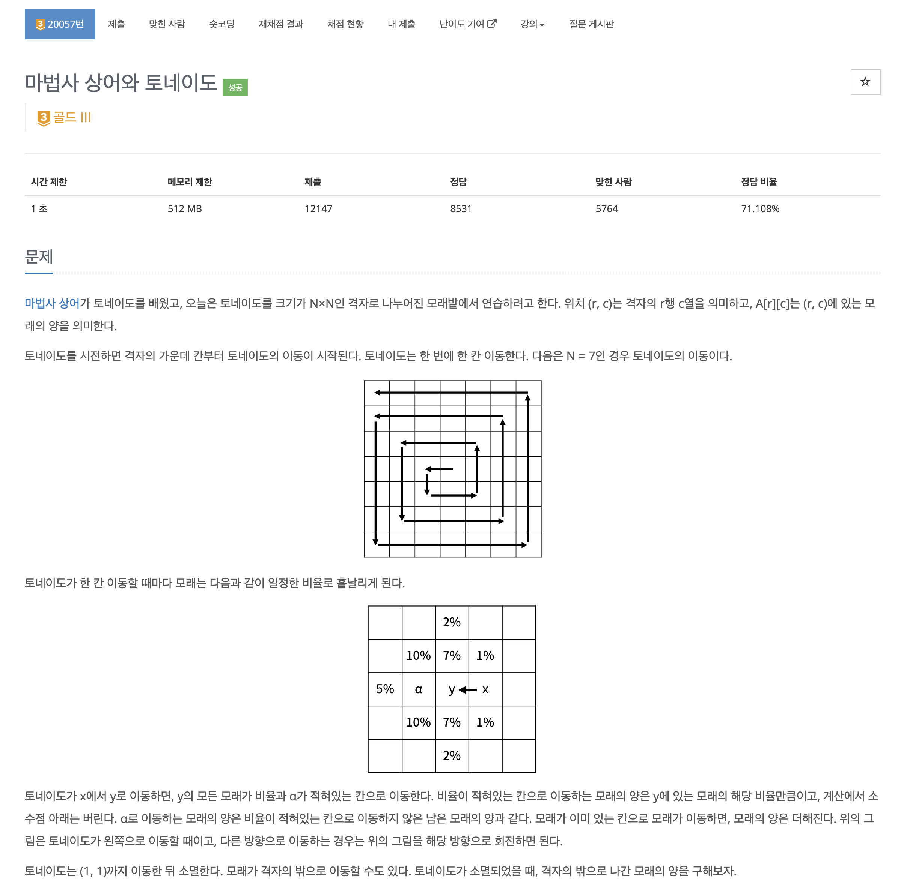
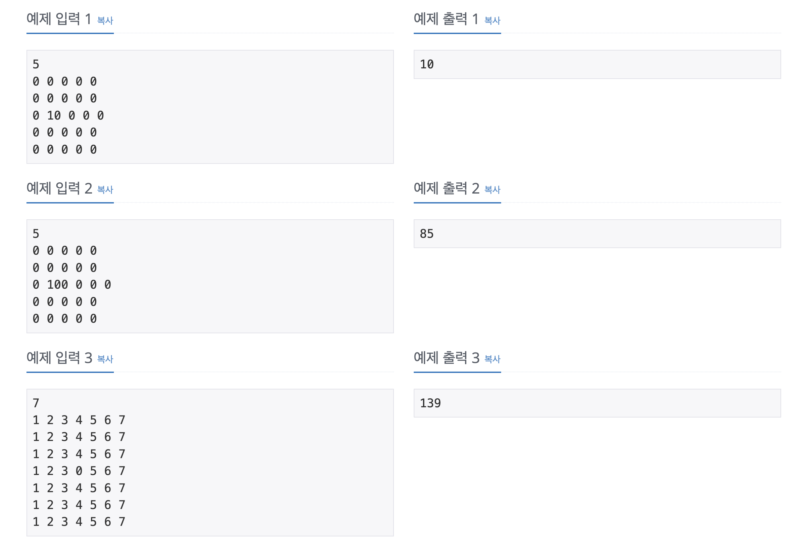
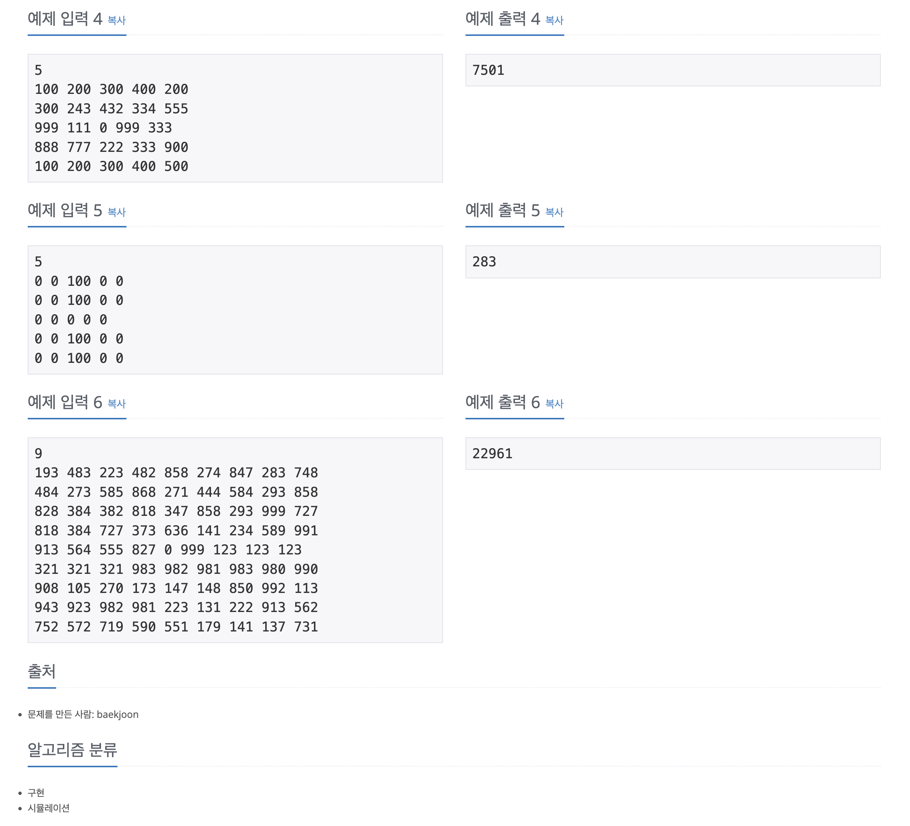

https://www.acmicpc.net/problem/20057

# 🔍 마법사 상어와 토네이도

| 항목    | 내용                     |
|-------|------------------------|
| 설계 시간 | 10 min                 |
| 구현 시간 | 60 min                 |
| 난이도   | 골드 3                   |
| 알고리즘  | 구현, 시뮬레이션              |
| 코드 길이 | 3101B                  |
| 실행 시간 | 488ms (시간 제한 1초)       |
| 메모리   | 93952KB (메모리 제한 512MB) |

---

# 💡 아이디어

달팽이 배열처럼 이동하는 것은 이동 길이가 1, 1, 2, 2, 3 이렇게 1부터 수가 두 번 등장하면 방향이 바뀌는 것을 이용했고, 모래의 이동은 5 x 5의 배열에 미리 이동시킨 후 대조하는 방식으로 해결했다.

---

# ✔ 문제 풀이

모래가 흩날린 경우의 이동을 2차원 배열로 바꾼 후 원본 배열과 인덱스 비교를 통해 이동시키는 방식을 적용했다. 토네이토 소멸 후 격자 내의 모래의 합을 구해서 이를 최초 값과 비교하는 방식으로 격자 밖으로 나간 모래의 양을 구했다.

---

# 🧠 어려웠던 점

안쪽에서 바깥쪽으로 돌아가는 달팽이 이동 구현이 은근 까다로웠다.

---

# 🧐 좋은 풀이
