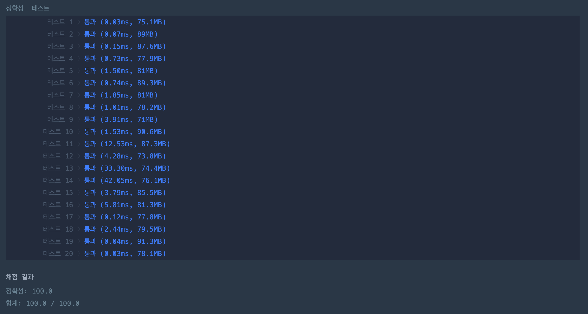

https://school.programmers.co.kr/learn/courses/30/lessons/150368

# 문제 설명

카카오톡에서는 **이모티콘 플러스 서비스** 가입자 수를 늘리기 위해 **이모티콘 할인 행사**를 진행하려 합니다. 목표는 다음과 같습니다.

1. **이모티콘 플러스 서비스 가입자를 최대한 늘리는 것**
2. **이모티콘 판매액을 최대한 늘리는 것** (1번 목표가 우선이며, 2번 목표가 그 다음입니다.)

## 할인 행사 방식

- `n`명의 카카오톡 사용자들에게 `m`개의 이모티콘을 할인하여 판매합니다.
- 이모티콘마다 할인율은 **10%, 20%, 30%, 40%** 중 하나로 설정됩니다.
- 카카오톡 사용자들은 다음 기준을 따릅니다:
    1. 각 사용자는 **자신의 기준 할인율 이상** 할인하는 이모티콘을 모두 구매합니다.
    2. 각 사용자는 **이모티콘 구매 비용의 합이 특정 가격 이상**이 되면 이모티콘 구매를 취소하고 **이모티콘 플러스 서비스에 가입**합니다.

## 예시

| 사용자 | 비율(%) | 가격(원) |
|--------|--------|---------|
| 1      | 40     | 10,000  |
| 2      | 25     | 10,000  |

| 이모티콘 | 가격(원) |
|---------|---------|
| 1       | 7,000   |
| 2       | 9,000   |

### **할인율 적용 예시 1**
> **모든 이모티콘을 40% 할인**

| 사용자 | 구매한 이모티콘 | 이모티콘 구매 비용(원) | 이모티콘 플러스 가입 여부 |
|--------|-----------------|-----------------|----------------|
| 1      | 1, 2            | 9,600           | X              |
| 2      | 1, 2            | 9,600           | X              |

**결과:**
- **이모티콘 플러스 가입자: 0명**
- **이모티콘 판매액: 19,200원**

---

### **할인율 적용 예시 2**
> **1번 이모티콘을 30% 할인, 2번 이모티콘을 40% 할인**

| 사용자 | 구매한 이모티콘 | 이모티콘 구매 비용(원) | 이모티콘 플러스 가입 여부 |
|--------|-----------------|-----------------|----------------|
| 1      | 2               | 5,400           | X              |
| 2      | 1, 2            | 10,300          | O              |

**결과:**
- **이모티콘 플러스 가입자: 1명**
- **이모티콘 판매액: 5,400원**

---

# **입력 형식**
- `users`: `n x 2` 크기의 2차원 정수 배열
    - `users[i] = [비율, 가격]`
    - 비율% 이상의 할인된 이모티콘을 구매
    - 구매 금액이 가격 이상이면 이모티콘 구매 취소 후 서비스 가입

- `emoticons`: 길이 `m`의 1차원 정수 배열
    - `emoticons[i]`: i+1번 이모티콘의 정가

# **출력 형식**
- `[이모티콘 플러스 가입자 수, 이모티콘 판매액]`을 담은 1차원 정수 배열을 반환

---

## **제한 사항**
- `1 ≤ n ≤ 100`
- `1 ≤ 비율 ≤ 40`
- `100 ≤ 가격 ≤ 1,000,000` (100의 배수)
- `1 ≤ m ≤ 7`
- `100 ≤ emoticons[i] ≤ 1,000,000` (100의 배수)

---

# **입출력 예**

| `users` | `emoticons` | `result` |
|---------|------------|----------|
| `[[40, 10000], [25, 10000]]` | `[7000, 9000]` | `[1, 5400]` |
| `[[40, 2900], [23, 10000], [11, 5200], [5, 5900], [40, 3100], [27, 9200], [32, 6900]]` | `[1300, 1500, 1600, 4900]` | `[4, 13860]` |

---

## **입출력 예 설명**
### **입출력 예 #1**
- 위의 예시와 동일함.

### **입출력 예 #2**
- 아래와 같은 할인율을 적용했을 때 최적의 결과를 얻을 수 있음.

| 이모티콘 | 할인율 |
|---------|--------|
| 1       | 40%    |
| 2       | 40%    |
| 3       | 20%    |
| 4       | 40%    |

**결과:**
- 이모티콘 플러스 가입자 **4명**
- 이모티콘 판매액 **13,860원**
- 위보다 더 나은 방법이 없으므로 `[4, 13860]`을 반환.

# 🔍 이모티콘 할인행사

| 항목    | 내용                     |
|-------|------------------------|
| 설계 시간 | 5 min                  |
| 구현 시간 | 30 min                 |
| 난이도   | Lv 2                   |
| 알고리즘  | 중복 순열, 백트래킹            |

---

# 💡 아이디어

중복 순열과 백트래킹을 적용한 완전 탐색으로 해결했다.

---

# ✔ 문제 풀이

각 이모티콘 마다 10, 20, 30, 40의 할인율을 적용할 수 있을 때 어떻게 할인율을 적용해야 이모티콘 플러스 가입자 수가 최대가 되거나 이모티콘 플러스 가입자 수가 동일하면 이모티콘 판매액이 최대가 되야한다.
이를 위해 각 이모티콘 마다 4가지 할인율을 적용하는 중복 순열을 활용했고 백트래킹을 위해 모든 이모티콘에 특정 할인율을 적용한 후 계산을 하지 않고 각 이모티콘에 할인율을 적용했을 때 바로 구매 비용을 계산했다.

---

# 🧠 어려웠던 점

Lv2라서 반복문을 활용한 구현이지 않을까 했는데 순열로 구현하게 될 줄 몰랐다.

---

# 🧐 좋은 풀이
