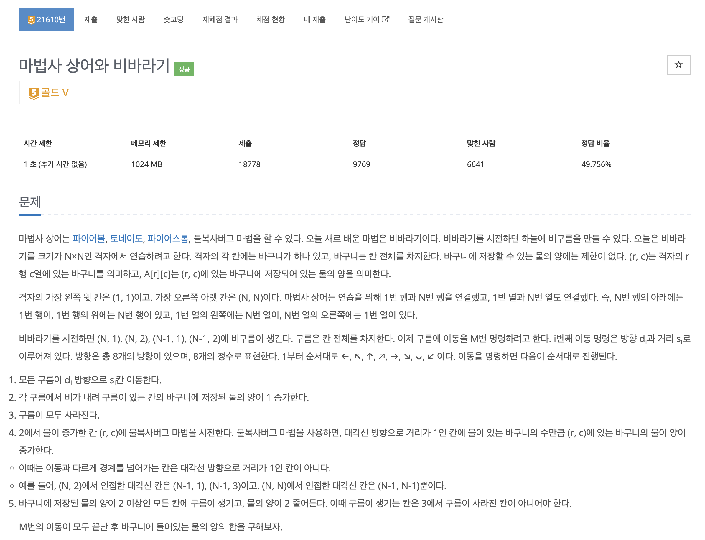
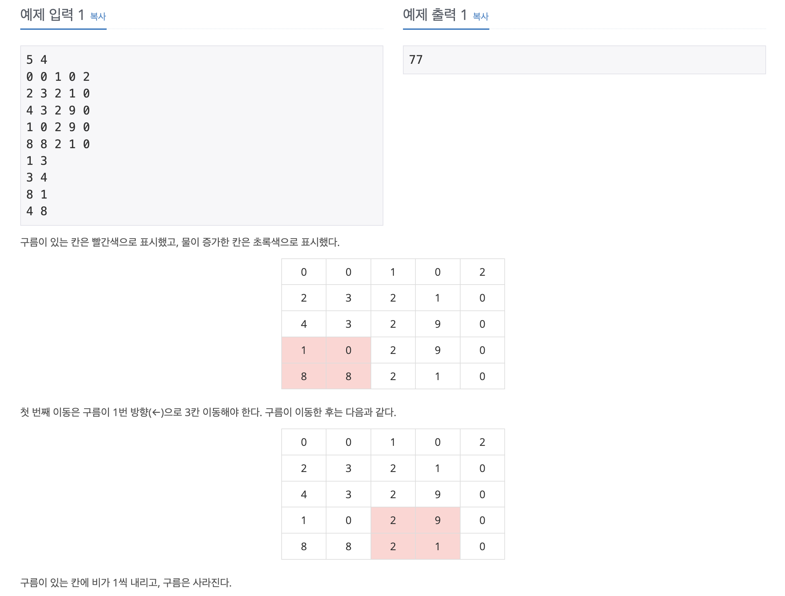
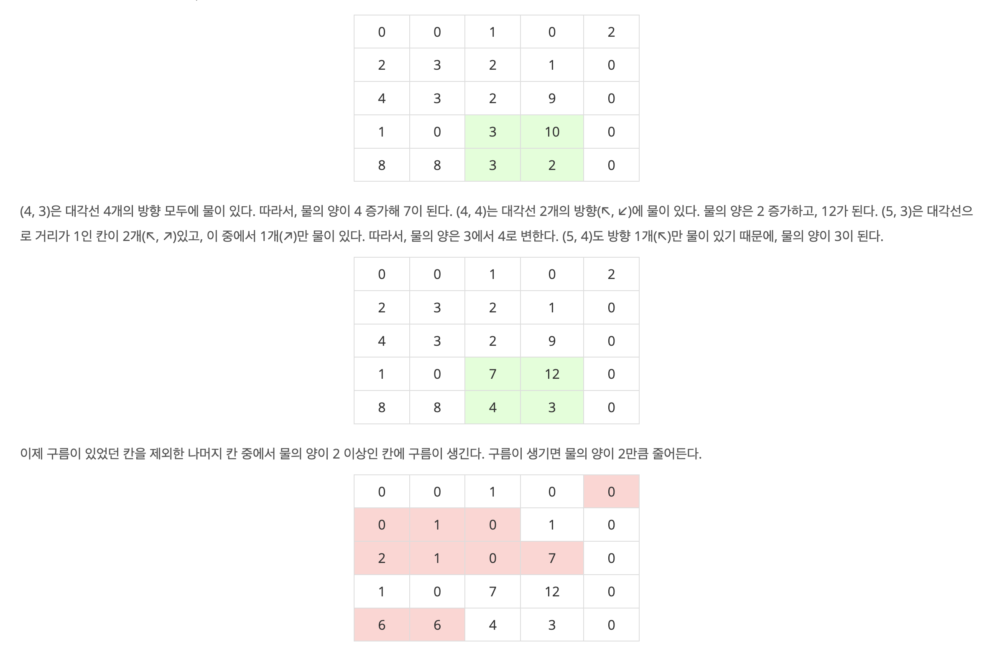
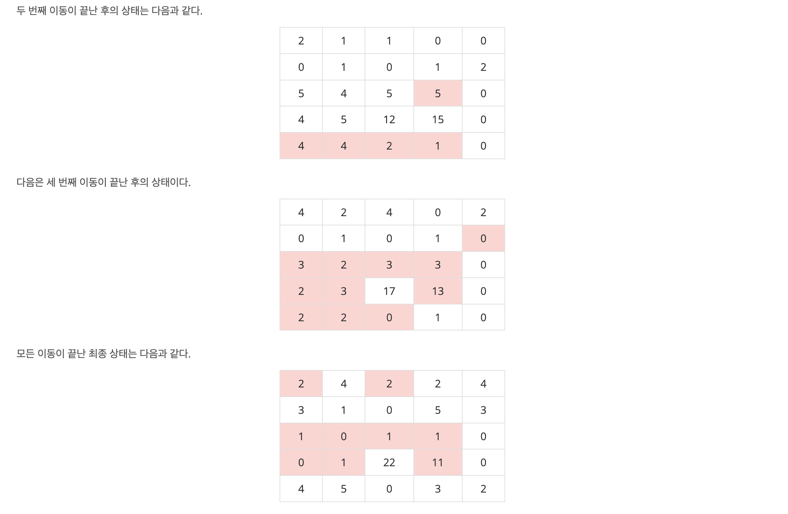
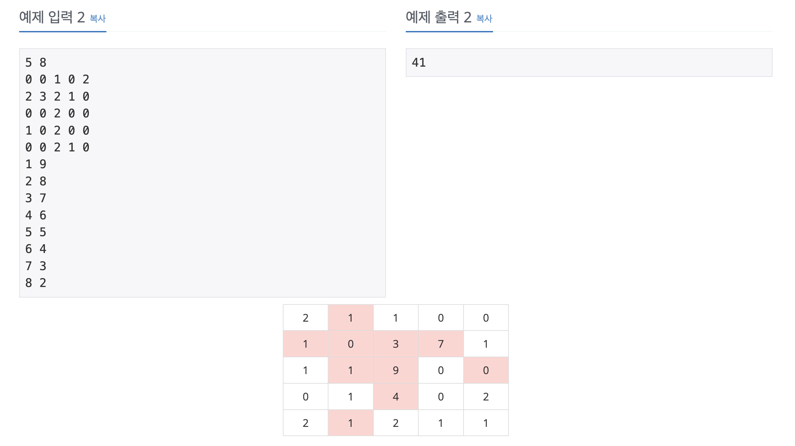
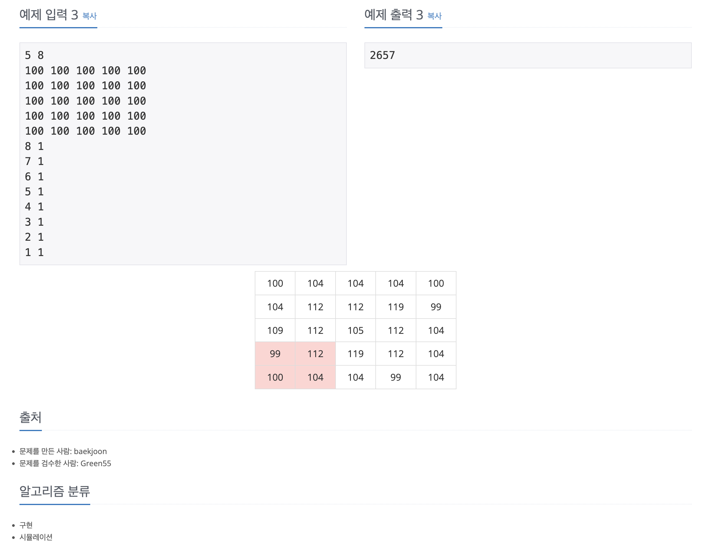

https://www.acmicpc.net/problem/21610

# 🔍 마법사 상어와 비바라기

| 항목    | 내용                      |
|-------|-------------------------|
| 설계 시간 | 5 min                   |
| 구현 시간 | 35 min                  |
| 난이도   | 골드 5                    |
| 알고리즘  | 구현, 시뮬레이션               |
| 코드 길이 | 2716B                   |
| 실행 시간 | 204ms (시간 제한 1초)        |
| 메모리   | 22260KB (메모리 제한 1024MB) |

---

# 💡 아이디어

1번 행, 열과 N번 행, 열이 연결된 것에 대한 처리만 잘 해주면 되는 구현 문제로 모듈러 연산으로 환형 연결 처리를 하고 구름은 Queue를 활용해서 처리하는 방식으로 해결했다.

---

# ✔ 문제 풀이

구름의 이동 거리인 s가 최대 50이어서 환형 연결은 50 * N을 더하고 N으로 나눈 나머지를 사용하는 방식으로 구현했다.
구름은 Queue를 활용했고 Queue의 크기만큼 연산하는 상황이 많아 len 변수로 처리해주는 것만 신경썼다.
move 메서드는 이전에 저장한 구름 위치정보를 바탕으로 구름을 이동시킨 후 비를 1 내리고, 대각선 방향에 대한 탐색으로 물복사버그 진행 후 새롭게 다음 구름 위치를 탐색하는 순서로 구현했다.

---

# 🧠 어려웠던 점

---

# 🧐 좋은 풀이
