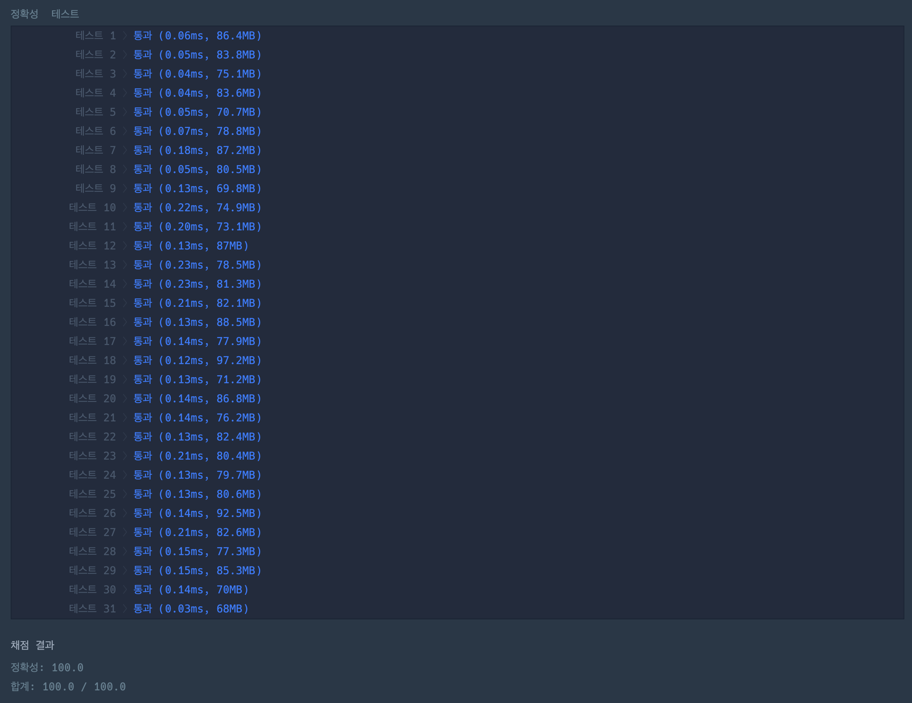

https://school.programmers.co.kr/learn/courses/30/lessons/150365

## 문제 설명

n x m 격자 미로가 주어집니다. 당신은 미로의 (x, y)에서 출발해 (r, c)로 이동해서 탈출해야 합니다.

단, 미로를 탈출하는 조건이 세 가지 있습니다.

1. 격자의 바깥으로는 나갈 수 없습니다.
2. (x, y)에서 (r, c)까지 이동하는 거리가 총 k여야 합니다. 이때, (x, y)와 (r, c)격자를 포함해, 같은 격자를 두 번 이상 방문해도 됩니다.
3. 미로에서 탈출한 경로를 문자열로 나타냈을 때, **문자열이 사전 순으로 가장 빠른 경로로 탈출해야 합니다**.

이동 경로는 다음과 같이 문자열로 바꿀 수 있습니다.

- `l`: 왼쪽으로 한 칸 이동
- `r`: 오른쪽으로 한 칸 이동
- `u`: 위쪽으로 한 칸 이동
- `d`: 아래쪽으로 한 칸 이동

예를 들어, **왼쪽으로 한 칸, 위로 한 칸, 왼쪽으로 한 칸** 움직였다면, 문자열 `"lul"`로 나타낼 수 있습니다.

미로에서는 인접한 **상, 하, 좌, 우** 격자로 한 칸씩 이동할 수 있습니다.

예를 들어 다음과 같이 **3 x 4** 격자가 있다고 가정해 보겠습니다.

```
....
..S.
E...
```

미로의 좌측 상단은 `(1, 1)`이고 우측 하단은 `(3, 4)`입니다. `.`은 빈 공간, `S`는 출발 지점, `E`는 탈출 지점입니다.

탈출까지 이동해야 하는 거리 `k`가 `5`라면 다음과 같은 경로로 탈출할 수 있습니다.

1. lldud
2. ulldd
3. rdlll
4. dllrl
5. dllud
6. ...

이때 **"dllrl"보다 사전 순으로 빠른 경로로 탈출할 수는 없습니다.**

---

## 입력 형식

격자의 크기를 뜻하는 정수 `n`, `m`,  
출발 위치를 뜻하는 정수 `x`, `y`,  
탈출 지점을 뜻하는 정수 `r`, `c`,  
탈출까지 이동해야 하는 거리를 뜻하는 정수 `k`가 매개변수로 주어집니다.

이때, **미로를 탈출하기 위한 경로를 return** 하도록 `solution` 함수를 완성해주세요.  
단, 위 조건대로 **미로를 탈출할 수 없는 경우** `"impossible"`을 return 해야 합니다.

---

## 제한사항

- `2 ≤ n (미로의 세로 길이) ≤ 50`
- `2 ≤ m (미로의 가로 길이) ≤ 50`
- `1 ≤ x ≤ n`
- `1 ≤ y ≤ m`
- `1 ≤ r ≤ n`
- `1 ≤ c ≤ m`
- `(x, y) ≠ (r, c)`
- `1 ≤ k ≤ 2,500`

---

## 입출력 예

| n | m | x | y | r | c | k | result         |
|---|---|---|---|---|---|---|----------------|
| 3 | 4 | 2 | 3 | 3 | 1 | 5 | `"dllrl"`      |
| 2 | 2 | 1 | 1 | 2 | 2 | 2 | `"dr"`         |
| 3 | 3 | 1 | 2 | 3 | 3 | 4 | `"impossible"` |

---

## 입출력 예 설명

### 입출력 예 #1

문제 예시와 동일합니다.

---

### 입출력 예 #2

미로의 크기는 **2 x 2**입니다.  
출발 지점은 **(1, 1)**이고, 탈출 지점은 **(2, 2)**입니다.

빈 공간은 `.`이고, 출발 지점을 `S`, 탈출 지점을 `E`로 나타내면 다음과 같습니다.

```
S.
.E
```

미로의 좌측 상단은 `(1, 1)`, 우측 하단은 `(2, 2)`입니다.  
탈출까지 이동해야 하는 거리 `k`가 `2`이므로 다음과 같은 경로로 탈출할 수 있습니다.

```
rd
dr
```

이 중 **"dr"이 사전 순으로 가장 빠른 경로**입니다.  
따라서 `"dr"`을 return 해야 합니다.

---

### 입출력 예 #3

미로의 크기는 **3 x 3**입니다.  
출발 지점은 **(1, 2)**이고, 탈출 지점은 **(3, 3)**입니다.

빈 공간은 `.`이고, 출발 지점을 `S`, 탈출 지점을 `E`로 나타내면 다음과 같습니다.

```
.S.
...
..E
```

미로의 좌측 상단은 `(1, 1)`, 우측 하단은 `(3, 3)`입니다.

**탈출까지 이동해야 하는 거리 `k`가 4**입니다.  
이때, **이동 거리가 4이면서, S에서 E까지 이동할 수 있는 경로는 존재하지 않습니다.**

따라서 `"impossible"`을 return 해야 합니다.

# 🔍 미로 탈출 명령어

| 항목    | 내용     |
|-------|--------|
| 설계 시간 | 60 min |
| 구현 시간 | 40 min |
| 난이도   | Lv 3   |
| 알고리즘  | 구현     |



---

# 💡 아이디어

사전순의 우선순위는 d, l, r, u 이다.
미로를 탈출하는 경로는 최단경로와 잉여경로로 구분할 수 있고 잉여경로는 u와 d, l과 r의 개수가 동일해야 한다.
전체 경로에서 사전순으로 가장 앞서려면 출발 지점에서 탈출 지점까지 갈 수 있는 선에서 최대한 아래로 먼저 가고 아래로 더 갈 수 없으면 최대한 왼쪽으로 가고 더 왼쪽으로 갈 수 없으면 오른쪽 갔다 왼쪽 갔다를 반복하고 탈출 지점으로 가면 된다.

---

# ✔ 문제 풀이

출발 지점을 기준으로 탈출 지점이 좌하, 우하, 좌상, 우상 4가지 위치 중 어디에 있는지에 따라 조건 분기로 접근했다.
최단 경로와 잉여 경로를 사전순으로 잘 섞는게 중요한데 좌하, 우하는 최단 경로의 아래 방향 커멘드를 먼저하고 잉여 경로의 아래 방향 커멘드를 해준 후 좌우 이동이 끝나면 보정으로 위 방향 커멘드를 해줬다.
좌우 방향 커멘드는 왼쪽 위치면 최단 경로의 왼쪽을 먼저해주고 오른쪽 위치면 잉여 경로의 왼쪽을 먼저 해주는 식으로 접근하면 된다.
아래쪽도 왼쪽도 더 갈 수 없으면 오른쪽으로 한칸 갔다 왼쪽으로 다시 오는게 사전순으로 가장 빨라서 이 부분만 고려해주면 된다.

---

# 🧠 어려웠던 점

조건 분기가 쉽지 않았다.

---

# 🧐 좋은 풀이
