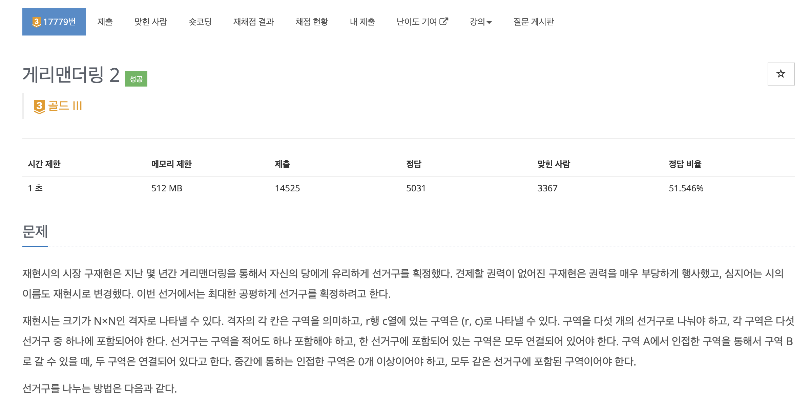
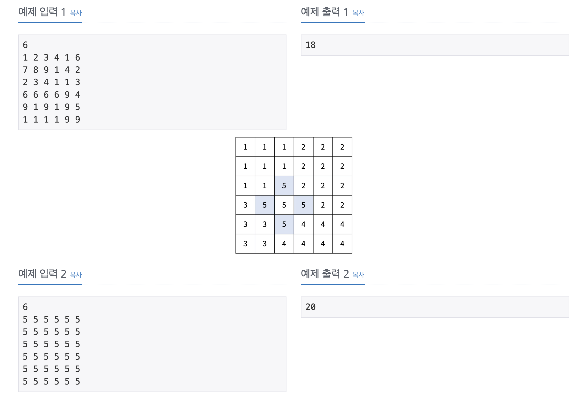
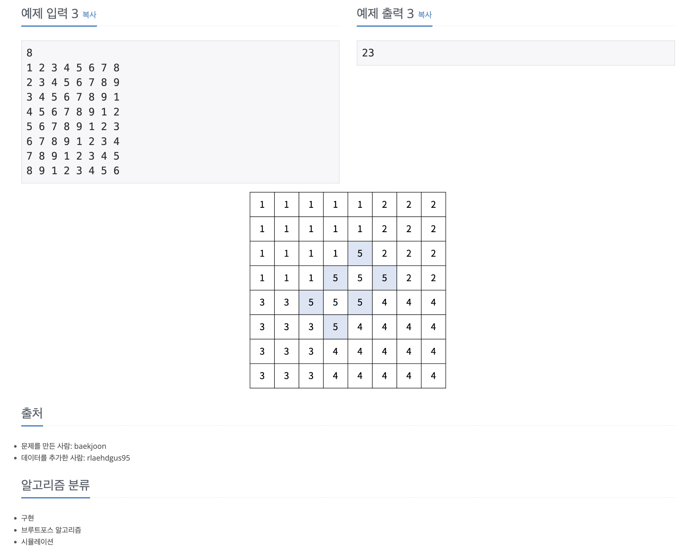

https://www.acmicpc.net/problem/17779

# 🔍 게리맨더링 2

| 항목    | 내용                     |
|-------|------------------------|
| 설계 시간 | 10 min                 |
| 구현 시간 | 90 min                 |
| 난이도   | 골드 3                   |
| 알고리즘  | 구현, 시뮬레이션, 브루트포스 알고리즘  |
| 코드 길이 | 3515B                  |
| 실행 시간 | 232ms (시간 제한 1초)       |
| 메모리   | 40272KB (메모리 제한 512MB) |

---

# 💡 아이디어

경계선을 표시하고 각 선거구의 영역에 대해 경계선에 닿기 전까지 탐색하는 방식을 활용했다.

---

# ✔ 문제 풀이

먼저 기준점의 좌표와 d1, d2의 길이 모든 경우에 대해 탐색하는 브루트포스 알고리즘으로 접근했고 이를 위해 4중 for문으로 모든 케이스르 탐색했다.
기준점의 좌표와 d1, d2를 결정하면 해당 정보로 그림의 파란 경계선에 숫자 5를 넣은 방문 체크 배열을 만들었고 이를 활용해 탐색 경계를 구분했다.
탐색은 1번 영역은 정방향 순회, 2번 영역은 90도 돌린 정방향 순회, 4번 영역은 180도 돌린 정방향 순회, 3번 영역은 270도 돌린 정방향 순회로 탐색을 했고 탐색 과정에서 경계를 만나면 해당 안쪽 for문은 break로 추가 탐색을 하지 않도록 구현했다.

---

# 🧠 어려웠던 점

2차원 배열 순회 트릭으로 해볼 수 있을거 같았는데 쉽지 않아서 그냥 방문 체크 배열을 적용하게 됐는데 안되는 이유 디버깅이 좀 어려웠다.

---

# 🧐 좋은 풀이
