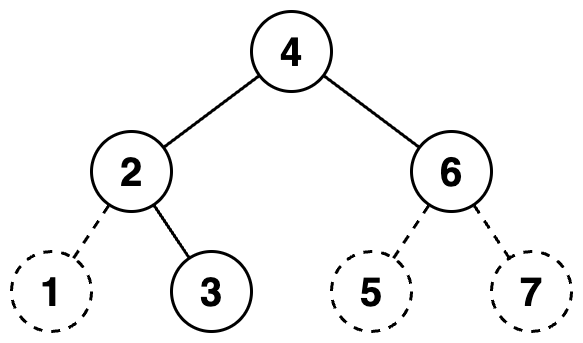
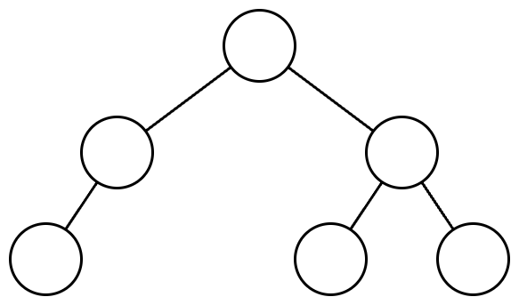

https://school.programmers.co.kr/learn/courses/30/lessons/150367

# 문제 설명

당신은 이진트리를 수로 표현하는 것을 좋아합니다.

이진트리를 수로 표현하는 방법은 다음과 같습니다.

1. 이진수를 저장할 빈 문자열을 생성합니다.
2. 주어진 이진트리에 더미 노드를 추가하여 포화 이진트리로 만듭니다. 루트 노드는 그대로 유지합니다.
3. 만들어진 포화 이진트리의 노드들을 가장 왼쪽 노드부터 가장 오른쪽 노드까지, 왼쪽에 있는 순서대로 살펴봅니다. 노드의 높이는 살펴보는 순서에 영향을 끼치지 않습니다.
4. 살펴본 노드가 더미 노드라면, 문자열 뒤에 0을 추가합니다. 살펴본 노드가 더미 노드가 아니라면, 문자열 뒤에 1을 추가합니다.
5. 문자열에 저장된 이진수를 십진수로 변환합니다.

이진트리에서 리프 노드가 아닌 노드는 자신의 왼쪽 자식이 루트인 서브트리의 노드들보다 오른쪽에 있으며, 자신의 오른쪽 자식이 루트인 서브트리의 노드들보다 왼쪽에 있다고 가정합니다.
다음은 이진트리를 수로 표현하는 예시입니다.
주어진 이진트리는 다음과 같습니다.

주어진 이진트리에 더미노드를 추가하여 포화 이진트리로 만들면 다음과 같습니다. 더미 노드는 점선으로 표시하였고, 노드 안의 수는 살펴보는 순서를 의미합니다.

노드들을 왼쪽에 있는 순서대로 살펴보며 0과 1을 생성한 문자열에 추가하면 "0111010"이 됩니다. 이 이진수를 십진수로 변환하면 58입니다.
당신은 수가 주어졌을때, 하나의 이진트리로 해당 수를 표현할 수 있는지 알고 싶습니다.
이진트리로 만들고 싶은 수를 담은 1차원 정수 배열 numbers가 주어집니다. numbers에 주어진 순서대로 하나의 이진트리로 해당 수를 표현할 수 있다면 1을, 표현할 수 없다면 0을 1차원 정수 배열에 담아
return 하도록 solution 함수를 완성해주세요.

---

# 제한사항

- 1 ≤ numbers의 길이 ≤ 10,000
    - 1 ≤ numbers의 원소 ≤ 1015

---

# 입출력 예

| numbers        | result    |
|----------------|-----------|
| [7, 42, 5]     | [1, 1, 0] |
| [63, 111, 95]	 | [1, 1, 0] |

# 입출력 예 설명

# 입출력 예 #1

7은 다음과 같은 이진트리로 표현할 수 있습니다.

42는 다음과 같은 이진트리로 표현할 수 있습니다.

5는 이진트리로 표현할 수 없습니다.

따라서, [1, 0]을 return 하면 됩니다.

# 입출력 예 #2

63은 다음과 같은 이진트리로 표현할 수 있습니다.

111은 다음과 같은 이진트리로 표현할 수 있습니다.

95는 이진트리로 표현할 수 없습니다.

따라서, [1, 1, 0]을 return 하면 됩니다.

---

# 🔍 표현 가능한 이진트리

| 항목    | 내용            |
|-------|---------------|
| 설계 시간 | 40 min        |
| 구현 시간 | 40 min        |
| 난이도   | Lv 3          |
| 알고리즘  | 분할정복, dfs, 트리 |

---

# 💡 아이디어

해당 숫자를 이진수로 변환한 후 해당 수를 활용한 포화 이진트리를 만들었다.
이후 DFS 알고리즘으로 트리를 순회하며 해당 숫자를 이진트리로 만들 수 있는지 판단하는 방식으로 해결했다.

---

# ✔ 문제 풀이

Long.toBinaryString 메서드로 정수를 이진수 문자열로 간단하게 변환할 수 있다. 이후 트리의 순회를 위해 해당 숫자로 포화 이진트리를 만들어야하는데 포화 이진트리는 배열로 구현했고 원래 숫자가 바뀌지 않게 앞에 0을 추가하는 방식으로 포화 이진트리를 만들었다.
포화 이진트리의 크기는 2^N - 1인 점을 이용해 비트마스킹으로 구했다. 이후 트리의 루트부터 자식들을 순회하는데 이때 더미 노드를 발견하면 순회를 종료하고 더미 노드가 아니면 자식 노드에서 찾은 1의 개수를 반환하도록 했다.
해당 숫자가 이진트리로 표현 가능한 수면 dfs에서 발견한 1의 수와 이진수의 1의 수가 동일해야하며 이진수의 1의 수는 Long.bitCount 메서드로 찾았다.

---

# 🧠 어려웠던 점

- 앞에 0을 1개만 붙이거나 안붙이는 2가지 경우만 있는 줄 알았는데 0을 여러 개 붙이는 상황이 있는 줄 몰랐다.

---

# 🧐 좋은 풀이
