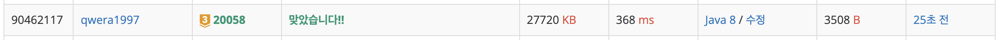

https://www.acmicpc.net/problem/20058

# 🔍 마법사 상어와 파이어스톰

| 항목    | 내용                              |
|-------|---------------------------------|
| 설계 시간 | 5 min                           |
| 구현 시간 | 30 min                          |
| 난이도   | 골드 3                            |
| 알고리즘  | 구현, 시뮬레이션, BFS, DFS             |
| 코드 길이 | 3508B, 3221B                    |
| 실행 시간 | 368ms, 348ms (시간 제한 1초)         |
| 메모리   | 27720KB, 26856KB (메모리 제한 512MB) |

---

# 💡 아이디어

2차원 배열의 회전, 얼음의 양 줄이기, 가장 큰 얼음 덩어리의 크기를 각각 구현해서 합치면 되는 문제로 2차원 배열의 회전읜 격자의 크기와 동일한 크기의 배열과 인덱스의 활용으로, 얼음 양 줄이기는 Queue를 활용해서, 가장 큰 얼음 덩어리의 크기는 BFS, DFS 알고리즘으로 구할 수 있다.

---

# ✔ 문제 풀이

얼음판의 크기는 2^N으로 주어지는데 편의를 위해 N을 2^N으로 바꿔서 이용했다. 이를 위해 비트 연산자를 활용했다.
격자의 크기 역시 비트 연산으로 L을 2^L로 바뀌줬고 이후 회전 메서드에서 이용했다. 회전은 두 2차원 배열의 크기가 다른 점만 주의해서 구현하면 된다.
얼음의 양 줄이기는 사방탐색으로 줄여야 하는 위치만 Queue에 담아주고 이후 한번에 줄이도록 구현했다.
BFS, DFS는 탐색한 얼음의 크기를 반환하면 된다.

---

# 🧠 어려웠던 점

---

# 🧐 좋은 풀이
