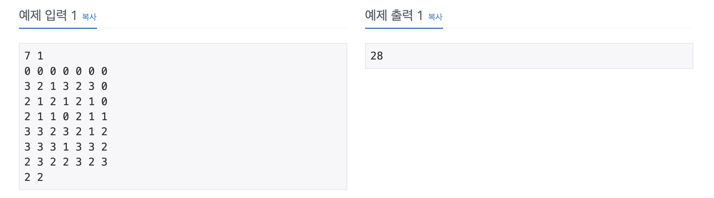

https://www.acmicpc.net/problem/21611

# 🔍 마법사 상어와 블리자드

| 항목    | 내용                      |
|-------|-------------------------|
| 설계 시간 | 30 min                  |
| 구현 시간 | 90 min                  |
| 난이도   | 골드 1                    |
| 알고리즘  | 구현, 시뮬레이션               |
| 코드 길이 | 5260B                   |
| 실행 시간 | 248ms (시간 제한 1초)        |
| 메모리   | 27560KB (메모리 제한 1024MB) |

---

# 💡 아이디어

달팽이 배열을 활용한 다양한 연산을 하는 문제로 구슬을 파괴 후 재배치 -> 구슬의 폭발과 재배치 반복 -> 구슬의 변화 순서가 반복된다.
각 단계를 수행하는 메서드를 작성해서 조합하는 방식으로 해결했고 달팽이 배열의 이동을 처리하기 위해 Queue와 Deque, 델타 배열을 활용했다.

---

# ✔ 문제 풀이

달팽이 배열의 회전 방향에 맞춰 반시계 방향으로 델타 배열을 만들었고 입력의 d를 이 델타 배열에 맞추기 위한 배열도 선언했다.
이후 각 마법에 대해 destroy 메서드를 호출했는데 해당 메서드에서 마법의 한 사이클을 전부 수행했다.
먼저 구슬을 파괴한 후 재배치를 해야하는데 이때 달팽이 배열의 순회로 구슬을 Queue에 담고, 다시 순회하며 순서대로 구슬을 넣어줬다.
구슬의 폭발은 Deque를 활용해서 구슬을 담다가 구슬의 종류가 바뀌는 순간 이전에 담은 구슬이 연속으로 4개 이상 담겨있으면 제거하는 방식으로 구현했다.
구슬의 변화도 비슷하게 구슬의 종류가 바뀔때마다 Deque에서 다 빼고 개수와 숫자로 바꿔서 넣어줬다.

---

# 🧠 어려웠던 점

달팽이 배열의 이동 구현은 항상 좀 까다로운거 같다.
코드가 중복이 좀 많은데 최적화하기가 어려웠다.

---

# 🧐 좋은 풀이
