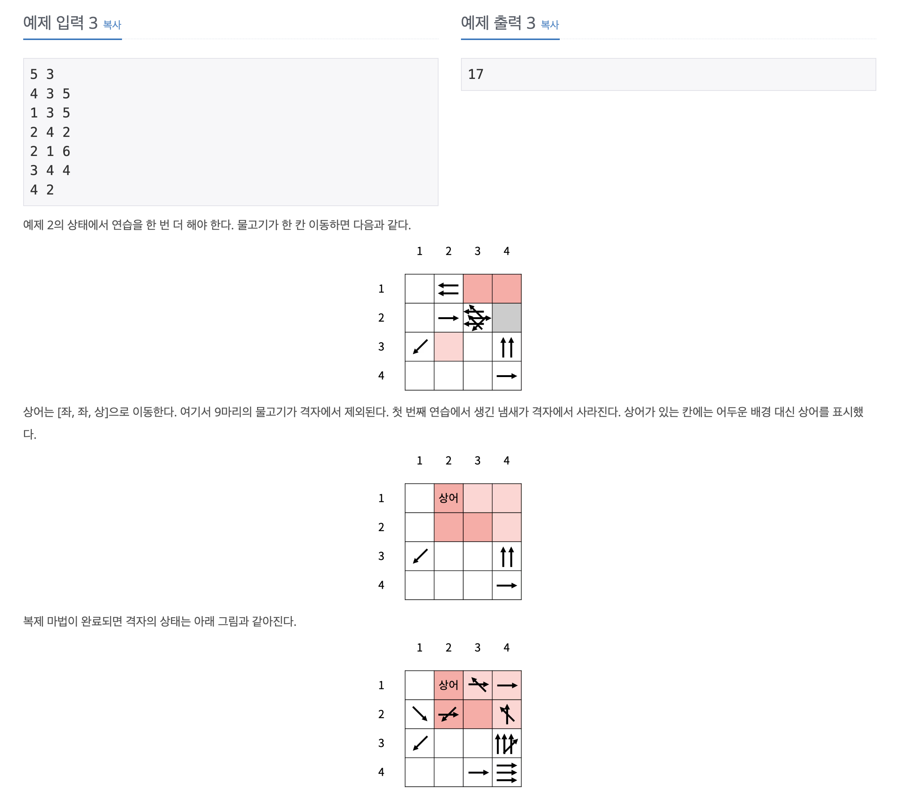

https://www.acmicpc.net/problem/23290

# 🔍 마법사 상어와 복제

| 항목    | 내용                      |
|-------|-------------------------|
| 설계 시간 | 30 min                  |
| 구현 시간 | 90 min                  |
| 난이도   | 골드 1                    |
| 알고리즘  | 구현, 시뮬레이션               |
| 코드 길이 | 5182B                   |
| 실행 시간 | 284ms (시간 제한 2초)        |
| 메모리   | 69900KB (메모리 제한 1024MB) |

---

# 💡 아이디어

마법 연습의 각 작업을 메서드로 분리하고 조립해서 로직을 구현하는 방식으로 접근했다.
팔방탐색 델타배열로 이동과 회전을 기본으로 처리하고 물고기는 클래스를 만들어 객체로 관리했다.

---

# ✔ 문제 풀이

물고기는 위치와 방향을 담은 객체로 관리하며 Queue로 다뤘다.
각 위치의 물고기 수를 저장하기 위한 카운팅 맵과 각 위치에서 냄새의 남은 시간을 저장하기 위한 카운팅 맵을 활용했다.

작업 1은 작업 5에서 복제를 하기 위해 현재 물고기 정보를 따로 보관해야한다.
작업 2는 물고기의 이동으로 델타배열을 통해 회전을 구현하고 상어 위치와 냄새 위치를 기록해서 구현하면 된다.
작업 3은 상어의 이동으로 DFS 알고리즘을 통한 완전 탐색으로 진행했고 방문 체크 및 방문 해제로 물고기를 중복으로 제외하지 않게 주의하면서 탐색했고 가장 많이 제외하면서 사전순으로 앞서게 하기 위해 사전순으로 가장 뒤인 경우부터 역으로 탐색을 했다.
작업 4는 냄새를 지우는 단계로 그냥 냄새의 시간을 담은 배열에서 1씩 빼주는 방식으로 구현했다.
작업 5는 복제 단계로 작업 1에서 보관한 물고기를 담아주면 된다.

---

# 🧠 어려웠던 점

---

# 🧐 좋은 풀이
