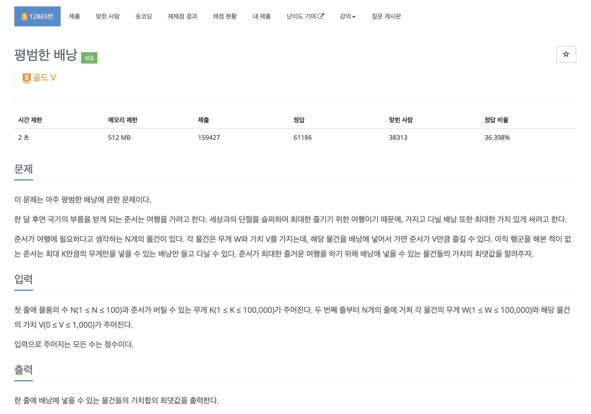
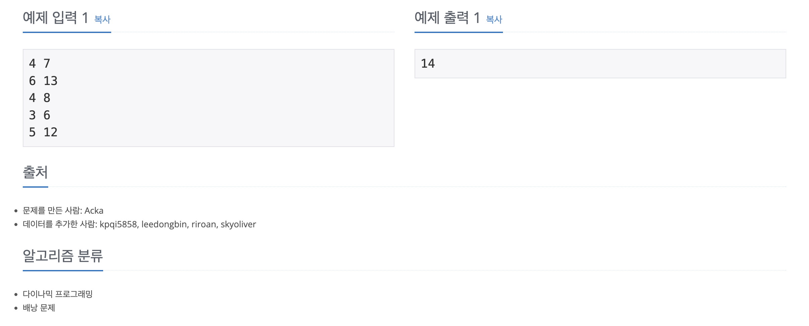

https://www.acmicpc.net/problem/12865

# 🔍 평범한 배낭

| 항목    | 내용                              |
|-------|---------------------------------|
| 설계 시간 | 5 min                           |
| 구현 시간 | 30 min                          |
| 난이도   | 골드 5                            |
| 알고리즘  | DP, 배낭 문제                       |
| 코드 길이 | 1095B, 1191B                    |
| 실행 시간 | 100ms, 136ms (시간 제한 2초)         |
| 메모리   | 12316KB, 51324KB (메모리 제한 512MB) |

---

# 💡 아이디어

대표적인 0-1 배낭 문제로 다이나믹 프로그래밍으로 해결할 수 있다.
직관적인 2차원 dp 테이블을 활용한 방식과 좀 더 발전한 1차원 dp 배열을 활용한 방식으로 해결했다.

---

# ✔ 문제 풀이

2차원 dp 테이블은 행을 물건의 번호, 열을 무게로 하면 되고 1차원 dp 배열은 무게를 인덱스로 하면 된다.

2차원 dp 테이블은 행 번호가 늘어날수록 고려하는 물건의 종류가 늘어난다고 생각하면 되고 현재 번호의 물건을 담았을 때와 안 담았을 때 중 최댓값을 찾으면 된다.
1차원 dp 배열은 2차원 dp 테이블이 이전 행의 정보로 현재 행을 구성하는 점에 착안해 갱신해주면 되고 이때 인덱스를 뒤에서부터 갱신해줘서 같은 물건이 중복으로 담기는 것을 방지해줬다.

---

# 🧠 어려웠던 점

---

# 🧐 좋은 풀이
