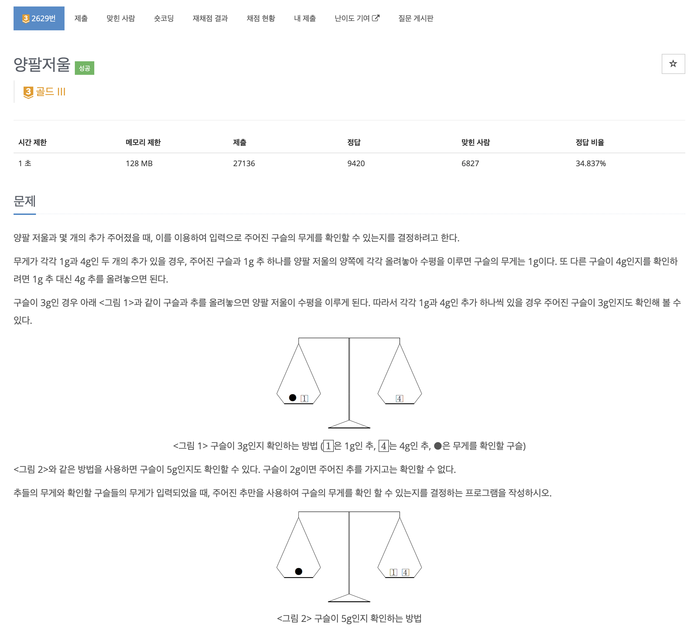
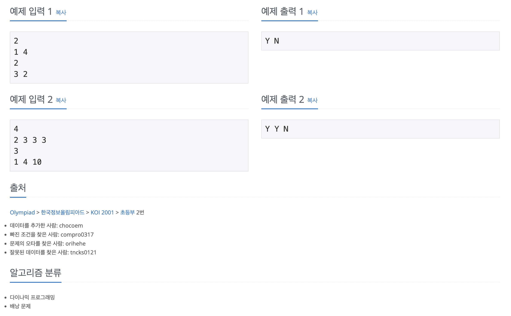

https://www.acmicpc.net/problem/2629

# 🔍 양팔저울

| 항목    | 내용                              |
|-------|---------------------------------|
| 설계 시간 | 30 min                          |
| 구현 시간 | 60 min                          |
| 난이도   | 골드 3                            |
| 알고리즘  | DP, 배낭 문제                       |
| 코드 길이 | 1451B, 1429B                    |
| 실행 시간 | 84ms, 68ms (시간 제한 1초)           |
| 메모리   | 13056KB, 11872KB (메모리 제한 128MB) |

---

# 💡 아이디어

TopDown, BottomUp 다이나믹 프로그래밍을 활용해서 해결했다.

---

# ✔ 문제 풀이

TopDown 방식은 부분집합을 구하는 재귀 메서드와 메모이제이션을 활용했는데 부분집합은 해당 추를 사용하지 않거나 왼쪽 팔에 추를 올리거나 오른쪽 팔에 추를 올리는 3가지 경우가 있다.
추의 개수가 최대 30개이므로 모든 경우의 수는 3^30가지가 되고 이건 시간초과가 발생하게 된다. 이를 해결하기 위해 boolean 타입 2차원 배열을 활용해 해당 추까지 주어졌을 때 구할 수 있는 무게를 방문 체크하고 방문된 경우를 만나면 바로 종료하도록 했다.
파라미터로는 추의 번호와 구할 수 있는 무게를 들고 다녔고 구할 수 있는 무게는 왼쪽 팔 - 오른쪽 팔로 설정했다. 다만 이때 오른쪽 팔이 더 무거워서 음수가 나와도 무게를 잴 수 있으므로 절댓값을 씌워줬다.

BottomUp 방식은 일반적인 2차원 dp 테이블을 활용한 배낭 문제로 접근했고 각 추마다 역시 3가지 케이스가 존재한다. 현재 추를 사용하지 않는 경우에는 현재 추가 없던 조건에서 구할 수 있는 무게면 역시 구할 수 있고, 
현재 추를 사용하는 경우 왼쪽 팔에 사용하면 더하는 방향, 오른쪽 팔에 사용하면 빼는 방향이 된다.

---

# 🧠 어려웠던 점

두 방식으로 문제 해결은 됐지만 개념이 조금 모호한거 같다.

---

# 🧐 좋은 풀이
