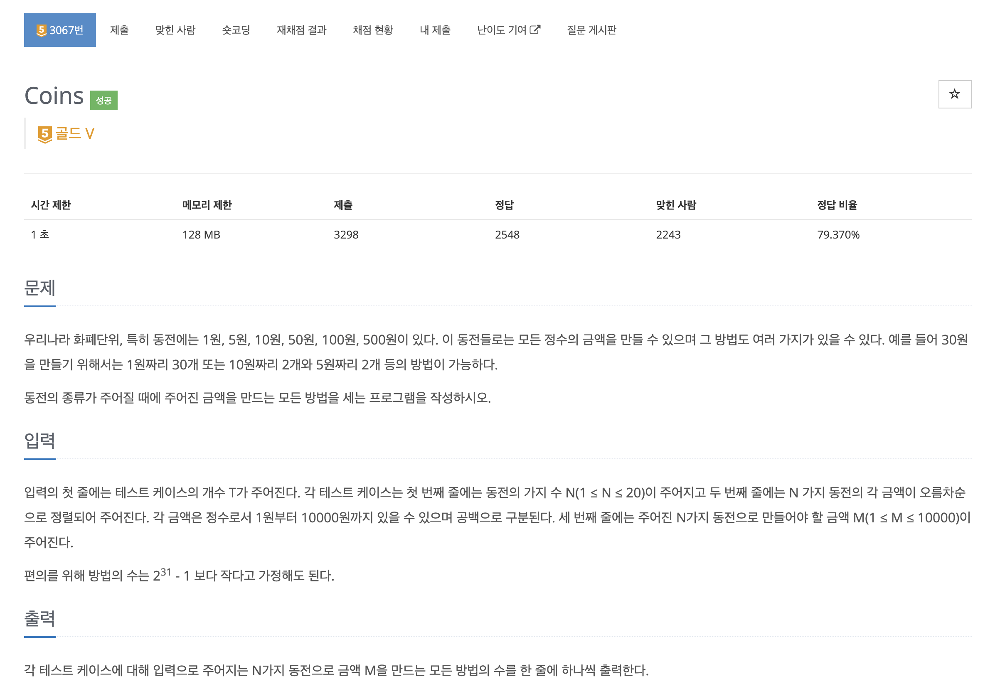

https://www.acmicpc.net/problem/3067

# 🔍 Coins

| 항목    | 내용                              |
|-------|---------------------------------|
| 설계 시간 | 5 min                           |
| 구현 시간 | 30 min                          |
| 난이도   | 골드 5                            |
| 알고리즘  | DP, 배낭 문제                       |
| 코드 길이 | 1134B, 1216B                    |
| 실행 시간 | 72ms, 104ms (시간 제한 1초)          |
| 메모리   | 12408KB, 19904KB (메모리 제한 128MB) |

---

# 💡 아이디어

무한 배낭 문제로 다이나믹 프로그래밍으로 해결할 수 있다.
직관적인 2차원 dp 테이블을 활용한 방식과 좀 더 발전한 1차원 dp 배열을 활용한 방식으로 해결했다.

---

# ✔ 문제 풀이

2차원 dp 테이블은 행을 동전의 번호, 열을 방법의 수로 하면 되고 1차원 dp 배열은 방법의 수를 인덱스로 하면 된다.

방법의 수는 현재 동전을 사용해서 만들 수 있는 경우의 수와 현재 동전을 사용하지 않고 만들 수 있는 경우의 수의 합으로 구할 수 있다.
2차원 dp 테이블의 경우 0원을 만들 수 있는 경우는 1가지이므로 모든 행의 0번 인덱스는 1로 초기화했다.
방법의 수를 구하기 위해 dp 테이블의 각 칸은 현재 동전을 사용하지 않고 만들 수 있는 경우의 수로 초기화 해준 뒤 현재 동전을 사용해서 만들 수 있는 방법의 수를 더해줬다.
현재 동전을 사용해서 만들 수 있는 방법의 수는 현재 동전의 액면가를 뺀 dp 테이블 위치에서 방법의 수가 존재하면 이걸 더해주면 된다.

1차원 dp 배열도 동일한 원리로 동전을 중복 사용할 수 있으므로 역순이 아닌 정방향으로 갱신을 해줬다.

---

# 🧠 어려웠던 점

---

# 🧐 좋은 풀이
