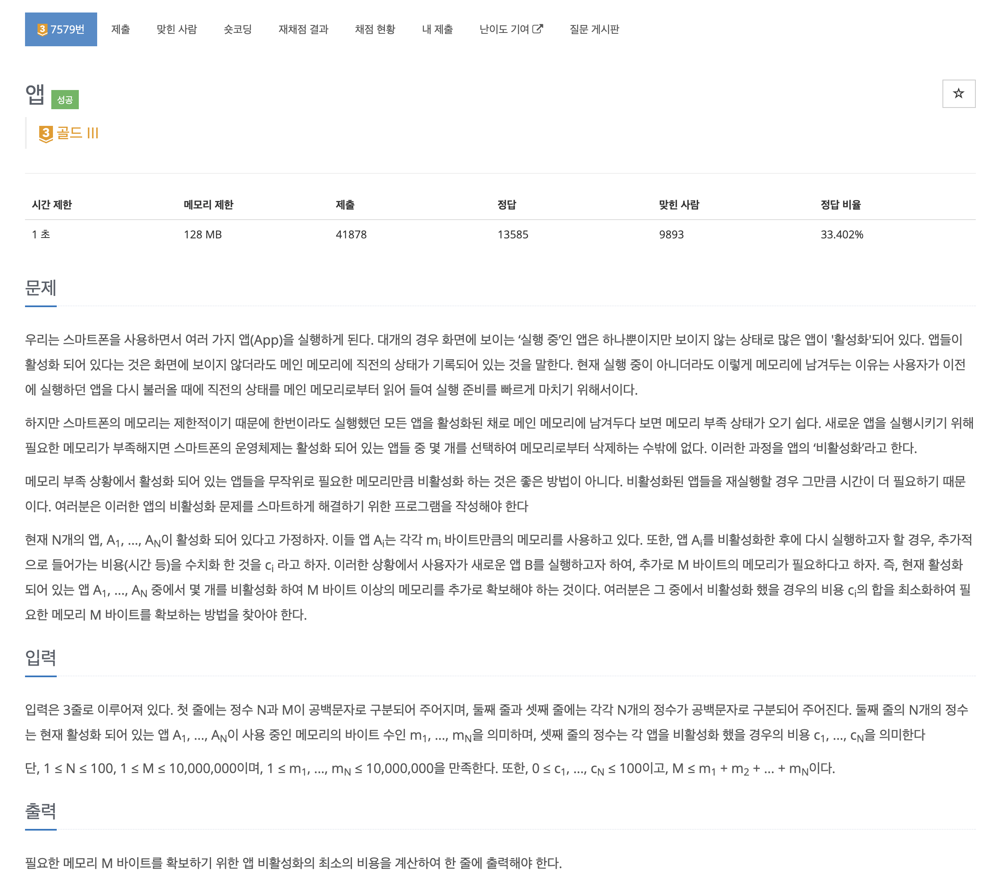
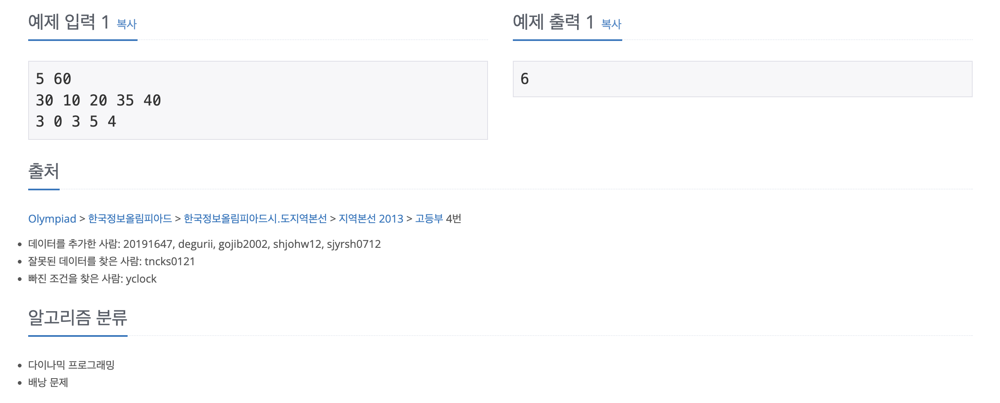

https://www.acmicpc.net/problem/7579

# 🔍 앱

| 항목    | 내용                              |
|-------|---------------------------------|
| 설계 시간 | 15 min                          |
| 구현 시간 | 30 min                          |
| 난이도   | 골드 3                            |
| 알고리즘  | DP, 배낭 문제                       |
| 코드 길이 | 1095B, 1191B                    |
| 실행 시간 | 96ms, 96ms (시간 제한 1초)           |
| 메모리   | 12056KB, 16212KB (메모리 제한 128MB) |

---

# 💡 아이디어

0-1 배낭 문제로 다이나믹 프로그래밍으로 해결할 수 있다.
앱을 비활성화하는 비용을 무게, 앱을 비활성화해서 확보할 수 있는 메모리를 가치로 생각하면 된다.

---

# ✔ 문제 풀이

1차원 dp, 2차원 dp 두 가지 방식으로 모두 풀어봤고 dp 테이블에는 확보할 수 있는 메모리를, 인덱스에는 비활성화하는데 필요한 비용을 두면 된다.
비활성화하는데 필요한 비용이 0일 수 있어서 인덱스 0부터 모두 사용하고 이후 정답을 찾을 때도 0번 인덱스부터 탐색을 해야한다.
정답은 최소 비용으로 M 이상의 메모리를 확보해야하는데 인덱스 자체가 이미 정렬이 된 개념이어서 앞에서부터 순회하면 된다.

---

# 🧠 어려웠던 점

dp 테이블의 기준을 설정하는데 시간이 좀 걸렸다.

---

# 🧐 좋은 풀이
