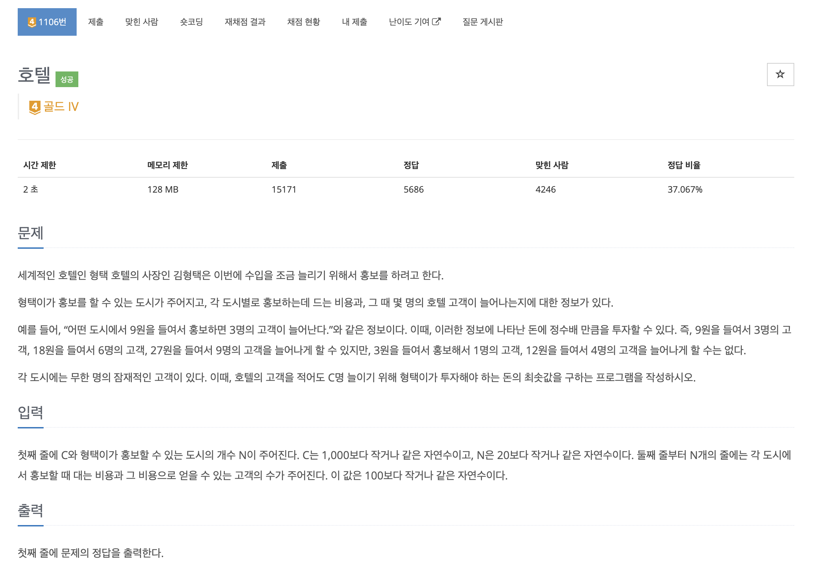

https://www.acmicpc.net/problem/1106

# 🔍 호텔

| 항목    | 내용                              |
|-------|---------------------------------|
| 설계 시간 | 5 min                           |
| 구현 시간 | 20 min                          |
| 난이도   | 골드 4                            |
| 알고리즘  | DP, 배낭 문제                       |
| 코드 길이 | 1356B, 1421B                    |
| 실행 시간 | 68ms, 64ms (시간 제한 2초)           |
| 메모리   | 11684KB, 11768KB (메모리 제한 128MB) |

---

# 💡 아이디어

무한 배낭 문제로 다이나믹 프로그래밍으로 해결할 수 있다.
고객을 무게, 돈을 가치로 생각하면 되며 C명 이상을 담았을 때 최솟값을 구해야 하는 점에 주의해야한다.

---

# ✔ 문제 풀이

1차원 dp, 2차원 dp 두 가지 방식으로 풀어봤고 최솟값을 저장하는 배낭 문제여서 최댓값으로 초기화한 후 최솟값을 저장하도록 했다.
C명 이상인 최솟값을 구해야하는 조건에서 정확히 C명일 때를 구하는게 아님에 주의해야하고 돈을 정수배만큼 투자할 수 있다는 점에서 무한 배낭 문제임에 주의해야한다.
이를 위해 dp의 크기를 C보다 크게 설정해야하는데 한번 배낭에 담을 때 고객이 최대 100명이므로 100만큼 더 크게 설정했고 중복으로 담을 수 있어서 현재 상태와 비교하도록 dp 로직을 구현했다.

---

# 🧠 어려웠던 점

dp 테이블의 크기를 10만으로 고정으로 설정했는데 더 최적화할 수 있을 줄 몰랐다.

---

# 🧐 좋은 풀이
