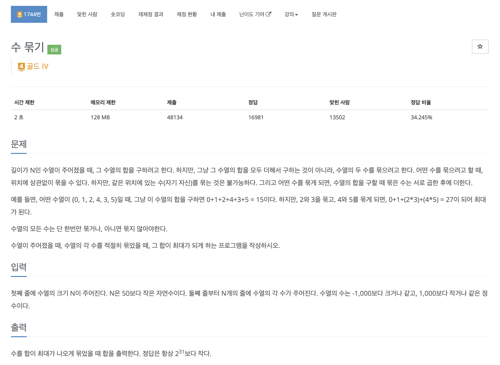
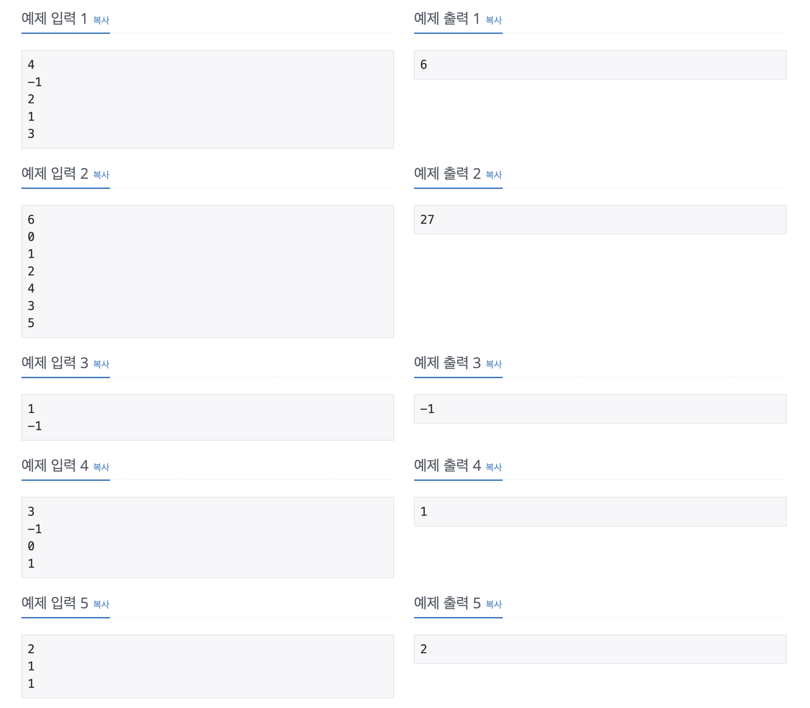
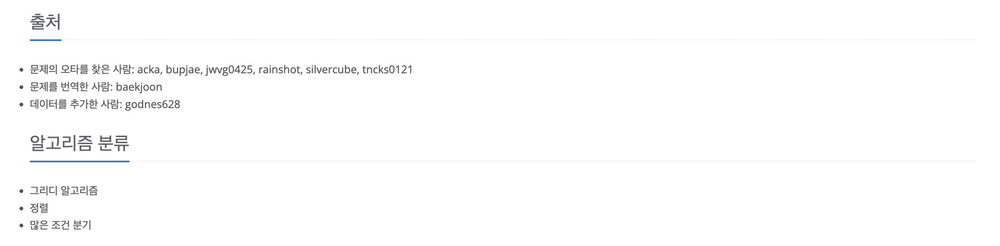

https://www.acmicpc.net/problem/1744

# 🔍 수 묶기

| 항목    | 내용                     |
|-------|------------------------|
| 설계 시간 | 5 min                  |
| 구현 시간 | 20 min                 |
| 난이도   | 골드 4                   |
| 알고리즘  | 그리디 알고리즘               |
| 코드 길이 | 1153B                  |
| 실행 시간 | 64ms (시간 제한 2초)        |
| 메모리   | 11520KB (메모리 제한 128MB) |

---

# 💡 아이디어

그리디 알고리즘으로 해결할 수 있다.
1 보다 큰 정수는 값이 큰 정수부터 2개씩 묶을수록 최대가 되고, 1은 그냥 더할 때 최대가 된다.
0 이하인 정수는 절댓값이 큰 정수부터 2개씩 묶을수록 최대가 된다.

---

# ✔ 문제 풀이

1 보다 큰 정수를 담은 우선순위 큐와 0 이하인 정수를 담은 우선순위 큐 두 개를 활용했다.
1은 따로 담지 않고 바로 더해줬다.
1 보다 큰 정수를 담은 우선순위 큐는 절댓값이 큰 수부터 묶어야하므로 우선순위 큐의 길이가 홀수면 앞의 수 하나는 빼서 그냥 더하고 나머지는 묶는 식으로 구현했고,
0 이하인 정수를 담은 우선순위 큐도 절댓값이 큰 수부터 묶어야하므로 하나밖에 안남아서 묶을 수 없으면 그냥 더하는 조건을 추가했다.

---

# 🧠 어려웠던 점

-1, 0, 1 이 부분에서 그리디 알고리즘의 로직을 검증하는게 약간 어려웠다.

---

# 🧐 좋은 풀이
