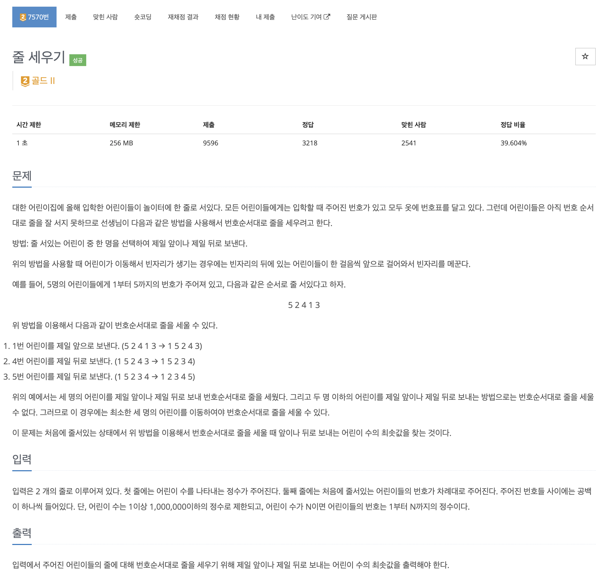
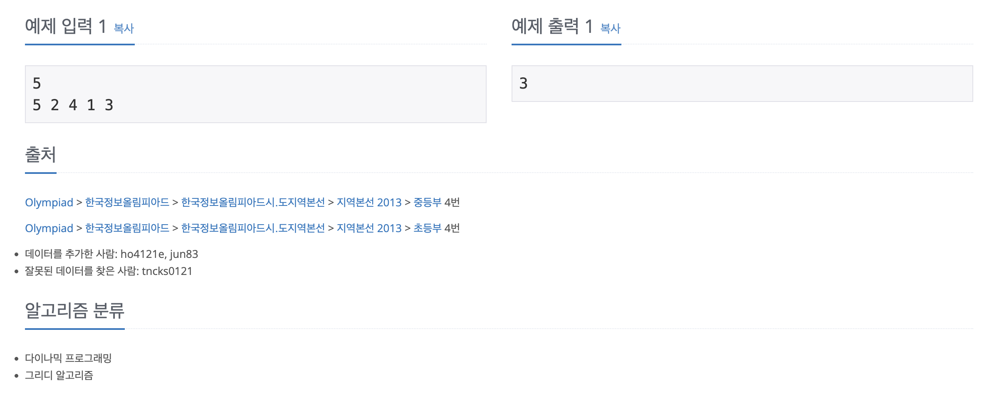

https://www.acmicpc.net/problem/7570

# 🔍 줄 세우기

| 항목    | 내용                      |
|-------|-------------------------|
| 설계 시간 | 60 min                  |
| 구현 시간 | 10 min                  |
| 난이도   | 골드 2                    |
| 알고리즘  | 그리디 알고리즘, DP            |
| 코드 길이 | 669B                    |
| 실행 시간 | 376ms (시간 제한 1초)        |
| 메모리   | 119676KB (메모리 제한 256MB) |

---

# 💡 아이디어

가장 긴 연속하며 증가하는 번호로 이루어진 부분 수열을 구하고 수열에 해당하지 않는 번호를 적절하게 앞 뒤로 이동시키는 그리디 알고리즘과 다이나믹 프로그래밍으로 해결할 수 있다.

---

# ✔ 문제 풀이

dp 배열을 먼저 선언했고 dp 배열은 인덱스에 해당하는 숫자로 끝나는 가장 긴 연속하며 증가하는 부분 수열의 길이를 저장한다.
점화식은 dp[idx] = dp[idx-1] + 1 로 연속해야하므로 해당 숫자보다 1 작은 숫자로 끝나는 가장 긴 연속하며 증가하는 부분 수열의 길이 + 1을 해주면 된다.

---

# 🧠 어려웠던 점

LIS로 접근했는데 안 풀려서 문제 유형을 봤다가 그리디, DP여서 다른 방식을 찾다가 안 풀려서 구글링했는데 연속하는 LIS였다.
O(log N) LIS로 다시 접근했는데 연속하는 LIS를 구할 수 없어서 다시 구글링해서 코드까지 참고하니 기존 LIS랑 전혀 다르게 풀어서 색달랐다.
코드 길이에 비하면 꽤 어려웠던거 같다

---

# 🧐 좋은 풀이
