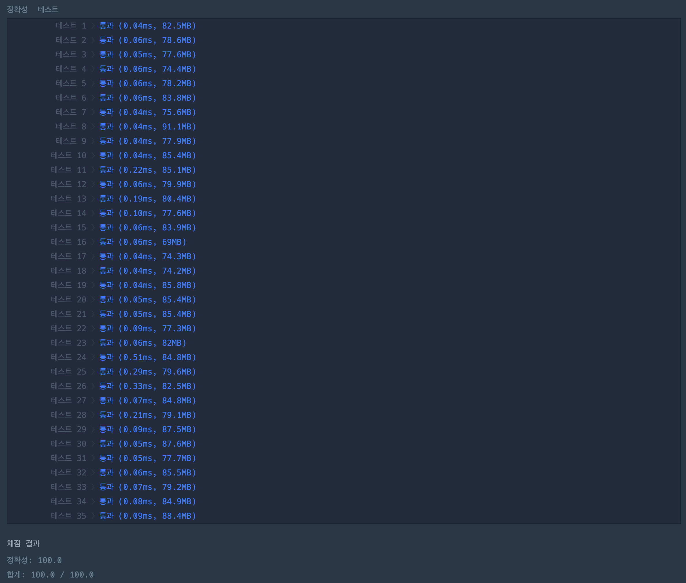

https://school.programmers.co.kr/learn/courses/30/lessons/172927

## 문제 설명

마인은 곡괭이로 광산에서 광석을 캐려고 합니다. 마인은 다이아몬드 곡괭이, 철 곡괭이, 돌 곡괭이를 각각 0개에서 5개까지 가지고 있으며, 곡괭이로 광물을 캘 때는 피로도가 소모됩니다. 각 곡괭이로 광물을 캘 때의
피로도는 아래 표와 같습니다.

예를 들어, 철 곡괭이는 다이아몬드를 캘 때 피로도 5가 소모되며, 철과 돌을 캘때는 피로도가 1씩 소모됩니다. 각 곡괭이는 종류에 상관없이 광물 5개를 캔 후에는 더 이상 사용할 수 없습니다.  
마인은 다음과 같은 규칙을 지키면서 최소한의 피로도로 광물을 캐려고 합니다.

- 사용할 수 있는 곡괭이중 아무거나 하나를 선택해 광물을 캡니다.
- 한 번 사용하기 시작한 곡괭이는 사용할 수 없을 때까지 사용합니다.
- 광물은 주어진 순서대로만 캘 수 있습니다.
- 광산에 있는 모든 광물을 캐거나, 더 사용할 곡괭이가 없을 때까지 광물을 캡니다.

즉, 곡괭이를 하나 선택해서 광물 5개를 연속으로 캐고, 다음 곡괭이를 선택해서 광물 5개를 연속으로 캐는 과정을 반복하며, 더 사용할 곡괭이가 없거나 광산에 있는 모든 광물을 캘 때까지 과정을 반복하면 됩니다.

---

## 제한사항

- `picks`는 `[dia, iron, stone]`과 같은 구조로 이루어져 있습니다.
    - `0 ≤ dia, iron, stone ≤ 5`
    - `dia`는 다이아몬드 곡괭이의 수를 의미합니다.
    - `iron`은 철 곡괭이의 수를 의미합니다.
    - `stone`은 돌 곡괭이의 수를 의미합니다.
    - 곡괭이는 최소 1개 이상 가지고 있습니다.
- `5 ≤ minerals의 길이 ≤ 50`
    - `minerals`는 다음 3개의 문자열로 이루어져 있으며 각각의 의미는 다음과 같습니다.
    - `"diamond"` : 다이아몬드
    - `"iron"` : 철
    - `"stone"` : 돌

---

## 입출력 예

| picks       | minerals                                                                                                     | result |
|-------------|--------------------------------------------------------------------------------------------------------------|--------|
| `[1, 3, 2]` | `["diamond", "diamond", "diamond", "iron", "iron", "diamond", "iron", "stone"]`                              | `12`   |
| `[0, 1, 1]` | `["diamond", "diamond", "diamond", "diamond", "diamond", "iron", "iron", "iron", "iron", "iron", "diamond"]` | `50`   |

---

## 입출력 예 설명

### 입출력 예 #1

다이아몬드 곡괭이로 앞에 다섯 광물을 캐고 철 곡괭이로 남은 다이아몬드, 철, 돌을 1개씩 캐면  
`12(1 + 1 + 1 + 1 + 1 + 5 + 1 + 1)`의 피로도로 캘 수 있으며 이때가 최소값입니다.

### 입출력 예 #2

철 곡괭이로 다이아몬드 5개를 캐고 돌 곡괭이로 철 5개를 캐면  
`50(5×5 + 5×5)`의 피로도로 캘 수 있으며, 이때가 최소값입니다.

# 🔍 광물 캐기

| 항목    | 내용                    |
|-------|-----------------------|
| 설계 시간 | 5 min                 |
| 구현 시간 | 25 min                |
| 난이도   | Lv 2                  |
| 알고리즘  | 구현, 순열과 조합, 백트래킹 |

---

# 💡 아이디어

주어진 곡괭이 중 광물을 캐는데 필요한 곡괭이를 순열로 구하는 방법으로 해결할 수 있다.

---

# ✔ 문제 풀이

주어진 표처럼 곡괭이와 광물로 바로 피로도를 계산하기 위해 2차원 배열을 초기화했고 주어진 광물도 인덱스와 매핑시키기 위해 int 형으로 변경한 배열을 활용했다.
순열의 과정에서 곡괭이를 선택하면 바로 피로도를 계산하고 모든 곡괭이를 선택했을 때 최소 피로도를 계산하도록 했다.
백트래킹으로 현재 피로도가 최소 피로도 이상이면 바로 종료하도록 했다.

---

# 🧠 어려웠던 점

- 구현 디테일이 약간 까다로웠던 것 같다.

---

# 🧐 좋은 풀이
