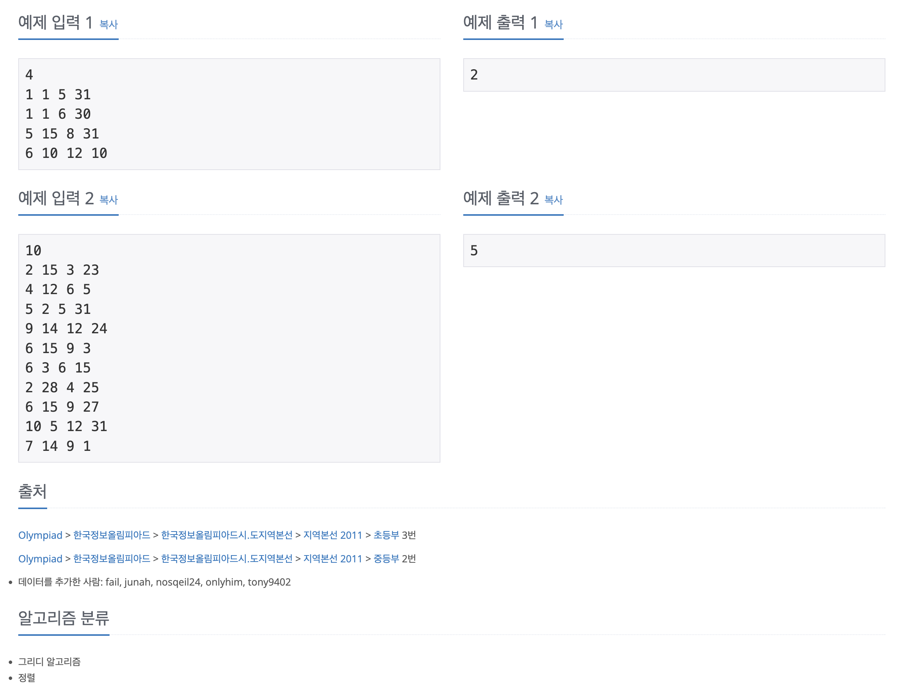

https://www.acmicpc.net/problem/2457

# 🔍 공주님의 정원

| 항목    | 내용                     |
|-------|------------------------|
| 설계 시간 | 50 min                 |
| 구현 시간 | 20 min                 |
| 난이도   | 골드 3                   |
| 알고리즘  | 그리디 알고리즘, 정렬           |
| 코드 길이 | 1545B                  |
| 실행 시간 | 572ms (시간 제한 1초)       |
| 메모리   | 56680KB (메모리 제한 192MB) |

---

# 💡 아이디어

그리디 알고리즘으로 해결할 수 있었다.
시작일에 대한 오름차순 정렬 우선순위 큐와 종료일에 대한 내림차순 우선순위 큐 두 개를 활용해서 3월 1일부터 피어있는 꽃 중 가장 지는 날이 늦을 꽃을 선택하고 현재 날짜를 갱신 후 다시 현재 날짜에 피어 있는 꽃 중 가장 지는 날이 늦은 꽃을 선택하는 과정을 반복했다.

---

# ✔ 문제 풀이

최초 모든 꽃은 시작일에 대한 오름차순 우선순위 큐에 담았다.
이후 현재 날짜를 3월 1일로 세팅해서 3월 1일에 피어져 있는 꽃들을 임시 우선순위 큐에 담고 이 중 가장 지는 날이 늦은 꽃 하나만 선택했다.
이후 현재 날짜를 다시 갱신하고 현재 날짜 기준 피어져 있는 꽃들을 다시 임시 우선순위 큐에 담는 과정을 반복하도록 구현했다.
계산의 편의를 위해 월 * 100 + 일 형식으로 날짜를 처리했고 11월 30일까지 꽃이 피어야 하는 조건만 주의해서 구현하면 됐다.

---

# 🧠 어려웠던 점

날짜 처리가 까다로웠는데 처음에는 1월 1일을 1일, 2월 1일은 32일 이렇게 변환했다가 구글링에서 위 형식으로 처리하는 것을 보고 수정했는데 잘 됐다.

---

# 🧐 좋은 풀이
