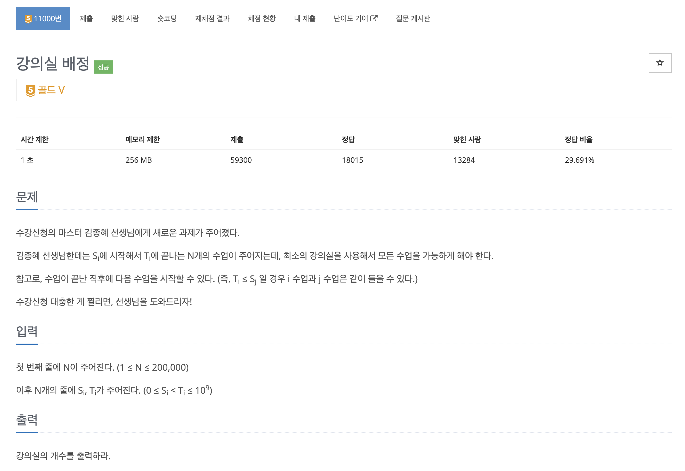
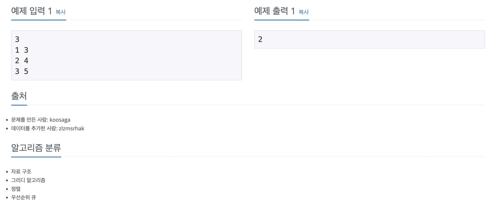

https://www.acmicpc.net/problem/11000

# 🔍 강의실 배정

| 항목    | 내용                     |
|-------|------------------------|
| 설계 시간 | 60 min                 |
| 구현 시간 | 10 min                 |
| 난이도   | 골드 5                   |
| 알고리즘  | 그리디 알고리즘, 정렬, 우선순위 큐   |
| 코드 길이 | 1212B                  |
| 실행 시간 | 664ms (시간 제한 1초)       |
| 메모리   | 76352KB (메모리 제한 256MB) |

---

# 💡 아이디어

그리디 알고리즘으로 해결할 수 있었다.
시작 시간에 대한 오름차순 정렬 우선순위 큐와 종료 시간에 대한 오름차순 우선순위 큐 두 개를 활용해서 해결할 수 있다.

---

# ✔ 문제 풀이

시작 시간에 대한 오름차순 우선순위 큐를 items, 종료 시간에 대한 오름차순 우선순위 큐를 pq로 선언했다.
pq에 items의 첫번째 원소를 삽입한채로 시작하며 pq의 peek의 종료 시간보다 items의 peek의 시작 시간이 늦으면 pq의 해당 강의 뒤에 items의 강의를 붙이는 개념으로 생각할 수 있어서 pq의 해당 원소를 제거했다.
pq에서 제거했으면 뒤에 붙이는 거니 pq에 삽입해야하고 pq에서 제거하지 않았어도 새로운 강의실이 필요한 것이므로 pq에 삽입해야 한다.

---

# 🧠 어려웠던 점

안풀려서 구글링 참고했는데 그리디 알고리즘은 아이디어가 어려운거 같다.

---

# 🧐 좋은 풀이
