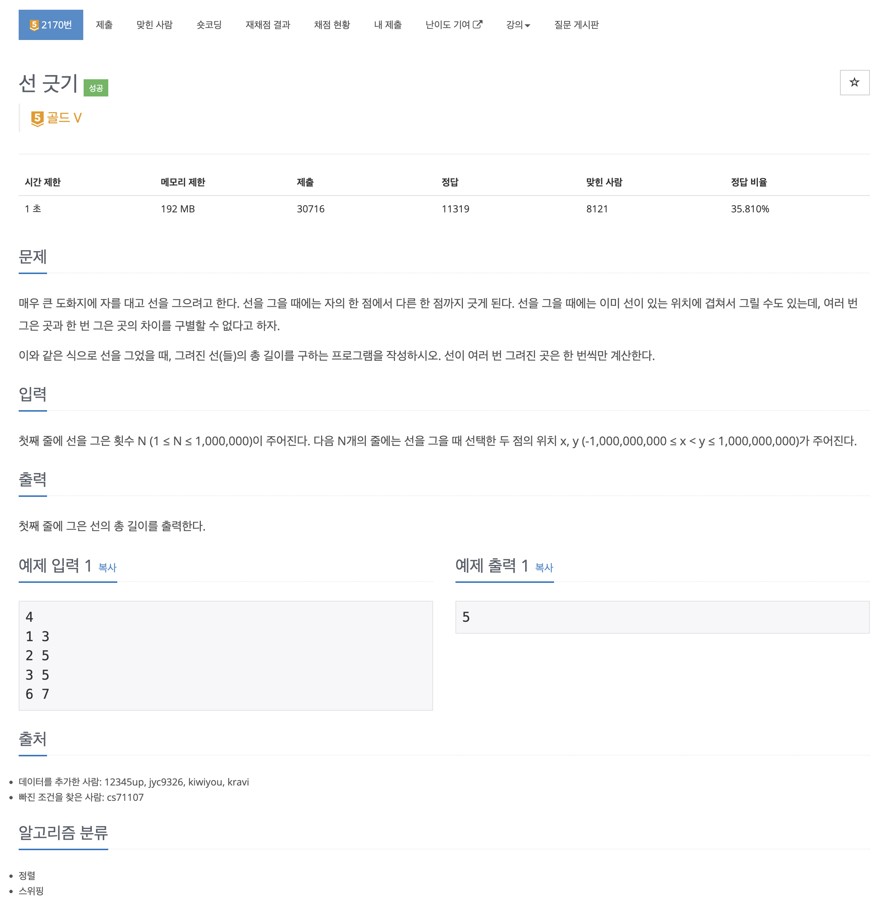

https://www.acmicpc.net/problem/2170

# 🔍 선 긋기

| 항목    | 내용                                |
|-------|-----------------------------------|
| 설계 시간 | 5 min                             |
| 구현 시간 | 15 min                            |
| 난이도   | 골드 5                              |
| 알고리즘  | 그리디 알고리즘, 정렬, 스위핑                 |
| 코드 길이 | 1455B, 1422B                      |
| 실행 시간 | 1740ms, 1532ms (시간 제한 1초)         |
| 메모리   | 328856KB, 324504KB (메모리 제한 192MB) |

---

# 💡 아이디어

그리디 알고리즘과 스위핑 알고리즘으로 해결할 수 있었다.

---

# ✔ 문제 풀이

일반적인 그리디 알고리즘이랑 스위핑 두 가지 방식으로 접근했다.

그리디 알고리즘은 선의 x 좌표를 기준으로 오름차순 정렬한 우선순위 큐(items)와 y 좌표를 기준으로 내림차순 정렬한 우선순위 큐(pq) 두 개를 사용했다.
items에서 원소(item)를 하나씩 꺼내서 pq의 원소(cur)와 비교하며 item과 cur이 겹치는 부분이 있으면 두 선을 합친 선을 pq에 다시 삽입하고 겹치는 부분이 없으면 각각 삽입하는 방식으로 구현했다.
이후 pq의 모든 선을 꺼내서 길이를 합하면 된다.

스위핑은 x 좌표를 기준으로 오름차순, x 좌표가 같으면 y 좌표를 기준으로 오름차순 정렬한 우선순위 큐 하나만 사용했고,
시작점과 끝점을 저장하는 변수 s, e를 사용했다.
우선순위 큐에서 원소를 하나씩 꺼내며 s, e로 이루어진 선과 겹치면 e의 위치만 갱신해주면 되고 겹치지 않으면 s, e의 위치를 갱신하고 선의 길이를 구하면 된다.

---

# 🧠 어려웠던 점

알고리즘 유형이 스위핑이라고 나와서 스위핑으로 해결하는 아이디어를 구글링으로 봤는데 그리디 알고리즘 계열의 스위핑 문제인거 같았다.
우선순위 큐 두 개로 해결하는 방식에 익숙해져 있었는데 참신했다.

---

# 🧐 좋은 풀이
