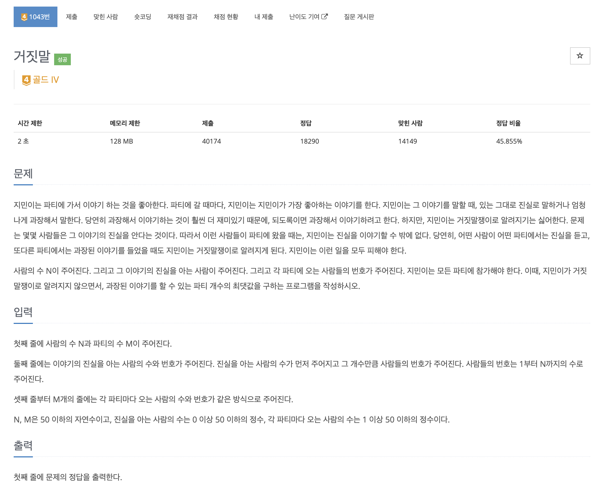
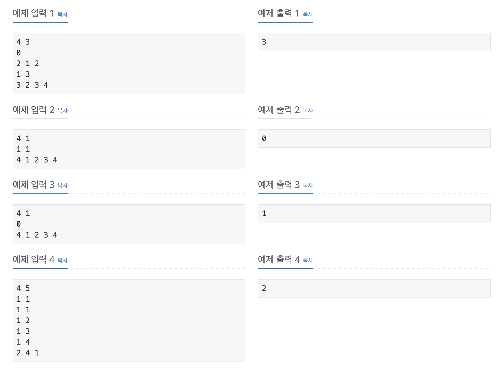
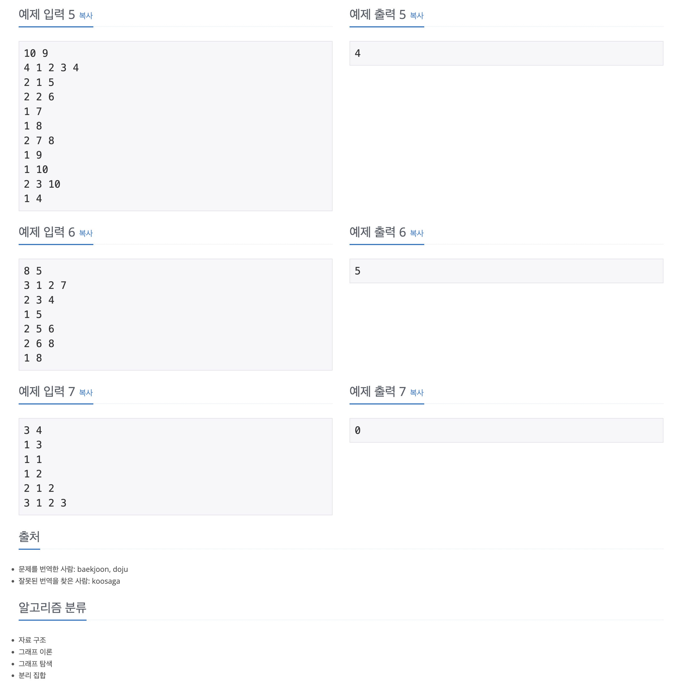

https://www.acmicpc.net/problem/1043

# 🔍 거짓말

| 항목    | 내용                     |
|-------|------------------------|
| 설계 시간 | 15 min                 |
| 구현 시간 | 10 min                 |
| 난이도   | 골드 4                   |
| 알고리즘  | 유니온 파인드 알고리즘           |
| 코드 길이 | 1699B                  |
| 실행 시간 | 68ms (시간 제한 2초)        |
| 메모리   | 11708KB (메모리 제한 128MB) |

---

# 💡 아이디어

유니온 파인드 알고리즘을 통해 각 파티를 집합으로 표현한 후 각 파티의 그룹장만 따로 담아준다.
이후 각 파티의 그룹장이 진실을 아는 지 판단했다.

---

# ✔ 문제 풀이

진실을 아는 사람은 부모의 번호를 0번으로 설정했고 파티의 그룹장은 번호가 작은 사람이 오도록 했다.
유니온 파인드 알고리즘을 통해 그룹을 형성한 후 그룹장만 따로 Queue에 담아줬다.
이러면 Queue의 그룹장의 부모(최고 조상)이 0인지 여부로 그룹에 진실을 말해야하는지 간단하게 판단할 수 있다.

---

# 🧠 어려웠던 점

- 정답율에 비하면 약간 어려운 듯

---

# 🧐 좋은 풀이
