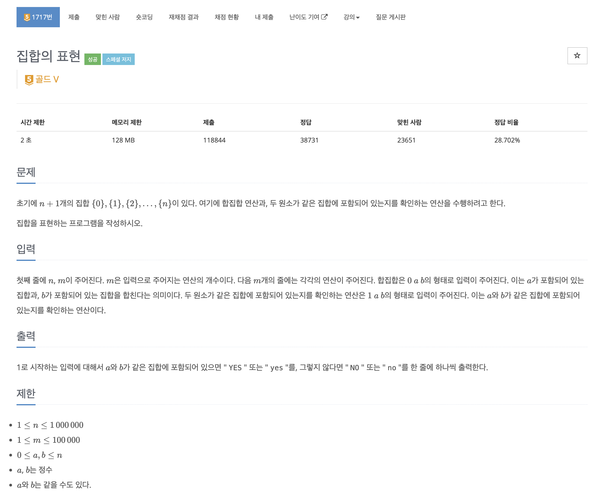
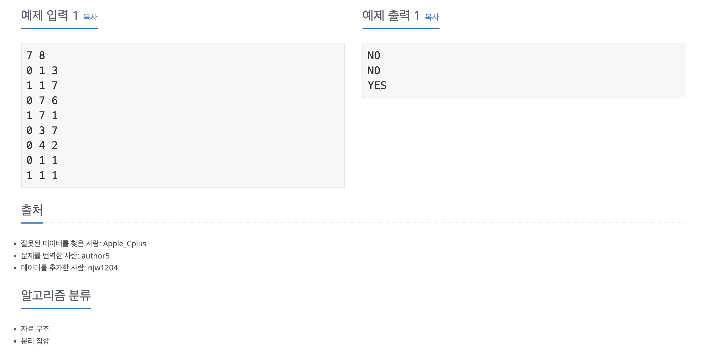

https://www.acmicpc.net/problem/1717

# 🔍 집합의 표현

| 항목    | 내용                     |
|-------|------------------------|
| 설계 시간 | 5 min                  |
| 구현 시간 | 5 min                  |
| 난이도   | 골드 5                   |
| 알고리즘  | 유니온 파인드 알고리즘           |
| 코드 길이 | 1426B                  |
| 실행 시간 | 352ms (시간 제한 2초)       |
| 메모리   | 47104KB (메모리 제한 128MB) |

---

# 💡 아이디어

유니온 파인드 알고리즘으로 해결할 수 있다.

---

# ✔ 문제 풀이

각 집합의 합집합 연산은 union, 같은 집합에 있는 지 확인하는 연산은 find로 구할 수 있다.

---

# 🧠 어려웠던 점

---

# 🧐 좋은 풀이
