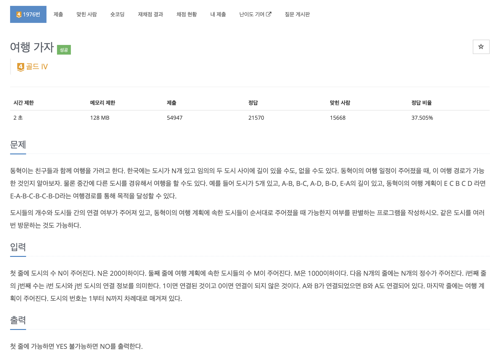

https://www.acmicpc.net/problem/1976

# 🔍 여행 가자

| 항목    | 내용                     |
|-------|------------------------|
| 설계 시간 | 5 min                  |
| 구현 시간 | 5 min                  |
| 난이도   | 골드 4                   |
| 알고리즘  | 유니온 파인드 알고리즘           |
| 코드 길이 | 1324B                  |
| 실행 시간 | 124ms (시간 제한 2초)       |
| 메모리   | 15376KB (메모리 제한 128MB) |

---

# 💡 아이디어

여행을 가려는 도시가 모드 하나의 그래프 안에만 있으면 되므로 유니온 파인드 알고리즘으로 해결할 수 있다.

---

# ✔ 문제 풀이

union 연산으로 그래프를 구성한 후 Set을 활용해 여행가려는 각 도시의 그룹장을 저장했다.
Set의 크기가 1이면 모든 도시가 하나의 그래프 안에 있는 것이므로 여행을 갈 수 있다.

---

# 🧠 어려웠던 점

---

# 🧐 좋은 풀이
