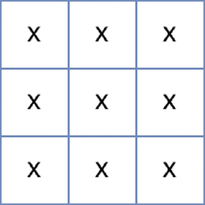

# [Programmers 154540 - 무인도 여행](https://school.programmers.co.kr/learn/courses/30/lessons/154540)

## 문제 설명

메리는 여름을 맞아 무인도로 여행을 가기 위해 지도를 보고 있습니다. 지도에는 바다와 무인도들에 대한 정보가 표시돼 있습니다. 지도는 1 x 1크기의 사각형들로 이루어진 직사각형 격자 형태이며, 격자의 각 칸에는 'X' 또는 1에서 9 사이의 자연수가 적혀있습니다. 지도의 'X'는 바다를 나타내며, 숫자는 무인도를 나타냅니다. 이때, 상, 하, 좌, 우로 연결되는 땅들은 하나의 무인도를 이룹니다. 지도의 각 칸에 적힌 숫자는 식량을 나타내는데, 상, 하, 좌, 우로 연결되는 칸에 적힌 숫자를 모두 합한 값은 해당 무인도에서 최대 며칠동안 머물 수 있는지를 나타냅니다. 어떤 섬으로 놀러 갈지 못 정한 메리는 우선 각 섬에서 최대 며칠씩 머물 수 있는지 알아본 후 놀러갈 섬을 결정하려 합니다.

지도를 나타내는 문자열 배열 `maps`가 매개변수로 주어질 때, 각 섬에서 최대 며칠씩 머무를 수 있는지 배열에 오름차순으로 담아 return 하는 solution 함수를 완성해주세요. 만약 지낼 수 있는 무인도가 없다면 -1을 배열에 담아 return 해주세요.

## 제한 사항

- 3 ≤ `maps`의 길이 ≤ 100
  - 3 ≤ `maps[i]`의 길이 ≤ 100
  - `maps[i]`는 'X' 또는 1 과 9 사이의 자연수로 이루어진 문자열입니다.
  - 지도는 직사각형 형태입니다.

## 입출력 예

| maps                               | result     |
| ---------------------------------- | ---------- |
| ["X591X","X1X5X","X231X", "1XXX1"] | [1, 1, 27] |
| ["XXX","XXX","XXX"]                | [-1]       |

## 입출력 예 설명

입출력 예 #1

위 문자열은 다음과 같은 지도를 나타냅니다.


연결된 땅들의 값을 합치면 다음과 같으며


이를 오름차순으로 정렬하면 [1, 1, 27]이 됩니다.

입출력 예 #2

위 문자열은 다음과 같은 지도를 나타냅니다.



섬이 존재하지 않기 때문에 -1을 배열에 담아 반환합니다.

---

## 문제 정보

| 난이도 | Lv.2 |
| ------ | ---- |
| 정답률 | 49%  |

## 풀이 정보

| 풀이 시간 | 29 min |
| --------- | ------ |
| 알고리즘  | BFS    |

| 정확성 테스트                      |
| ---------------------------------- |
| 테스트 1 〉 통과 (0.28ms, 74.9MB)  |
| 테스트 2 〉 통과 (0.27ms, 84.8MB)  |
| 테스트 3 〉 통과 (0.36ms, 85.4MB)  |
| 테스트 4 〉 통과 (0.42ms, 73.7MB)  |
| 테스트 5 〉 통과 (1.15ms, 80.6MB)  |
| 테스트 6 〉 통과 (2.15ms, 88.2MB)  |
| 테스트 7 〉 통과 (1.61ms, 75.9MB)  |
| 테스트 8 〉 통과 (2.94ms, 73MB)    |
| 테스트 9 〉 통과 (2.86ms, 72.8MB)  |
| 테스트 10 〉 통과 (2.55ms, 74.2MB) |
| 테스트 11 〉 통과 (2.63ms, 92.2MB) |
| 테스트 12 〉 통과 (3.42ms, 80.7MB) |
| 테스트 13 〉 통과 (3.29ms, 73.9MB) |
| 테스트 14 〉 통과 (6.93ms, 81.6MB) |
| 테스트 15 〉 통과 (4.77ms, 92.7MB) |
| 테스트 16 〉 통과 (5.27ms, 87MB)   |
| 테스트 17 〉 통과 (0.68ms, 90.6MB) |
| 테스트 18 〉 통과 (5.23ms, 84.8MB) |
| 테스트 19 〉 통과 (8.78ms, 88.1MB) |
| 테스트 20 〉 통과 (1.11ms, 72.9MB) |
| 테스트 21 〉 통과 (3.77ms, 79.8MB) |
| 테스트 22 〉 통과 (0.35ms, 81.6MB) |
| 테스트 23 〉 통과 (8.21ms, 76.1MB) |
| 테스트 24 〉 통과 (4.87ms, 91.6MB) |
| 테스트 25 〉 통과 (0.44ms, 90.5MB) |

## 코드

```java
import java.util.*;

class Solution {

    // 상우하좌 방향 배열
    private static final int[] dr = {-1, 0, 1, 0};
    private static final int[] dc = {0, 1, 0, -1};

    public int[] solution(String[] maps) {
        int[][] map = init(maps);  // 2차원 int 배열로 변환

        List<Integer> list = new ArrayList<>();  // 무인도별 머물 수 있는 날 임시 저장
        for (int i = 0; i < map.length; i++) {
            for (int j = 0; j < map[i].length; j++) {
                if (map[i][j] == 0) continue;

                int result = bfs(i, j, map.length, map[i].length, map);
                list.add(result);
            }
        }
        list.sort(Comparator.naturalOrder());  // 오름차순 정렬

        if (list.isEmpty()) return new int[]{-1};  // 지낼 수 있는 무인도가 없으면 -1을 배열에 담아 반환
        return listToArray(list);  // list를 배열로 변환해서 반환
    }

    private static int[][] init(String[] maps) {
        int[][] map = new int[maps.length][maps[0].length()];

        for (int i = 0; i < maps.length; i++) {
            for (int j = 0; j < maps[i].length(); j++) {
                char c = maps[i].charAt(j);

                if (c != 'X') map[i][j] = Character.getNumericValue(c);
            }
        }

        return map;
    }

    // 원본 무인도를 변경하여 방문 체크(방문한 땅을 바다로 변환)
    private static int bfs(int r, int c, int N, int M, int[][] map) {
        int sum = 0;

        Queue<int[]> q = new ArrayDeque<>();
        q.offer(new int[]{r, c});
        sum += map[r][c];
        map[r][c] = 0;

        while (!q.isEmpty()) {
            int[] node = q.poll();

            for (int dir = 0; dir < 4; dir++) {
                int nr = node[0] + dr[dir];
                int nc = node[1] + dc[dir];

                if (nr < 0 || nr >= N || nc < 0 || nc >= M) continue;
                if (map[nr][nc] == 0) continue;

                q.offer(new int[]{nr, nc});
                sum += map[nr][nc];
                map[nr][nc] = 0;
            }
        }

        return sum;
    }

    private static int[] listToArray(List<Integer> list) {
        int[] arr = new int[list.size()];

        for (int i = 0; i < arr.length; i++) {
            arr[i] = list.get(i);
        }

        return arr;
    }
}
```

## 해설

2차원으로 표현되는 지도에서 무인도의 크기를 오름차순으로 정렬된 배열로 반환하는 문제로 BFS를 활용하면 간단하게 해결할 수 있다. `String[]`로 주어지는 입력이 탐색에 까다롭기에 2차원 int형 배열로 변환을 한 후 BFS를 통해 무인도가 발견되면 크기를 받아서 임시로 리스트에 저장했고 이후 정렬하고 int형 배열로 변환해서 반환하는 방식으로 구현했다. BFS는 지도를 한 번만 탐색하면 돼서 그냥 지도에서 방문한 곳을 바다로 바꾸는 방식으로 방문 체크를 처리해줬다.

## 리뷰

배열은 길이를 `.length` 처럼 필드로, 문자열은 `.length()` 처럼 메서드로 받아야하는데 이 부분을 헷갈리면 디버깅에 약간 시간이 걸릴 것 같았다. 리스트를 오름차순으로 정렬하는 `list.sort(Comparator.naturalOrder());` 파트에서 `naturalOrder()`가 `Collections`의 메서드로 착각해서 디버깅에 시간이 좀 걸렸다.

---
