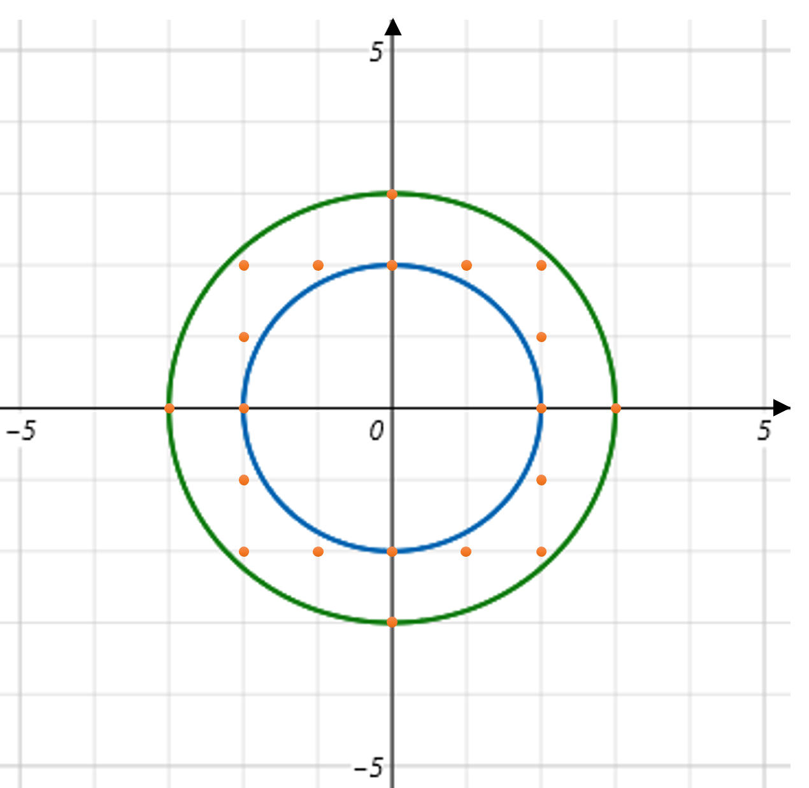

# [Programmers 181187 - 두 원 사이의 정수 쌍](https://school.programmers.co.kr/learn/courses/30/lessons/181187)

## 문제 설명

x축과 y축으로 이루어진 2차원 직교 좌표계에 중심이 원점인 서로 다른 크기의 원이 두 개 주어집니다. 반지름을 나타내는 두 정수 `r1`, `r2`가 매개변수로 주어질 때, 두 원 사이의 공간에 x좌표와 y좌표가 모두 정수인 점의 개수를 return하도록 solution 함수를 완성해주세요.

※ 각 원 위의 점도 포함하여 셉니다.

## 제한 사항

- 1 ≤ `r1` < `r2` ≤ 1,000,000

## 입출력 예

| r1  | r2  | result |
| --- | --- | ------ |
| 2   | 3   | 20     |

## 입출력 예 설명



그림과 같이 정수 쌍으로 이루어진 점은 총 20개 입니다.

---

## 문제 정보

| 난이도 | Lv.2 |
| ------ | ---- |
| 정답률 | 41%  |

## 풀이 정보

| 풀이 시간 | 40 min                |
| --------- | --------------------- |
| 알고리즘  | 수학, 피타고라스 정리 |

| 정확성 테스트                       |
| ----------------------------------- |
| 테스트 1 〉 통과 (0.25ms, 88.3MB)   |
| 테스트 2 〉 통과 (0.30ms, 82.4MB)   |
| 테스트 3 〉 통과 (0.36ms, 86MB)     |
| 테스트 4 〉 통과 (0.64ms, 81.9MB)   |
| 테스트 5 〉 통과 (0.61ms, 74.3MB)   |
| 테스트 6 〉 통과 (0.80ms, 76.1MB)   |
| 테스트 7 〉 통과 (10.66ms, 87.4MB)  |
| 테스트 8 〉 통과 (11.55ms, 96.2MB)  |
| 테스트 9 〉 통과 (10.36ms, 76.3MB)  |
| 테스트 10 〉 통과 (12.97ms, 75.3MB) |

## 코드

```java
class Solution {
    public long solution(int r1, int r2) {
        long answer = 0;

        // 1사분면에 해당하는 좌표 수만 계산
        for (long x = 1; x <= r2; x++) {
            int max = (int) Math.sqrt((long) r2 * r2 - x * x);
            int min = (int) Math.ceil(Math.sqrt((long) r1 * r1 - x * x));
            answer += max - min + 1;
        }

        // 전체 좌표 수 반환
        return answer * 4;
    }
}
```

## 해설

피타고라스의 정리를 통해 x, y 좌표의 후보를 탐색하는 것이 기본 방향성이다. 원은 상하좌우 대칭이므로 1사분면에 대해서만 계산 후 4배를 해주면 전체 좌표의 수를 구할 수 있다.

1사분면의 좌표 수는 좌표 축에서 중복 계산이 되는 것을 방지하기 위헤 x를 1부터 r2까지 늘리며 진행했고 큰 원과 작은 원의 경계 간 거리 차를 통해 좌표 수를 셀 수 있다. 큰 원의 경우 피타고라스 정리와 Math.sqrt 메서드를 통해 계산 후 정수로 다운 캐스팅하면 나머지가 버림 처리 되어서 딱 걸칠 때랑 안 걸칠 때 모두 원 경계거나 내부 점을 구할 수 있다. 작은 원의 경우 동일하게 계산 후 Math.ceil 메서드를 통해 올림 처리를 해야 원의 외부 점을 정확하게 구할 수 있다.

## 리뷰

각 x 좌표에 대한 두 원의 y 좌표 거리를 비교하면 해결할 수 있는데 이걸 자꾸 반복문으로 하나하나 세는 비효율로 시간 초과가 발생했다. 집중력이 좀 더 필요할 것 같다. 추가로 Math.ceil 메서드는 코딩테스트에서 잘 사용하지 않는 메서드인데 모르면 약간은 억울할만한 문제인거 같다.

---
