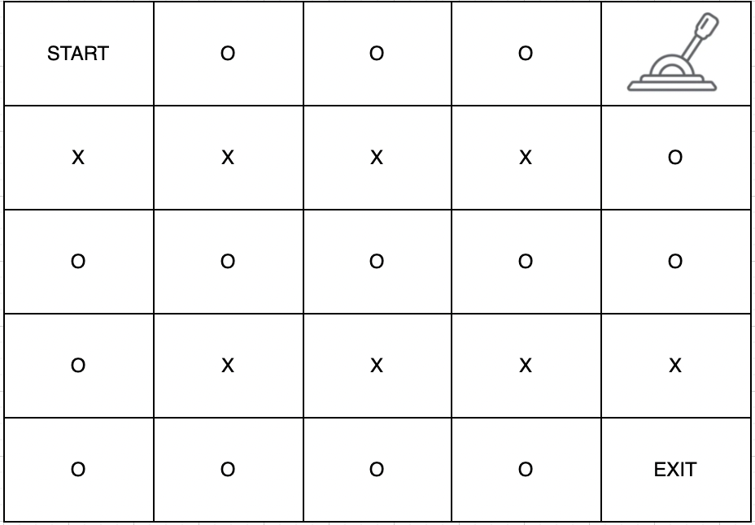

# [Programmers 159993 - 미로 탈출](https://school.programmers.co.kr/learn/courses/30/lessons/159993)

## 문제 설명

1 x 1 크기의 칸들로 이루어진 직사각형 격자 형태의 미로에서 탈출하려고 합니다. 각 칸은 통로 또는 벽으로 구성되어 있으며, 벽으로 된 칸은 지나갈 수 없고 통로로 된 칸으로만 이동할 수 있습니다. 통로들 중 한 칸에는 미로를 빠져나가는 문이 있는데, 이 문은 레버를 당겨서만 열 수 있습니다. 레버 또한 통로들 중 한 칸에 있습니다. 따라서, 출발 지점에서 먼저 레버가 있는 칸으로 이동하여 레버를 당긴 후 미로를 빠져나가는 문이 있는 칸으로 이동하면 됩니다. 이때 아직 레버를 당기지 않았더라도 출구가 있는 칸을 지나갈 수 있습니다. 미로에서 한 칸을 이동하는데 1초가 걸린다고 할 때, 최대한 빠르게 미로를 빠져나가는데 걸리는 시간을 구하려 합니다.

미로를 나타낸 문자열 배열 `maps`가 매개변수로 주어질 때, 미로를 탈출하는데 필요한 최소 시간을 return 하는 solution 함수를 완성해주세요. 만약, 탈출할 수 없다면 -1을 return 해주세요.

## 제한 사항

- 5 ≤ `maps`의 길이 ≤ 100
  - 5 ≤ `maps[i]`의 길이 ≤ 100
  - `maps[i]`는 다음 5개의 문자들로만 이루어져 있습니다.
    - S : 시작 지점
    - E : 출구
    - L : 레버
    - O : 통로
    - X : 벽
  - 시작 지점과 출구, 레버는 항상 다른 곳에 존재하며 한 개씩만 존재합니다.
  - 출구는 레버가 당겨지지 않아도 지나갈 수 있으며, 모든 통로, 출구, 레버, 시작점은 여러 번 지나갈 수 있습니다.

## 입출력 예

| maps                                      | result |
| ----------------------------------------- | ------ |
| ["SOOOL","XXXXO","OOOOO","OXXXX","OOOOE"] | 16     |
| ["LOOXS","OOOOX","OOOOO","OOOOO","EOOOO"] | -1     |

## 입출력 예 설명

입출력 예 #1

주어진 문자열은 다음과 같은 미로이며



다음과 같이 이동하면 가장 빠른 시간에 탈출할 수 있습니다.


4번 이동하여 레버를 당기고 출구까지 이동하면 총 16초의 시간이 걸립니다. 따라서 16을 반환합니다.

입출력 예 #2

주어진 문자열은 다음과 같은 미로입니다.


시작 지점에서 이동할 수 있는 공간이 없어서 탈출할 수 없습니다. 따라서 -1을 반환합니다.

---

## 문제 정보

| 난이도 | Lv.2 |
| ------ | ---- |
| 정답률 | 53%  |

## 풀이 정보

| 풀이 시간 | 19 min |
| --------- | ------ |
| 알고리즘  | BFS    |

| 정확성 테스트                      |
| ---------------------------------- |
| 테스트 1 〉 통과 (0.10ms, 73.9MB)  |
| 테스트 2 〉 통과 (0.23ms, 84.4MB)  |
| 테스트 3 〉 통과 (0.58ms, 89.4MB)  |
| 테스트 4 〉 통과 (0.32ms, 77.1MB)  |
| 테스트 5 〉 통과 (0.27ms, 79.6MB)  |
| 테스트 6 〉 통과 (0.15ms, 74MB)    |
| 테스트 7 〉 통과 (1.47ms, 88.9MB)  |
| 테스트 8 〉 통과 (2.36ms, 89.9MB)  |
| 테스트 9 〉 통과 (0.16ms, 78.9MB)  |
| 테스트 10 〉 통과 (0.07ms, 75.9MB) |
| 테스트 11 〉 통과 (0.96ms, 83.1MB) |
| 테스트 12 〉 통과 (3.21ms, 75.5MB) |
| 테스트 13 〉 통과 (2.73ms, 88.3MB) |
| 테스트 14 〉 통과 (3.06ms, 73.9MB) |
| 테스트 15 〉 통과 (0.86ms, 82.2MB) |
| 테스트 16 〉 통과 (4.06ms, 85.7MB) |
| 테스트 17 〉 통과 (6.54ms, 80.6MB) |
| 테스트 18 〉 통과 (0.41ms, 76.4MB) |
| 테스트 19 〉 통과 (0.36ms, 88.3MB) |
| 테스트 20 〉 통과 (3.73ms, 84MB)   |
| 테스트 21 〉 통과 (1.43ms, 83.6MB) |
| 테스트 22 〉 통과 (0.24ms, 75.3MB) |
| 테스트 23 〉 통과 (0.10ms, 74.3MB) |

## 코드

```java
import java.util.*;

class Solution {

    // 상우하좌 방향 배열
    private static final int[] dr = {-1, 0, 1, 0};
    private static final int[] dc = {0, 1, 0, -1};

    public int solution(String[] maps) {
        int[] start = new int[2];
        int[] end = new int[2];
        int[] lever = new int[2];

        // 주어진 maps를 2차원 char 배열로 변환하고 시작 지점, 출구, 레버의 위치 저장
        char[][] map = new char[maps.length][maps[0].length()];
        for (int i = 0; i < maps.length; i++) {
            for (int j = 0; j < maps[i].length(); j++) {
                char c = maps[i].charAt(j);

                if (c == 'S') {
                    start[0] = i;
                    start[1] = j;
                } else if (c == 'E') {
                    end[0] = i;
                    end[1] = j;
                } else if (c == 'L') {
                    lever[0] = i;
                    lever[1] = j;
                }

                map[i][j] = c;
            }
        }

        int answer = 0;

        // 시작 지점에서 레버까지 bfs 탐색으로 이동 가능한지 판단
        int startToLever = bfs(start, lever, map.length, map[0].length, map);
        if (startToLever == -1) return -1;
        answer += startToLever;

        // 레버에서 출구까지 bfs 탐색으로 이동 가능한지 판단
        int leverToEnd = bfs(lever, end, map.length, map[0].length, map);
        if (leverToEnd == -1) return -1;
        answer += leverToEnd;

        return answer;
    }

    private static int bfs(int[] from, int[] to, int N, int M, char[][] map) {
        Queue<int[]> q = new ArrayDeque<>();
        q.offer(from);

        boolean[][] visited = new boolean[N][M];
        visited[from[0]][from[1]] = true;

        int dist = 0;

        while (!q.isEmpty()) {
            int len = q.size();

            for (int i = 0; i < len; i++) {
                int[] node = q.poll();

                if (node[0] == to[0] && node[1] == to[1]) return dist;

                for (int dir = 0; dir < 4; dir++) {
                    int nr = node[0] + dr[dir];
                    int nc = node[1] + dc[dir];

                    if (nr < 0 || nr >= N || nc < 0 || nc >= M) continue;
                    if (map[nr][nc] == 'X' || visited[nr][nc]) continue;

                    q.offer(new int[]{nr, nc});
                    visited[nr][nc] = true;
                }
            }

            dist++;
        }

        return -1;
    }
}
```

## 해설

시작 지점에서 출구로 빠져나가야 하는데 레버를 당겨야 빠져나갈 수 있는 상황이다. 최대한 빠르게 미로를 탈출하려면 시작 지점에서 레버가 있는 곳을 방문하고 다시 레버가 있는 곳에서 출구까지 방문하면 된다. 두 가지 경로를 각각 bfs로 처리했으며 하나씩 존재하는 시작 지점, 레버 위치, 출구를 미리 찾아서 bfs에 전달하면 된다. bfs는 최단 거리 bfs로 큐의 길이만큼 탐색하는 로직만 추가해주면 된다.

## 리뷰

최단 거리 bfs를 오랜만에 구현해서 큐의 길이를 따로 변수로 빼고 해당 변수만큼 반복하는 것을 까먹어서 큐의 길이만큼 바로 반복문을 돌리는 실수를 했다. 반복문 내에서 큐에 원소를 집어 넣으므로 주의해야했다.

---
