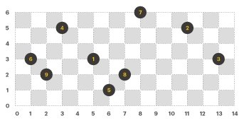
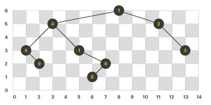

# [Programmers 42892 - 길 찾기 게임](https://school.programmers.co.kr/learn/courses/30/lessons/42892)

## 문제 설명

### 길 찾기 게임

전무로 승진한 라이언은 기분이 너무 좋아 프렌즈를 이끌고 특별 휴가를 가기로 했다.  
내친김에 여행 계획까지 구상하던 라이언은 재미있는 게임을 생각해냈고 역시 전무로 승진할만한 인재라고 스스로에게 감탄했다.

라이언이 구상한(그리고 아마도 라이언만 즐거울만한) 게임은, 카카오 프렌즈를 두 팀으로 나누고, 각 팀이 같은 곳을 다른 순서로 방문하도록 해서 먼저 순회를 마친 팀이 승리하는 것이다.

그냥 지도를 주고 게임을 시작하면 재미가 덜해지므로, 라이언은 방문할 곳의 2차원 좌표 값을 구하고 각 장소를 이진트리의 노드가 되도록 구성한 후, 순회 방법을 힌트로 주어 각 팀이 스스로 경로를 찾도록 할 계획이다.

라이언은 아래와 같은 특별한 규칙으로 트리 노드들을 구성한다.

- 트리를 구성하는 모든 노드의 x, y 좌표 값은 정수이다.
- 모든 노드는 서로 다른 x값을 가진다.
- 같은 레벨(level)에 있는 노드는 같은 y 좌표를 가진다.
- 자식 노드의 y 값은 항상 부모 노드보다 작다.
- 임의의 노드 V의 왼쪽 서브 트리(left subtree)에 있는 모든 노드의 x값은 V의 x값보다 작다.
- 임의의 노드 V의 오른쪽 서브 트리(right subtree)에 있는 모든 노드의 x값은 V의 x값보다 크다.

아래 예시를 확인해보자.

라이언의 규칙에 맞게 이진트리의 노드만 좌표 평면에 그리면 다음과 같다. (이진트리의 각 노드에는 1부터 N까지 순서대로 번호가 붙어있다.)



이제, 노드를 잇는 간선(edge)을 모두 그리면 아래와 같은 모양이 된다.



위 이진트리에서 전위 순회(preorder), 후위 순회(postorder)를 한 결과는 다음과 같고, 이것은 각 팀이 방문해야 할 순서를 의미한다.

- 전위 순회 : 7, 4, 6, 9, 1, 8, 5, 2, 3
- 후위 순회 : 9, 6, 5, 8, 1, 4, 3, 2, 7

다행히 두 팀 모두 머리를 모아 분석한 끝에 라이언의 의도를 간신히 알아차렸다.

그러나 여전히 문제는 남아있다. 노드의 수가 예시처럼 적다면 쉽게 해결할 수 있겠지만, 예상대로 라이언은 그렇게 할 생각이 전혀 없었다.

이제 당신이 나설 때가 되었다.

곤경에 빠진 카카오 프렌즈를 위해 이진트리를 구성하는 노드들의 좌표가 담긴 배열 nodeinfo가 매개변수로 주어질 때,
노드들로 구성된 이진트리를 전위 순회, 후위 순회한 결과를 2차원 배열에 순서대로 담아 return 하도록 solution 함수를 완성하자.

## 제한 사항

- nodeinfo는 이진트리를 구성하는 각 노드의 좌표가 1번 노드부터 순서대로 들어있는 2차원 배열이다.
  - nodeinfo의 길이는 `1` 이상 `10,000` 이하이다.
  - nodeinfo[i] 는 i + 1번 노드의 좌표이며, [x축 좌표, y축 좌표] 순으로 들어있다.
  - 모든 노드의 좌표 값은 `0` 이상 `100,000` 이하인 정수이다.
  - 트리의 깊이가 `1,000` 이하인 경우만 입력으로 주어진다.
  - 모든 노드의 좌표는 문제에 주어진 규칙을 따르며, 잘못된 노드 위치가 주어지는 경우는 없다.

## 입출력 예

| nodeinfo                                                  | result                                    |
| --------------------------------------------------------- | ----------------------------------------- |
| [[5,3],[11,5],[13,3],[3,5],[6,1],[1,3],[8,6],[7,2],[2,2]] | [[7,4,6,9,1,8,5,2,3],[9,6,5,8,1,4,3,2,7]] |

## 입출력 예 설명

입출력 예 #1

문제에 주어진 예시와 같다.

---

## 문제 정보

| 난이도 | Lv.3 |
| ------ | ---- |
| 정답률 | 39%  |

## 풀이 정보

| 풀이 시간 | 120 + 15 min |
| --------- | ------------ |
| 알고리즘  | 트리         |

| 정확성 테스트                       |
| ----------------------------------- |
| 테스트 1 〉 통과 (0.68ms, 87MB)     |
| 테스트 2 〉 통과 (0.70ms, 81.2MB)   |
| 테스트 3 〉 통과 (0.75ms, 70.3MB)   |
| 테스트 4 〉 통과 (0.71ms, 71.6MB)   |
| 테스트 5 〉 통과 (0.65ms, 91.1MB)   |
| 테스트 6 〉 통과 (7.95ms, 75.5MB)   |
| 테스트 7 〉 통과 (6.43ms, 86.3MB)   |
| 테스트 8 〉 통과 (9.66ms, 101MB)    |
| 테스트 9 〉 통과 (22.85ms, 94.4MB)  |
| 테스트 10 〉 통과 (5.18ms, 80.9MB)  |
| 테스트 11 〉 통과 (22.95ms, 97.7MB) |
| 테스트 12 〉 통과 (22.64ms, 105MB)  |
| 테스트 13 〉 통과 (1.25ms, 74.5MB)  |
| 테스트 14 〉 통과 (2.92ms, 93.3MB)  |
| 테스트 15 〉 통과 (8.47ms, 102MB)   |
| 테스트 16 〉 통과 (14.16ms, 94.2MB) |
| 테스트 17 〉 통과 (2.88ms, 99.9MB)  |
| 테스트 18 〉 통과 (14.80ms, 94.6MB) |
| 테스트 19 〉 통과 (4.06ms, 76.1MB)  |
| 테스트 20 〉 통과 (8.40ms, 94MB)    |
| 테스트 21 〉 통과 (11.34ms, 91.9MB) |
| 테스트 22 〉 통과 (14.63ms, 102MB)  |
| 테스트 23 〉 통과 (17.87ms, 90.2MB) |
| 테스트 24 〉 통과 (0.68ms, 85.1MB)  |
| 테스트 25 〉 통과 (0.77ms, 71.3MB)  |
| 테스트 26 〉 통과 (9.57ms, 87.7MB)  |
| 테스트 27 〉 통과 (0.77ms, 81.5MB)  |
| 테스트 28 〉 통과 (0.69ms, 74.4MB)  |
| 테스트 29 〉 통과 (0.72ms, 83.2MB)  |

## 코드

```java
import java.util.*;

class Solution {

    // 이진 트리를 구성할 노드 클래스
    private static class Node {
        private int num;
        private int x;
        private int y;
        private Node left;
        private Node right;

        public Node(int num, int x, int y) {
            this.num = num;
            this.x = x;
            this.y = y;
        }
    }

    private static final List<Integer> preorderList = new ArrayList<>();  // 전위 순회 결과를 담을 리스트
    private static final List<Integer> postorderList = new ArrayList<>();  // 후위 순회 결과를 담을 리스트

    public int[][] solution(int[][] nodeinfo) {
        Node[] nodes = new Node[nodeinfo.length];

        for (int i = 0; i < nodeinfo.length; i++) {
            nodes[i] = new Node(i + 1, nodeinfo[i][0], nodeinfo[i][1]);
        }

        // y 좌표가 큰 순서로, y 좌표가 같으면 x 좌표가 작은 순서로 정렬
        Arrays.sort(nodes, (n1, n2) -> {
            if (n1.y != n2.y) return Integer.compare(n2.y, n1.y);
            return Integer.compare(n1.x, n2.x);
        });

        // 각 노드에 대해 참조 관계 설정
        for (int i = 1; i < nodes.length; i++) {
            init(nodes[0], nodes[i]);
        }

        preorder(nodes[0]);
        postorder(nodes[0]);

        return new int[][]{listToArray(preorderList), listToArray(postorderList)};
    }

    private static void init(Node parent, Node child) {
        // 부모보다 x 값이 작으면 왼쪽 자식 후보인데 왼쪽 자식이 없으면 채워주고 있으면 왼쪽 자식과 재귀 비교 (오른쪽도 마찬가지)
        if (parent.x > child.x) {
            if (parent.left == null) {
                parent.left = child;
            } else {
                init(parent.left, child);
            }
        } else {
            if (parent.right == null) {
                parent.right = child;
            } else {
                init(parent.right, child);
            }
        }
    }

    // 전위 순회
    private static void preorder(Node node) {
        if (node == null) return;

        preorderList.add(node.num);
        preorder(node.left);
        preorder(node.right);
    }

    // 후위 순회
    private static void postorder(Node node) {
        if (node == null) return;

        postorder(node.left);
        postorder(node.right);
        postorderList.add(node.num);
    }

    // 리스트를 배열로 변환
    private static int[] listToArray(List<Integer> list) {
        int[] arr = new int[list.size()];

        for (int i = 0; i < arr.length; i++) {
            arr[i] = list.get(i);
        }

        return arr;
    }
}
```

## 해설

2차원 좌표 평면에 주어진 각 점들을 통해 이진 탐색 트리를 직접 구현하는 문제이다. 주어진 좌표를 통해 이진 탐색 트리를 만들기 위해 좌표와 번호, 왼쪽 자식 노드, 오른쪽 자식노드를 필드로 가지는 노드 클래스를 먼저 만들어 주었고 노드 클래스 배열을 통해 초기화를 해줬다. 이후 y값이 클수록, y값이 같다면 x값이 작을수록 우선순위가 높게 정렬을 해줬다. 그러면 노드 배열의 첫번째 원소가 자연스럽게 루트가 되며 이제 노드 배열을 순회하며 간선 관계를 연결해주면 된다. 배열을 순회하며 각 노드에 대해 루트와 비교하여 노드가 연결될 위치를 찾는데 노드는 부모 노드보다 x값이 작으면 왼쪽 자식 후보가 되며 만약 부모 노드의 왼쪽 자식이 없다면 왼쪽 자식, 왼쪽 자식이 있다면 다시 왼쪽 자식과 비교하여 들어갈 위치를 찾는 방식으로 구현할 수 있다. 오른쪽의 경우도 마찬가지이며 이를 `init` 메서드를 통해 재귀적으로 처리했다. 전위 순회, 후위 순회는 정형화된 패턴으로 위처럼 재귀와 선택 순간만 조절해주면 간단하게 얻을 수 있다.

## 리뷰

이진 탐색 트리 구현을 하는게 유형이라는 감은 잡았는데 방식을 못찾아서 2시간 동안 고민하다 인터넷을 참고했다. 각 좌표를 노드로 변환하고 특정 자료구조를 통해 노드를 찾는 방식으로 접근했는데 루트부터 트리를 채워나가는 방식은 생각도 못했다. 알면 쉽고 모르면 어려운 유형인거 같다.

---
