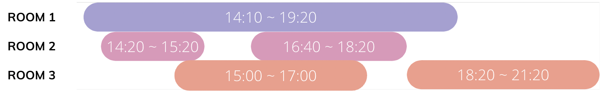

# [Programmers 155651 - 호텔 대실](https://school.programmers.co.kr/learn/courses/30/lessons/155651)

## 문제 설명

호텔을 운영 중인 코니는 최소한의 객실만을 사용하여 예약 손님들을 받으려고 합니다. 한 번 사용한 객실은 퇴실 시간을 기준으로 10분간 청소를 하고 다음 손님들이 사용할 수 있습니다.

예약 시각이 문자열 형태로 담긴 2차원 배열 `book_time`이 매개변수로 주어질 때, 코니에게 필요한 최소 객실의 수를 return 하는 solution 함수를 완성해주세요.

## 제한 사항

- 1 ≤ `book_time`의 길이 ≤ 1,000
  - `book_time[i]`는 ["HH:MM", "HH:MM"]의 형태로 이루어진 배열입니다
    - [대실 시작 시각, 대실 종료 시각] 형태입니다.
  - 시각은 HH:MM 형태로 24시간 표기법을 따르며, "00:00" 부터 "23:59" 까지로 주어집니다.
    - 예약 시각이 자정을 넘어가는 경우는 없습니다.
    - 시작 시각은 항상 종료 시각보다 빠릅니다.

## 입출력 예

| book_time                                                                                            | result |
| ---------------------------------------------------------------------------------------------------- | ------ |
| [["15:00", "17:00"], ["16:40", "18:20"], ["14:20", "15:20"], ["14:10", "19:20"], ["18:20", "21:20"]] | 3      |
| [["09:10", "10:10"], ["10:20", "12:20"]]                                                             | 1      |
| [["10:20", "12:30"], ["10:20", "12:30"], ["10:20", "12:30"]]                                         | 3      |

## 입출력 예 설명

입출력 예 #1



위 사진과 같습니다.

입출력 예 #2

첫 번째 손님이 10시 10분에 퇴실 후 10분간 청소한 뒤 두 번째 손님이 10시 20분에 입실하여 사용할 수 있으므로 방은 1개만 필요합니다.

입출력 예 #3

세 손님 모두 동일한 시간대를 예약했기 때문에 3개의 방이 필요합니다.

---

## 문제 정보

| 난이도 | Lv.2 |
| ------ | ---- |
| 정답률 | 53%  |

## 풀이 정보

| 풀이 시간 | 33 min          |
| --------- | --------------- |
| 알고리즘  | 그리디 알고리즘 |

| 정확성 테스트                      |
| ---------------------------------- |
| 테스트 1 〉 통과 (0.97ms, 77.2MB)  |
| 테스트 2 〉 통과 (2.81ms, 84.9MB)  |
| 테스트 3 〉 통과 (5.76ms, 89MB)    |
| 테스트 4 〉 통과 (4.15ms, 94.3MB)  |
| 테스트 5 〉 통과 (0.77ms, 84.7MB)  |
| 테스트 6 〉 통과 (6.69ms, 76.5MB)  |
| 테스트 7 〉 통과 (7.36ms, 91.4MB)  |
| 테스트 8 〉 통과 (5.38ms, 80.9MB)  |
| 테스트 9 〉 통과 (2.93ms, 84.1MB)  |
| 테스트 10 〉 통과 (6.35ms, 84MB)   |
| 테스트 11 〉 통과 (6.09ms, 97MB)   |
| 테스트 12 〉 통과 (7.16ms, 91.2MB) |
| 테스트 13 〉 통과 (3.04ms, 74.3MB) |
| 테스트 14 〉 통과 (5.51ms, 98.1MB) |
| 테스트 15 〉 통과 (6.79ms, 81.7MB) |
| 테스트 16 〉 통과 (4.31ms, 90.6MB) |
| 테스트 17 〉 통과 (5.83ms, 90.5MB) |
| 테스트 18 〉 통과 (4.81ms, 86.7MB) |
| 테스트 19 〉 통과 (4.96ms, 76.7MB) |

## 코드

```java
import java.util.*;

class Solution {
    public int solution(String[][] book_time) {
        // 주어진 book_time을 변환하고 예약 시작 시간이 빠른 순서로 정렬
        int[][] times = new int[book_time.length][2];
        for (int i = 0; i < book_time.length; i++) {
            times[i][0] = timeToInt(book_time[i][0]);
            times[i][1] = timeToInt(book_time[i][1]);
        }
        Arrays.sort(times, (o1, o2) -> Integer.compare(o1[0], o2[0]));

        // 확정한 예약의 종료 시간을 담는 우선순위 큐
        PriorityQueue<Integer> pq = new PriorityQueue<>();
        int cnt = 0;

        // 예약 하나를 미리 넣어서 peek() 과정에서 NPE 방지
        pq.offer(times[0][1]);
        cnt++;

        for (int i = 1; i < times.length; i++) {
            // 현재 예약의 시작 시간이 과거 예약 중 가장 빠른 종료 시간 + 10보다 크면 해당 방에 배치하면 된다.
            if (pq.peek() + 10 <= times[i][0]) {
                pq.poll();
            }
            // 아니면 새로운 방에 배치해야 한다.
            else {
                cnt++;
            }

            // 현재 예약 확정
            pq.offer(times[i][1]);
        }

        return cnt;
    }

    // "HH:MM" 꼴의 time을 00:00부터 지난 분으로 변환
    private static int timeToInt(String time) {
        String[] splitTime = time.split(":");
        return Integer.parseInt(splitTime[0]) * 60 +
                Integer.parseInt(splitTime[1]);
    }
}
```

## 해설

그리디 알고리즘을 통해 해결할 수 있는 문제다.

특정 예약을 받기 위해 새로운 방이 필요한지 기존 방을 활용할 수 있는지는 해당 예약의 시작 시간이 현재 각 방의 확정한 예약들의 종료 시간 중 가장 종료가 빠른 예약보다 늦으면 해당 방을 활용하면 되고 아니면 새로운 방을 할당해야 한다. 이를 위해 먼저 시작 시간이 빠른 순서로 예약들을 정렬을 해줬다. 이후 각 방의 종료 예약 시간을 저장하기 위해 우선순위 큐를 활용했다. 시작 시간이 빠른 순서로 정렬된 각 예약에 대해 확정 예약 중 종료 시간이 가장 빠른 예약보다 시작 시간이 느리면 해당 방에 예약을 배정하기 위해 기존 예약의 종료 시간을 새로운 예약의 종료 시간으로 덮으면 된다. 우선 순위 큐의 크기는 사용 중인 방의 개수가 된다.

## 리뷰

그리디 알고리즘은 그리디인치 눈치채는게 가장 어려운거 같다.

처음엔 다이나믹 프로그래밍으로 접근했다가 그리디로 변경해서 해결했다.

---
