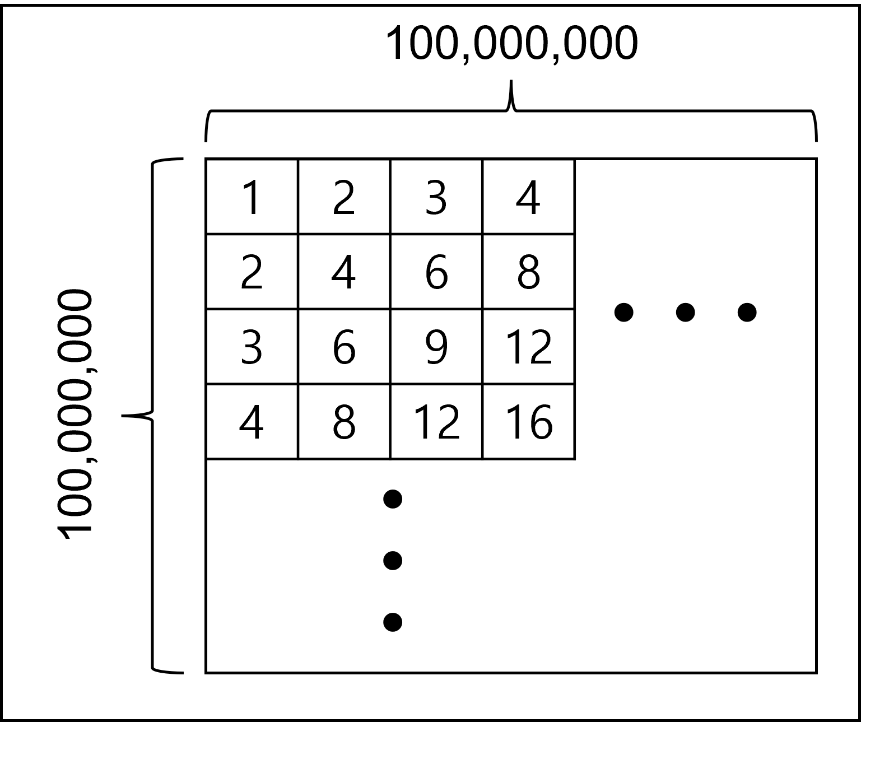

# [Programmers 138475 - 억억단을 외우자](https://school.programmers.co.kr/learn/courses/30/lessons/138475)

## 문제 설명

영우는 천하제일 암산대회를 앞두고 있습니다. 암산보다는 암기에 일가견이 있는 영우는 구구단을 확장하여 억억단을 만들고 외워버리기로 하였습니다.



억억단은 1억 x 1억 크기의 행렬입니다. 억억단을 외우던 영우는 친구 수연에게 퀴즈를 내달라고 부탁하였습니다.  
수연은 평범하게 문제를 내봐야 영우가 너무 쉽게 맞히기 때문에 좀 어렵게 퀴즈를 내보려고 합니다. 적당한 수 `e`를 먼저 정하여 알려주고 `e` 이하의 임의의 수 `s`를 여러 개 얘기합니다. 영우는 각 `s`에 대해서 `s`보다 크거나 같고 `e` 보다 작거나 같은 수 중에서 억억단에서 가장 많이 등장한 수를 답해야 합니다. 만약 가장 많이 등장한 수가 여러 개라면 그 중 가장 작은 수를 답해야 합니다.  
수연은 영우가 정답을 말하는지 확인하기 위해 당신에게 프로그램 제작을 의뢰하였습니다. `e`와 `s`의 목록 `starts`가 매개변수로 주어질 때 각 퀴즈의 답 목록을 return 하도록 solution 함수를 완성해주세요.

## 제한 사항

- 1 ≤ `e` ≤ 5,000,000
- 1 ≤ `starts`의 길이 ≤ min {`e`,100,000}
- 1 ≤ `starts`의 원소 ≤ `e`
- `starts`에는 중복되는 원소가 존재하지 않습니다.

## 입출력 예

| e   | starts  | result  |
| --- | ------- | ------- |
| 8   | [1,3,7] | [6,6,8] |

## 입출력 예 설명

억억단에서 1 ~ 8이 등장하는 횟수는 다음과 같습니다.

- 1번 등장 : 1
- 2번 등장 : 2, 3, 5, 7
- 3번 등장 : 4
- 4번 등장 : 6, 8

[1, 8] 범위에서는 6과 8이 각각 4번씩 등장하여 가장 많은데 6이 더 작은 수이므로 6이 정답입니다.  
[3, 8] 범위에서도 위와 같으므로 6이 정답입니다.  
[7, 8] 범위에서는 7은 2번, 8은 4번 등장하므로 8이 정답입니다.

---

## 문제 정보

| 난이도 | Lv.3 |
| ------ | ---- |
| 정답률 | 24%  |

## 풀이 정보

| 풀이 시간 | 130 + 15 min              |
| --------- | ------------------------- |
| 알고리즘  | 수학, 다이나믹 프로그래밍 |

| 정확성 테스트                       |
| ----------------------------------- |
| 테스트 1 〉 통과 (0.02ms, 81.3MB)   |
| 테스트 2 〉 통과 (0.02ms, 86.4MB)   |
| 테스트 3 〉 통과 (0.04ms, 72MB)     |
| 테스트 4 〉 통과 (0.09ms, 86.8MB)   |
| 테스트 5 〉 통과 (0.42ms, 79.4MB)   |
| 테스트 6 〉 통과 (0.96ms, 96.7MB)   |
| 테스트 7 〉 통과 (1.96ms, 87.7MB)   |
| 테스트 8 〉 통과 (7.72ms, 97.1MB)   |
| 테스트 9 〉 통과 (45.37ms, 99MB)    |
| 테스트 10 〉 통과 (284.64ms, 154MB) |

## 코드

```java
class Solution {
    public int[] solution(int e, int[] starts) {
        // 약수의 수를 저장하는 카운팅 배열
        int[] cntArr = new int[1 + e];

        // i를 약수로 갖는 e 이하의 수들에 대해 카운팅
        for (int i = 1; i <= e; i++) {
            for (int j = 1; j * i <= e; j++) {
                cntArr[j * i]++;
            }
        }

        // 해당 인덱스 수 ~ e 사이의 수 중 가장 약수가 많은 수를 저장하는 dp
        int[] dp = new int[1 + e];
        int cnt = 0;

        for (int i = e; i >= 1; i--) {
            // 약수의 수가 같거나 더 많은 수를 발견하면 갱신
            if (cntArr[i] > cnt) {
                dp[i] = i;
                cnt = cntArr[i];
            } else if (cntArr[i] == cnt) {
                dp[i] = i;
            } else {
                dp[i] = dp[i + 1];
            }
        }

        int[] answer = new int[starts.length];
        for (int i = 0; i < answer.length; i++) {
            answer[i] = dp[starts[i]];
        }

        return answer;
    }
}
```

## 해설

약수의 수를 구하는 방법과 다이나믹 프로그래밍의 조합으로 해결했다.

약수의 경우 약수의 수를 저장하는 카운팅 배열을 먼저 선언한 후 1부터 `e`까지 각 수를 약수로 갖는 수들을 세는 방식으로 카운팅을 했다. 2중 for문을 통해 구현했지만 안쪽 for문의 조건 범위가 작아서 시간복잡도 내에 반복이 가능했다. 이렇게 약수의 수를 O(1)로 얻는 카운팅 배열을 구했다면 이제 다이나믹 프로그래밍으로 특정 구간에서 약수의 수가 가장 많은 수를 빠르게 구해야 한다. 이때 약수의 개수가 동일하면 더 작은 수를 선택하는 것과 구간의 끝이 항상 `e`라는 점에서 역방향으로 순회하며 갱신해서 dp 배열을 구했다. 이러면 이제 O(1)로 구간 내 약수의 수가 최대인 수를 구할 수 있다.

## 리뷰

약수의 수를 구하는 방법을 각 수에 대해 매번 약수를 전부 세는 방식으로 구현하다보니 시간 초과가 발생했다. 수를 증가시키며 해당 수를 약수로 갖는 수를 전부 세는 방식을 인터넷에서 참고했는데 해당 방식으로 변경하니 바로 통과가 됐다. 처음 보는 약수 계산 스타일이어서 많이 헤맸다.

---
