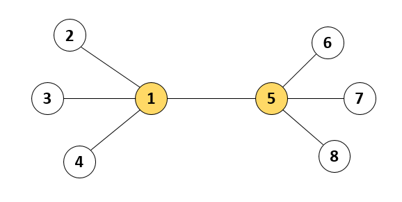
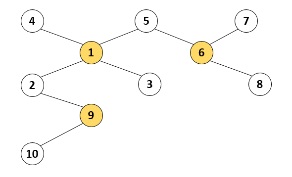

# [Programmers 133500 - 등대](https://school.programmers.co.kr/learn/courses/30/lessons/133500)

## 문제 설명

인천 앞바다에는 1부터 `n`까지 서로 다른 번호가 매겨진 등대 `n`개가 존재합니다. 등대와 등대 사이를 오가는 뱃길이 `n-1`개 존재하여, 어느 등대에서 출발해도 다른 모든 등대까지 이동할 수 있습니다. 등대 관리자 윤성이는 전력을 아끼기 위하여, 이 중 몇 개의 등대만 켜 두려고 합니다. 하지만 등대를 아무렇게나 꺼버리면, 뱃길을 오가는 배들이 위험할 수 있습니다. 한 뱃길의 양쪽 끝 등대 중 적어도 하나는 켜져 있도록 등대를 켜 두어야 합니다.

예를 들어, 아래 그림과 같이 등대 8개와 7개의 뱃길들이 있다고 합시다. 이 경우 1번 등대와 5번 등대 두 개만 켜 두어도 모든 뱃길은 양쪽 끝 등대 중 하나가 켜져 있으므로, 배들은 안전하게 운항할 수 있습니다.



등대의 개수 `n`과 각 뱃길이 연결된 등대의 번호를 담은 이차원 배열 `lighthouse`가 매개변수로 주어집니다. 윤성이가 켜 두어야 하는 등대 개수의 최솟값을 return 하도록 solution 함수를 작성해주세요.

## 제한 사항

- 2 ≤ `n` ≤ 100,000
- `lighthouse`의 길이 = `n – 1`
  - `lighthouse` 배열의 각 행 `[a, b]`는 `a`번 등대와 `b`번 등대가 뱃길로 연결되어 있다는 의미입니다.
    - 1 ≤ `a` ≠ `b` ≤ `n`
    - 모든 등대는 서로 다른 등대로 이동할 수 있는 뱃길이 존재하도록 입력이 주어집니다.

## 입출력 예

| n   | lighthouse                                                                | result |
| --- | ------------------------------------------------------------------------- | ------ |
| 8   | [[1, 2], [1, 3], [1, 4], [1, 5], [5, 6], [5, 7], [5, 8]]                  | 2      |
| 10  | [[4, 1], [5, 1], [5, 6], [7, 6], [1, 2], [1, 3], [6, 8], [2, 9], [9, 10]] | 3      |

## 입출력 예 설명

입출력 예 #1

- 본문에서 설명한 예시입니다.

입출력 예 #2

- 뱃길은 아래 그림과 같이 연결되어 있습니다. 윤성이가 이중 1, 6, 9번 등대 3개만 켜 두어도 모든 뱃길은 양쪽 끝 등대 중 하나가 켜져 있게 되고, 이때의 등대 개수 3개가 최소가 됩니다.



---

## 문제 정보

| 난이도 | Lv.3 |
| ------ | ---- |
| 정답률 | 26%  |

## 풀이 정보

| 풀이 시간 | 94 min                         |
| --------- | ------------------------------ |
| 알고리즘  | 트리, DFS, 다이나믹 프로그래밍 |

| 정확성 테스트                       |
| ----------------------------------- |
| 테스트 1 〉 통과 (101.98ms, 148MB)  |
| 테스트 2 〉 통과 (104.88ms, 140MB)  |
| 테스트 3 〉 통과 (111.24ms, 131MB)  |
| 테스트 4 〉 통과 (133.03ms, 139MB)  |
| 테스트 5 〉 통과 (106.54ms, 154MB)  |
| 테스트 6 〉 통과 (116.42ms, 138MB)  |
| 테스트 7 〉 통과 (114.14ms, 165MB)  |
| 테스트 8 〉 통과 (107.35ms, 147MB)  |
| 테스트 9 〉 통과 (123.31ms, 140MB)  |
| 테스트 10 〉 통과 (121.34ms, 152MB) |
| 테스트 11 〉 통과 (52.20ms, 130MB)  |
| 테스트 12 〉 통과 (34.60ms, 118MB)  |
| 테스트 13 〉 통과 (12.25ms, 105MB)  |
| 테스트 14 〉 통과 (0.12ms, 73.4MB)  |
| 테스트 15 〉 통과 (3.21ms, 78.5MB)  |
| 테스트 16 〉 통과 (6.90ms, 103MB)   |

## 코드

```java
import java.util.*;

class Solution {

    // 메모이제이션
    private static final Map<Integer, Integer> memoOn = new HashMap<>();
    private static final Map<Integer, Integer> memoOff = new HashMap<>();

    public int solution(int n, int[][] lighthouse) {
        // lighthouse로 양방향 인접리스트 생성
        List<Integer>[] adj = new ArrayList[1 + n];
        for (int i = 1; i <= n; i++) {
            adj[i] = new ArrayList<>();
        }
        for (int[] edge : lighthouse) {
            adj[edge[0]].add(edge[1]);
            adj[edge[1]].add(edge[0]);
        }

        // 방문 체크 배열
        boolean[] visited = new boolean[1 + n];

        // 1번 등대를 키는 경우와 끄는 경우 중 최솟값 반환(등대 번호는 무관)
        return Math.min(dfs(1, true, adj, visited), dfs(1, false, adj, visited));
    }

    private static int dfs(int node, boolean isOn, List<Integer>[] adj, boolean[] visited) {
        // 메모이제이션한 값이 있으면 해당 값을 반환해서 가지치기
        if (isOn && memoOn.containsKey(node)) {
            return memoOn.get(node);
        } else if (!isOn && memoOff.containsKey(node)) {
            return memoOff.get(node);
        }

        int cnt = isOn ? 1 : 0;
        visited[node] = true;

        for (int next : adj[node]) {
            if (visited[next]) continue;

            // 해당 등대를 켰을 경우 인접 등대를 켜는 경우와 끄는 경우 두 가지를 모두 탐색
            // 해당 등대를 껐을 경우 인접 등대는 모두 켜야 함
            if (isOn) {
                cnt += Math.min(dfs(next, true, adj, visited), dfs(next, false, adj, visited));
            } else {
                cnt += dfs(next, true, adj, visited);
            }
        }
        visited[node] = false;

        // 메모이제이션
        if (isOn) {
            memoOn.put(node, cnt);
        } else {
            memoOff.put(node, cnt);
        }

        return cnt;
    }
}
```

## 해설

1부터 `n`까지 `n`개의 등대가 있고 등대 사이에 뱃길이 `n-1`개 있으며 어느 등대에서든 모든 등대에 도착할 수 있다는 점에서 등대와 뱃길은 트리 구조를 띄고 있다. 이때 트리의 각 간선에 대해 최소 한쪽 정점이 선택된 정점이 되도록하는 최소 개수를 구하는 문제이다.

DFS와 다이나믹 프로그래밍을 활용한 메모이제이션으로 해결했는데 임의의 노드에서 DFS를 돌리는 데 해당 노드의 등대를 켰을 경우 인접한 노드는 등대를 켜도 되고 안켜도 되며 해당 노드의 등대를 껐을 경우 인접한 노드는 모두 등대를 켜야한다. 이를 위해 먼저 `lighthouse`를 인접 리스트로 만들었고 방문 체크 배열을 만들어서 DFS에 파라미터로 넘겨줬다. DFS는 켠 등대의 수를 반환하도록 하면 되는데 현재 노드의 등대를 켰을 경우 1, 껐을 경우 0으로 초기화한 후 인접 노드에 대한 재귀로 켠 등대의 수를 받아와 더하는 방식으로 구성했다. 여기까지 하면 로직은 완성됐는데 여기서 시간 초과를 해결하기 위해 메모이제이션으로 반복 탐색을 줄였다.

## 리뷰

처음에 어떤 방식으로 접근해야할 지 고민하는데 시간이 많이 걸렸고 트리라는 특성에 맞게 DFS로 구현했는데 시간 초과가 발생했다. 메모이제이션이 큰 의미가 있을까 싶었는데 1번 노드에 대해 켠 경우와 끈 경우 두 가지를 비교해서 반환하는게 `solution` 메서드라서 조금의 중복을 줄이기 위해 도입했는데 효과가 좋았다.

---
