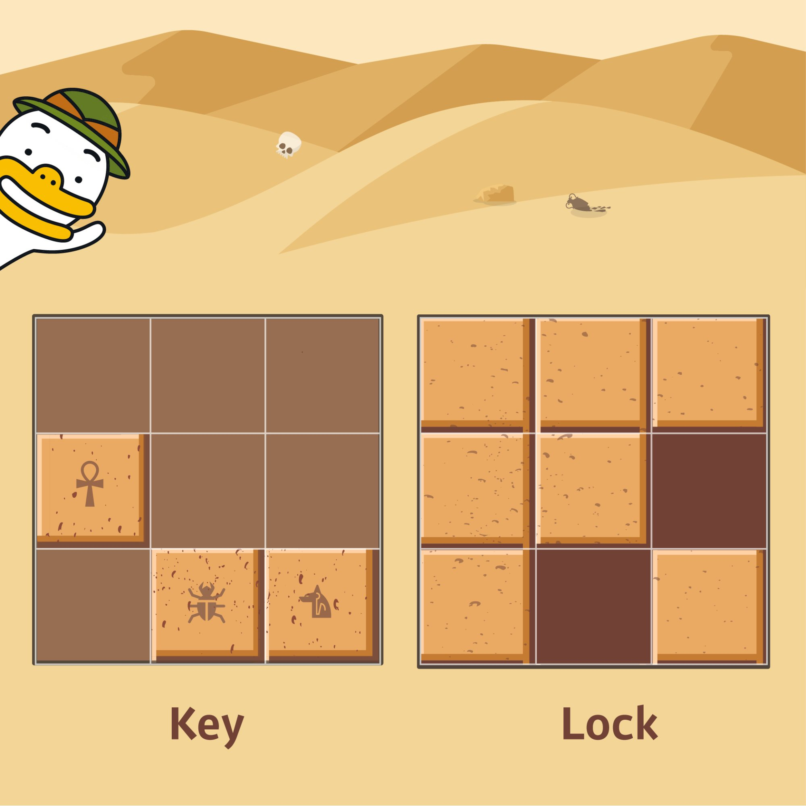

# [Programmers 60059 - 자물쇠와 열쇠](https://school.programmers.co.kr/learn/courses/30/lessons/60059)

## 문제 설명

고고학자인 "튜브"는 고대 유적지에서 보물과 유적이 가득할 것으로 추정되는 비밀의 문을 발견하였습니다. 그런데 문을 열려고 살펴보니 특이한 형태의 자물쇠로 잠겨 있었고 문 앞에는 특이한 형태의 열쇠와 함께 자물쇠를 푸는 방법에 대해 다음과 같이 설명해 주는 종이가 발견되었습니다.

잠겨있는 자물쇠는 격자 한 칸의 크기가 `1 x 1`인 `N x N` 크기의 정사각 격자 형태이고 특이한 모양의 열쇠는 `M x M` 크기인 정사각 격자 형태로 되어 있습니다.

자물쇠에는 홈이 파여 있고 열쇠 또한 홈과 돌기 부분이 있습니다. 열쇠는 회전과 이동이 가능하며 열쇠의 돌기 부분을 자물쇠의 홈 부분에 딱 맞게 채우면 자물쇠가 열리게 되는 구조입니다. 자물쇠 영역을 벗어난 부분에 있는 열쇠의 홈과 돌기는 자물쇠를 여는 데 영향을 주지 않지만, 자물쇠 영역 내에서는 열쇠의 돌기 부분과 자물쇠의 홈 부분이 정확히 일치해야 하며 열쇠의 돌기와 자물쇠의 돌기가 만나서는 안됩니다. 또한 자물쇠의 모든 홈을 채워 비어있는 곳이 없어야 자물쇠를 열 수 있습니다.

열쇠를 나타내는 2차원 배열 key와 자물쇠를 나타내는 2차원 배열 lock이 매개변수로 주어질 때, 열쇠로 자물쇠를 열수 있으면 true를, 열 수 없으면 false를 return 하도록 solution 함수를 완성해주세요.

## 제한 사항

- key는 M x M(3 ≤ M ≤ 20, M은 자연수)크기 2차원 배열입니다.
- lock은 N x N(3 ≤ N ≤ 20, N은 자연수)크기 2차원 배열입니다.
- M은 항상 N 이하입니다.
- key와 lock의 원소는 0 또는 1로 이루어져 있습니다.
  - 0은 홈 부분, 1은 돌기 부분을 나타냅니다.

## 입출력 예

| key                               | lock                              | result |
| --------------------------------- | --------------------------------- | ------ |
| [[0, 0, 0], [1, 0, 0], [0, 1, 1]] | [[1, 1, 1], [1, 1, 0], [1, 0, 1]] | true   |

## 입출력 예 설명

입출력 예 #1



key를 시계 방향으로 90도 회전하고, 오른쪽으로 한 칸, 아래로 한 칸 이동하면 lock의 홈 부분을 정확히 모두 채울 수 있습니다.

---

## 문제 정보

| 난이도 | Lv.3 |
| ------ | ---- |
| 정답률 | 41%  |

## 풀이 정보

| 풀이 시간 | 110 min           |
| --------- | ----------------- |
| 알고리즘  | 브루트 포스, 구현 |

| 정확성 테스트                      |
| ---------------------------------- |
| 테스트 1 〉 통과 (0.09ms, 89.1MB)  |
| 테스트 2 〉 통과 (0.06ms, 89.2MB)  |
| 테스트 3 〉 통과 (1.25ms, 77.9MB)  |
| 테스트 4 〉 통과 (0.05ms, 87.1MB)  |
| 테스트 5 〉 통과 (0.12ms, 81MB)    |
| 테스트 6 〉 통과 (0.07ms, 74.2MB)  |
| 테스트 7 〉 통과 (3.90ms, 75.8MB)  |
| 테스트 8 〉 통과 (2.18ms, 76.5MB)  |
| 테스트 9 〉 통과 (6.91ms, 72.7MB)  |
| 테스트 10 〉 통과 (0.49ms, 91.6MB) |
| 테스트 11 〉 통과 (1.03ms, 87.9MB) |
| 테스트 12 〉 통과 (0.04ms, 79.1MB) |
| 테스트 13 〉 통과 (0.27ms, 80.3MB) |
| 테스트 14 〉 통과 (0.13ms, 72.9MB) |
| 테스트 15 〉 통과 (0.87ms, 79.9MB) |
| 테스트 16 〉 통과 (2.42ms, 88.2MB) |
| 테스트 17 〉 통과 (0.08ms, 84.8MB) |
| 테스트 18 〉 통과 (1.75ms, 72.5MB) |
| 테스트 19 〉 통과 (0.07ms, 80.1MB) |
| 테스트 20 〉 통과 (3.07ms, 75.1MB) |
| 테스트 21 〉 통과 (0.59ms, 85.5MB) |
| 테스트 22 〉 통과 (0.17ms, 89.3MB) |
| 테스트 23 〉 통과 (0.18ms, 69.5MB) |
| 테스트 24 〉 통과 (0.25ms, 75.2MB) |
| 테스트 25 〉 통과 (2.76ms, 72MB)   |
| 테스트 26 〉 통과 (0.76ms, 77.3MB) |
| 테스트 27 〉 통과 (2.06ms, 79.4MB) |
| 테스트 28 〉 통과 (0.19ms, 85.5MB) |
| 테스트 29 〉 통과 (0.20ms, 93.5MB) |
| 테스트 30 〉 통과 (0.64ms, 82.8MB) |
| 테스트 31 〉 통과 (2.48ms, 77.8MB) |
| 테스트 32 〉 통과 (0.77ms, 79.1MB) |
| 테스트 33 〉 통과 (0.32ms, 88.2MB) |
| 테스트 34 〉 통과 (0.06ms, 71.2MB) |
| 테스트 35 〉 통과 (0.09ms, 72.5MB) |
| 테스트 36 〉 통과 (0.13ms, 88.3MB) |
| 테스트 37 〉 통과 (0.07ms, 73.6MB) |
| 테스트 38 〉 통과 (0.05ms, 76.3MB) |

## 코드

```java
class Solution {
    public boolean solution(int[][] key, int[][] lock) {
        // 회전을 고려한 4종류의 열쇠를 담아둔 3차원 배열
        int[][][] keys = initKeys(key);

        // 열쇠와 자물쇠의 크기를 고려해 열쇠의 0행 0열을 넣을 곳을 탐색
        for (int i = -key.length + 1; i < lock.length; i++) {
            for (int j = -key.length + 1; j < lock.length; j++) {

                // 회전을 고려한 열쇠들에 대해 탐색
                for (int k = 0; k < 4; k++) {

                    // 한번이라도 열 수 있으면 true 리턴
                    if (isFit(keys[k], lock, i, j)) return true;
                }
            }
        }

        return false;
    }

    // 0도, 90도, 180도, 270도 회전한 열쇠를 순서대로 저장
    private static int[][][] initKeys(int[][] key) {
        int[][][] keys = new int[4][key.length][key.length];

        keys[0] = key;
        keys[1] = rotate(keys[0]);
        keys[2] = rotate(keys[1]);
        keys[3] = rotate(keys[2]);

        return keys;
    }

    // 90도 회전한 열쇠를 반환하는 메서드
    private static int[][] rotate(int[][] arr) {
        int len = arr.length;
        int[][] result = new int[len][len];

        for (int i = 0; i < len; i++) {
            for (int j = 0; j < len; j++) {
                result[i][j] = arr[len - 1 - j][i];
            }
        }

        return result;
    }

    // 자물쇠의 모든 영역에서 맞물리면 true 반환
    private static boolean isFit(int[][] key, int[][] lock, int r, int c) {
        for (int i = 0; i < lock.length; i++) {
            for (int j = 0; j < lock.length; j++) {
                int keyValue = 0;

                // r, c는 자물쇠를 기준으로 열쇠를 넣을 인덱스인데 열쇠의 실제 인덱스로는 i - r, j - c가 되며 이 인덱스가 열쇠 범위 안이면 열쇠의 값 사용
                if (0 <= i - r && i - r < key.length && 0 <= j - c && j - c < key.length) {
                    keyValue = key[i - r][j - c];
                }

                if (lock[i][j] + keyValue != 1) return false;
            }
        }

        return true;
    }
}
```

## 해설

열쇠를 회전 및 이동할 수 있으며 자물쇠의 영역을 벗어나는 부분은 열쇠 모양의 영향을 안 받을 때 자물쇠와 열쇠의 홈과 돌기가 딱 맞는 경우가 있는지 판단하는 문제다. 먼저 기본 모양부터 회전한 모양까지 4가지 열쇠를 3차원 배열에 담아주었다. 이후 각 열쇠의 0행 0열이 자물쇠를 기준으로 어떤 인덱스에 들어갈 수 있는지 2중 for문으로 탐색했다. 열쇠 일부가 자물쇠를 벗어날 수 있으므로 탐색 범위는 열쇠의 `[M - 1][M - 1]`이 자물쇠의 `[0][0]`에 걸칠 때부터 열쇠의 `[0][0]`이 자물쇠의 `[N - 1][N - 1]`에 걸칠 때까지다.

자물쇠와 열쇠가 맞물리는지는 메서드로 따로 판별하도록 했는데 이때 자물쇠의 모든 영역에 대해 탐색을 하며 매핑되는 열쇠의 인덱스는 i - r, j - c 임에 주의해야 한다.

## 리뷰

범위가 작아 브루트 포스로 접근했으며 구현이 약간 까다로운 문제였던 것 같다. 자물쇠와 열쇠를 맞출 때 열쇠의 인덱스를 계산하는 과정이 약간 헷갈려서 디버깅에 오래 걸렸다.

---
