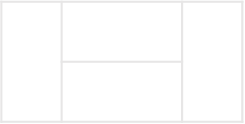

# [Programmers 12900 - 2 x n 타일링](https://school.programmers.co.kr/learn/courses/30/lessons/12900)

## 문제 설명

가로 길이가 2이고 세로의 길이가 1인 직사각형모양의 타일이 있습니다. 이 직사각형 타일을 이용하여 세로의 길이가 2이고 가로의 길이가 n인 바닥을 가득 채우려고 합니다. 타일을 채울 때는 다음과 같이 2가지 방법이 있습니다.

- 타일을 가로로 배치 하는 경우
- 타일을 세로로 배치 하는 경우

예를들어서 n이 7인 직사각형은 다음과 같이 채울 수 있습니다.


직사각형의 가로의 길이 n이 매개변수로 주어질 때, 이 직사각형을 채우는 방법의 수를 return 하는 solution 함수를 완성해주세요.

## 제한 사항

- 가로의 길이 n은 60,000이하의 자연수 입니다.
- 경우의 수가 많아 질 수 있으므로, 경우의 수를 1,000,000,007으로 나눈 나머지를 return해주세요.

## 입출력 예

| n   | result |
| --- | ------ |
| 4   | 5      |

## 입출력 예 설명

입출력 예 #1

다음과 같이 5가지 방법이 있다.




---

## 문제 정보

| 난이도 | Lv.2 |
| ------ | ---- |
| 정답률 | 59%  |

## 풀이 정보

| 풀이 시간 | 5 min               |
| --------- | ------------------- |
| 알고리즘  | 다이나믹 프로그래밍 |

| 정확성 테스트                      |
| ---------------------------------- |
| 테스트 1 〉 통과 (0.20ms, 84.5MB)  |
| 테스트 2 〉 통과 (0.05ms, 82.4MB)  |
| 테스트 3 〉 통과 (0.15ms, 85MB)    |
| 테스트 4 〉 통과 (0.23ms, 88.8MB)  |
| 테스트 5 〉 통과 (0.04ms, 76.1MB)  |
| 테스트 6 〉 통과 (0.20ms, 78.9MB)  |
| 테스트 7 〉 통과 (0.05ms, 83MB)    |
| 테스트 8 〉 통과 (0.17ms, 73.6MB)  |
| 테스트 9 〉 통과 (0.18ms, 82.5MB)  |
| 테스트 10 〉 통과 (0.27ms, 85.6MB) |
| 테스트 11 〉 통과 (0.12ms, 91.7MB) |
| 테스트 12 〉 통과 (0.08ms, 81.9MB) |
| 테스트 13 〉 통과 (0.07ms, 80.7MB) |
| 테스트 14 〉 통과 (0.13ms, 75.2MB) |

| 효율성 테스트                     |
| --------------------------------- |
| 테스트 1 〉 통과 (0.82ms, 53.6MB) |
| 테스트 2 〉 통과 (1.23ms, 54.1MB) |
| 테스트 3 〉 통과 (0.58ms, 54.1MB) |
| 테스트 4 〉 통과 (0.82ms, 53.9MB) |
| 테스트 5 〉 통과 (1.59ms, 54.6MB) |
| 테스트 6 〉 통과 (2.38ms, 53.8MB) |

## 코드

```java
class Solution {

    private static final int MOD = 1_000_000_007;

    public int solution(int n) {
        int[] dp = new int[1 + n];
        dp[0] = 1;
        dp[1] = 1;

        for (int i = 2; i <= n; i++) {
            dp[i] = (dp[i - 1] + dp[i - 2]) % MOD;
        }

        return dp[n];
    }
}
```

## 해설

Bottom-Up 다이나믹 프로그래밍을 활용하면 해결할 수 있는 문제다.

가로의 길이가 n인 바닥의 마지막 타일이 세로로 배치된 경우는 가로의 길이가 n - 1인 경우 전체에 세로로 배치를 하면 된다. 가로의 길이가 n인 바닥의 마지막 타일이 가로로 배치된 경우는 가로의 길이가 n - 2인 경우 전체에 가로로 배치하면 된다.

## 리뷰

기본적인 다이나믹 프로그래밍 문제로 점화식만 빠르게 찾으면 쉽게 풀 수 있었다.

---
