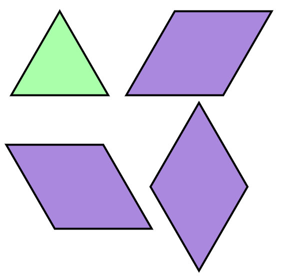

# [Programmers 258705 - 산 모양 타일링](https://school.programmers.co.kr/learn/courses/30/lessons/258705)

## 문제 설명

한 변의 길이가 1인 정삼각형 `2n+1`개를 이어붙여 윗변의 길이가 `n`, 아랫변의 길이가 `n+1`인 사다리꼴을 만들 수 있습니다. 이때 사다리꼴의 윗변과 변을 공유하는 `n`개의 정삼각형 중 일부의 위쪽에 같은 크기의 정삼각형을 붙여 새로운 모양을 만들었습니다. 예를 들어 `n`이 4이고, 1번째, 2번째, 4번째 정삼각형 위에 정삼각형을 붙인 모양은 다음과 같습니다.


이렇게 만든 모양을 정삼각형 타일 또는 정삼각형 2개를 이어 붙인 마름모 타일로 빈 곳이 없도록 채우려고 합니다. 정삼각형 타일과 마름모 타일은 돌려서 사용할 수 있습니다.



타일을 놓을 때 다른 타일과 겹치거나 모양을 벗어나게 놓을 수는 없습니다. 위의 예시 모양을 채우는 방법 중 일부는 다음과 같습니다.


사다리꼴의 윗변의 길이를 나타내는 정수 `n`과 사다리꼴 윗변에 붙인 정삼각형을 나타내는 1차원 정수 배열 `tops`가 매개변수로 주어집니다. 이때 문제 설명에 따라 만든 모양을 정삼각형 또는 마름모 타일로 빈 곳이 없도록 채우는 경우의 수를 `10007`로 나눈 나머지를 return 하도록 solution 함수를 완성해 주세요.

## 제한 사항

- 1 ≤ `n` ≤ 100,000
- `tops`의 길이 = `n`
  - `tops[i]`는 사다리꼴의 윗변과 변을 공유하는 `i+1`번째 정삼각형의 위쪽에 정삼각형을 붙이는 경우 1, 붙이지 않는 경우 0입니다.

## 입출력 예

| n   | tops                           | result |
| --- | ------------------------------ | ------ |
| 4   | [1, 1, 0, 1]                   | 149    |
| 2   | [0, 1]                         | 11     |
| 10  | [0, 0, 0, 0, 0, 0, 0, 0, 0, 0] | 7704   |

## 입출력 예 설명

입출력 예 #1

문제의 예시와 같습니다. 문제에서 설명한 방법을 포함해 총 149가지 방법이 존재합니다.

따라서 149를 return 해야 합니다.

입출력 예 #2

문제 설명에 따라 만든 모양은 다음과 같습니다.


이 모양을 타일로 채우는 방법은 다음과 같이 총 11가지입니다.


따라서 11을 return 해야 합니다.

입출력 예 #3

경우의 수는 총 17,711가지입니다. 따라서 17711을 10007로 나눈 나머지인 7704를 return 해야 합니다.

---

## 문제 정보

| 난이도 | Lv.3 |
| ------ | ---- |
| 정답률 | 27%  |

## 풀이 정보

| 풀이 시간 | 56 min              |
| --------- | ------------------- |
| 알고리즘  | 다이나믹 프로그래밍 |

| 정확성 테스트                      |
| ---------------------------------- |
| 테스트 1 〉 통과 (0.01ms, 79.6MB)  |
| 테스트 2 〉 통과 (0.02ms, 88.2MB)  |
| 테스트 3 〉 통과 (0.01ms, 86.3MB)  |
| 테스트 4 〉 통과 (0.03ms, 82.6MB)  |
| 테스트 5 〉 통과 (0.01ms, 86.3MB)  |
| 테스트 6 〉 통과 (0.01ms, 81MB)    |
| 테스트 7 〉 통과 (0.04ms, 78.9MB)  |
| 테스트 8 〉 통과 (0.04ms, 80.7MB)  |
| 테스트 9 〉 통과 (0.02ms, 87.1MB)  |
| 테스트 10 〉 통과 (0.03ms, 75.3MB) |
| 테스트 11 〉 통과 (0.04ms, 73.5MB) |
| 테스트 12 〉 통과 (0.04ms, 82.7MB) |
| 테스트 13 〉 통과 (0.04ms, 88.3MB) |
| 테스트 14 〉 통과 (0.06ms, 81.2MB) |
| 테스트 15 〉 통과 (0.04ms, 84.3MB) |
| 테스트 16 〉 통과 (0.05ms, 77.4MB) |
| 테스트 17 〉 통과 (3.32ms, 91.8MB) |
| 테스트 18 〉 통과 (3.78ms, 79.8MB) |
| 테스트 19 〉 통과 (3.60ms, 78.2MB) |
| 테스트 20 〉 통과 (3.30ms, 80.5MB) |
| 테스트 21 〉 통과 (3.30ms, 83.6MB) |
| 테스트 22 〉 통과 (3.35ms, 90.6MB) |
| 테스트 23 〉 통과 (3.21ms, 81.9MB) |
| 테스트 24 〉 통과 (3.18ms, 91.1MB) |
| 테스트 25 〉 통과 (2.35ms, 91.4MB) |

## 코드

```java
class Solution {

    private static final int MOD = 10_007;

    public int solution(int n, int[] tops) {
        int[] dp = new int[1 + n];
        dp[0] = 1;  // 삼각형 하나만 있는 경우 조합의 수는 1
        dp[1] = tops[0] == 0 ? 3 : 4;

        for (int i = 2; i <= n; i++) {
            // 뺄셈 과정에서 모듈러 연산 때문에 음수가 나올 수 있어서 MOD를 더하고 나머지를 구함
            if (tops[i - 1] == 0) {
                dp[i] = (dp[i - 1] * 3 - dp[i - 2] + MOD) % MOD;
            } else {
                dp[i] = (dp[i - 1] * 4 - dp[i - 2] + MOD) % MOD;
            }
        }

        return dp[n];
    }
}
```

## 해설

Bottom-Up 다이나믹 프로그래밍을 활용하면 해결할 수 있는 문제다.

주어진 타일 배치에 대해 다음 타일은 사다리꼴로 붙거나 산모양으로 붙을 수 있다. 이때 이전 타일 배치가 2번 마름모 모양으로 끝나지만 않으면 간단하게 구할 수 있는데 해당 경우가 문제가 된다. 이전 타일 배치가 2번 마름모 모양으로 끝나지 않는 조합의 수는 (이전 타일 배치 경우의 수 - 전전 타일 배치 경우의 수)로 구할 수 있는데 이는 이전 타일 배치가 2번 마름모 모양으로 끝나는 조합이 전전 타일 배치 전체 경우에 해당 마름모를 붙인 경우들로 이루어졌기 때문이다. 이를 수식으로 나타내면 사다리꼴로 다음 타일들이 붙은 경우 삼각형만 사용하는 경우, 1번 마름모를 사용하는 경우, 2번 마름모를 사용하는 경우가 있고, 산모양으로 붙은 경우 3번 마름모까지 사용하는 경우가 추가된다. 1번 마름모를 사용하는 경우를 제외하면 전부 이전 타일 배치에서 뒤에 붙이기만 하면 되고 1번 마름모를 사용하는 경우 이전 배치가 2번 마름모로 끝나지 않는 경우의 수를 통해 구하면 된다.

## 리뷰

현재 배치가 2번 마름모로 끝나는 경우와 끝나지 않는 경우를 2차원 dp로 나누어 저장하면 보다 직관적으로 풀 수 있는데 이를 합치려는 과정에서 약간 헷갈렸다.

---
