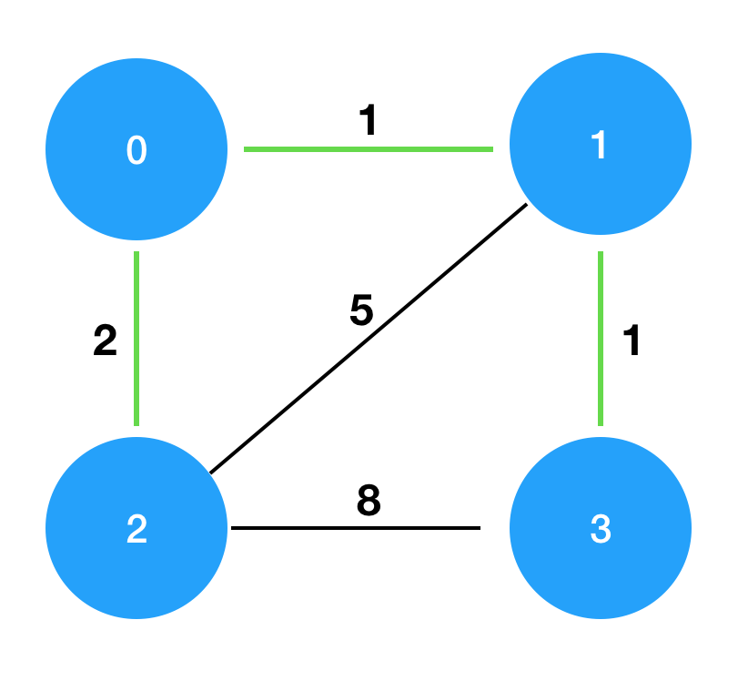

# [Programmers 42861 - 섬 연결하기](https://school.programmers.co.kr/learn/courses/30/lessons/42861)

## 문제 설명

n개의 섬 사이에 다리를 건설하는 비용(costs)이 주어질 때, 최소의 비용으로 모든 섬이 서로 통행 가능하도록 만들 때 필요한 최소 비용을 return 하도록 solution을 완성하세요.

다리를 여러 번 건너더라도, 도달할 수만 있으면 통행 가능하다고 봅니다. 예를 들어 A 섬과 B 섬 사이에 다리가 있고, B 섬과 C 섬 사이에 다리가 있으면 A 섬과 C 섬은 서로 통행 가능합니다.

## 제한 사항

- 섬의 개수 n은 1 이상 100 이하입니다.
- costs의 길이는 `((n-1) * n) / 2`이하입니다.
- 임의의 i에 대해, costs[i][0] 와 costs[i] [1]에는 다리가 연결되는 두 섬의 번호가 들어있고, costs[i] [2]에는 이 두 섬을 연결하는 다리를 건설할 때 드는 비용입니다.
- 같은 연결은 두 번 주어지지 않습니다. 또한 순서가 바뀌더라도 같은 연결로 봅니다. 즉 0과 1 사이를 연결하는 비용이 주어졌을 때, 1과 0의 비용이 주어지지 않습니다.
- 모든 섬 사이의 다리 건설 비용이 주어지지 않습니다. 이 경우, 두 섬 사이의 건설이 불가능한 것으로 봅니다.
- 연결할 수 없는 섬은 주어지지 않습니다.

## 입출력 예

| n   | costs                                     | return |
| --- | ----------------------------------------- | ------ |
| 4   | [[0,1,1],[0,2,2],[1,2,5],[1,3,1],[2,3,8]] | 4      |

## 입출력 예 설명

costs를 그림으로 표현하면 다음과 같으며, 이때 초록색 경로로 연결하는 것이 가장 적은 비용으로 모두를 통행할 수 있도록 만드는 방법입니다.



---

## 문제 정보

| 난이도 | Lv.3 |
| ------ | ---- |
| 정답률 | 49%  |

## 풀이 정보

| 풀이 시간 | 17 min            |
| --------- | ----------------- |
| 알고리즘  | 크루스칼 알고리즘 |

| 정확성 테스트                     |
| --------------------------------- |
| 테스트 1 〉 통과 (0.62ms, 82.1MB) |
| 테스트 2 〉 통과 (0.64ms, 89.7MB) |
| 테스트 3 〉 통과 (0.51ms, 73.9MB) |
| 테스트 4 〉 통과 (0.49ms, 74.5MB) |
| 테스트 5 〉 통과 (0.70ms, 75MB)   |
| 테스트 6 〉 통과 (0.85ms, 77.7MB) |
| 테스트 7 〉 통과 (0.62ms, 76.8MB) |
| 테스트 8 〉 통과 (0.45ms, 74.7MB) |

## 코드

```java
import java.util.*;

class Solution {
    public int solution(int n, int[][] costs) {
        // 크루스칼 알고리즘을 위해 간선 배열을 오름차순으로 정렬
        Arrays.sort(costs, (o1, o2) -> Integer.compare(o1[2], o2[2]));

        // union-find 알고리즘을 위한 make set
        make(n);

        return kruskal(n, costs);
    }

    // union-find 부모 배열
    private static int[] p;

    // make set
    private static void make(int n) {
        p = new int[n];
        for (int i = 0; i < n; i++) {
            p[i] = i;
        }
    }

    // find set
    private static int find(int x) {
        if (x == p[x]) return x;
        return p[x] = find(p[x]);
    }

    // union set
    private static void union(int x, int y) {
        p[find(y)] = find(x);
    }

    private static int kruskal(int n, int[][] edges) {
        int sum = 0;
        int cnt = 0;

        for (int[] edge : edges) {
            if (find(edge[0]) == find(edge[1])) continue;

            union(edge[0], edge[1]);
            sum += edge[2];
            cnt++;

            // n개의 정점에 대해 n - 1개의 간선을 선택하면 최소 스패닝 트리 완성
            if (cnt == n - 1) break;
        }

        return sum;
    }
}
```

## 해설

모든 섬을 최소 비용으로 연결해야하는 문제로 크루스칼 알고리즘을 활용하면 간단하게 해결할 수 있다. 먼저 크루스칼 알고리즘을 위해 주어진 간선 배열을 비용에 대한 오름차순으로 정렬해주고 크루스칼 알고리즘에 활용할 유니온 파인드 알고리즘 부모 배열과 메서드를 작성해줬다. 이후 정석적인 크루스칼 알고리즘으로 그룹화 및 비용 계산을 해주다가 n - 1개의 간선을 선택하면 종료하면 된다.

## 리뷰

크루스칼 알고리즘에 대해 아는지 묻는 수준의 문제로 비교적 간단하게 해결할 수 있었다.

---
