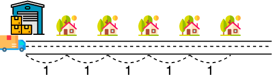

# [Programmers 150369 - 택배 배달과 수거하기](https://school.programmers.co.kr/learn/courses/30/lessons/150369)

## 문제 설명



당신은 일렬로 나열된 `n`개의 집에 택배를 배달하려 합니다. 배달할 물건은 모두 크기가 같은 재활용 택배 상자에 담아 배달하며, 배달을 다니면서 빈 재활용 택배 상자들을 수거하려 합니다.  
배달할 택배들은 모두 재활용 택배 상자에 담겨서 물류창고에 보관되어 있고, `i`번째 집은 물류창고에서 거리 `i`만큼 떨어져 있습니다. 또한 `i`번째 집은 `j`번째 집과 거리 `j - i`만큼 떨어져 있습니다. (1 ≤ `i` ≤ `j` ≤ `n`)  
트럭에는 재활용 택배 상자를 최대 `cap`개 실을 수 있습니다. 트럭은 배달할 재활용 택배 상자들을 실어 물류창고에서 출발해 각 집에 배달하면서, 빈 재활용 택배 상자들을 수거해 물류창고에 내립니다. 각 집마다 배달할 재활용 택배 상자의 개수와 수거할 빈 재활용 택배 상자의 개수를 알고 있을 때, 트럭 하나로 모든 배달과 수거를 마치고 물류창고까지 돌아올 수 있는 최소 이동 거리를 구하려 합니다. 각 집에 배달 및 수거할 때, 원하는 개수만큼 택배를 배달 및 수거할 수 있습니다.

다음은 `cap`=4 일 때, 최소 거리로 이동하면서 5개의 집에 배달 및 수거하는 과정을 나타낸 예시입니다.

배달 및 수거할 재활용 택배 상자 개수

|      | 집 #1 | 집 #2 | 집 #3 | 집 #4 | 집 #5 |
| ---- | ----- | ----- | ----- | ----- | ----- |
| 배달 | 1개   | 0개   | 3개   | 1개   | 2개   |
| 수거 | 0개   | 3개   | 0개   | 4개   | 0개   |

배달 및 수거 과정

|                | 집 #1 | 집 #2 | 집 #3 | 집 #4 | 집 #5 | 설명                                                                                                                                                        |
| -------------- | ----- | ----- | ----- | ----- | ----- | ----------------------------------------------------------------------------------------------------------------------------------------------------------- |
| 남은 배달/수거 | 1/0   | 0/3   | 3/0   | 1/4   | 2/0   | 물류창고에서 택배 3개를 트럭에 실어 출발합니다.                                                                                                             |
| 남은 배달/수거 | 1/0   | 0/3   | 3/0   | 0/4   | 0/0   | 물류창고에서 5번째 집까지 이동하면서(거리 5) 4번째 집에 택배 1개를 배달하고, 5번째 집에 택배 2개를 배달합니다.                                              |
| 남은 배달/수거 | 1/0   | 0/3   | 3/0   | 0/0   | 0/0   | 5번째 집에서 물류창고까지 이동하면서(거리 5) 4번째 집에서 빈 택배 상자 4개를 수거한 후, 수거한 빈 택배 상자를 물류창고에 내리고 택배 4개를 트럭에 싣습니다. |
| 남은 배달/수거 | 0/0   | 0/3   | 0/0   | 0/0   | 0/0   | 물류창고에서 3번째 집까지 이동하면서(거리 3) 1번째 집에 택배 1개를 배달하고, 3번째 집에 택배 3개를 배달합니다.                                              |
| 남은 배달/수거 | 0/0   | 0/0   | 0/0   | 0/0   | 0/0   | 3번째 집에서 물류창고까지 이동하면서(거리 3) 2번째 집에서 빈 택배 상자 3개를 수거한 후, 수거한 빈 택배 상자를 물류창고에 내립니다.                          |

16(=5+5+3+3)의 거리를 이동하면서 모든 배달 및 수거를 마쳤습니다. 같은 거리로 모든 배달 및 수거를 마치는 다른 방법이 있지만, 이보다 짧은 거리로 모든 배달 및 수거를 마치는 방법은 없습니다.

트럭에 실을 수 있는 재활용 택배 상자의 최대 개수를 나타내는 정수 `cap`, 배달할 집의 개수를 나타내는 정수 `n`, 각 집에 배달할 재활용 택배 상자의 개수를 담은 1차원 정수 배열 `deliveries`와 각 집에서 수거할 빈 재활용 택배 상자의 개수를 담은 1차원 정수 배열 `pickups`가 매개변수로 주어집니다. 이때, 트럭 하나로 모든 배달과 수거를 마치고 물류창고까지 돌아올 수 있는 최소 이동 거리를 return 하도록 solution 함수를 완성해 주세요.

## 제한 사항

- 1 ≤ `cap` ≤ 50
- 1 ≤ `n` ≤ 100,000
- `deliveries`의 길이 = `pickups`의 길이 = `n`
  - `deliveries[i]`는 i+1번째 집에 배달할 재활용 택배 상자의 개수를 나타냅니다.
  - `pickups[i]`는 i+1번째 집에서 수거할 빈 재활용 택배 상자의 개수를 나타냅니다.
  - 0 ≤ `deliveries`의 원소 ≤ 50
  - 0 ≤ `pickups`의 원소 ≤ 50
- 트럭의 초기 위치는 물류창고입니다.

## 입출력 예

| cap | n   | deliveries            | pickups               | result |
| --- | --- | --------------------- | --------------------- | ------ |
| 4   | 5   | [1, 0, 3, 1, 2]       | [0, 3, 0, 4, 0]       | 16     |
| 2   | 7   | [1, 0, 2, 0, 1, 0, 2] | [0, 2, 0, 1, 0, 2, 0] | 30     |

## 입출력 예 설명

입출력 예 #1

- 문제 예시와 동일합니다.

입출력 예 #2

배달 및 수거할 재활용 택배 상자 개수

|      | 집 #1 | 집 #2 | 집 #3 | 집 #4 | 집 #5 | 집 #6 | 집 #7 |
| ---- | ----- | ----- | ----- | ----- | ----- | ----- | ----- |
| 배달 | 1개   | 0개   | 2개   | 0개   | 1개   | 0개   | 2개   |
| 수거 | 0개   | 2개   | 0개   | 1개   | 0개   | 2개   | 0개   |

배달 및 수거 과정

|                | 집 #1 | 집 #2 | 집 #3 | 집 #4 | 집 #5 | 집 #6 | 집 #7 | 설명                                                                                                                                                                                                 |
| -------------- | ----- | ----- | ----- | ----- | ----- | ----- | ----- | ---------------------------------------------------------------------------------------------------------------------------------------------------------------------------------------------------- |
| 남은 배달/수거 | 1/0   | 0/2   | 2/0   | 0/1   | 1/0   | 0/2   | 2/0   | 물류창고에서 택배 2개를 트럭에 실어 출발합니다.                                                                                                                                                      |
| 남은 배달/수거 | 1/0   | 0/2   | 2/0   | 0/1   | 1/0   | 0/2   | 0/0   | 물류창고에서 7번째 집까지 이동하면서(거리 7) 7번째 집에 택배 2개를 배달합니다.                                                                                                                       |
| 남은 배달/수거 | 1/0   | 0/2   | 2/0   | 0/1   | 1/0   | 0/0   | 0/0   | 7번째 집에서 물류창고까지 이동하면서(거리 7) 6번째 집에서 빈 택배 상자 2개를 수거한 후, 수거한 빈 택배 상자를 물류창고에 내리고 택배 2개를 트럭에 싣습니다.                                          |
| 남은 배달/수거 | 1/0   | 0/2   | 1/0   | 0/1   | 0/0   | 0/0   | 0/0   | 물류창고에서 5번째 집까지 이동하면서(거리 5) 3번째 집에 택배 1개를 배달하고, 5번째 집에 택배 1개를 배달합니다.                                                                                       |
| 남은 배달/수거 | 1/0   | 0/1   | 1/0   | 0/0   | 0/0   | 0/0   | 0/0   | 5번째 집에서 물류창고까지 이동하면서(거리 5) 4번째 집에서 빈 택배 상자 1개를 수거하고 2번째 집에서 빈 택배 상자 1개를 수거한 후, 수거한 빈 택배 상자를 물류창고에 내리고 택배 2개를 트럭에 싣습니다. |
| 남은 배달/수거 | 0/0   | 0/1   | 0/0   | 0/0   | 0/0   | 0/0   | 0/0   | 물류창고에서 3번째 집까지 이동하면서(거리 3) 1번째 집에 택배 1개를 배달하고, 3번째 집에 택배 1개를 배달합니다.                                                                                       |
| 남은 배달/수거 | 0/0   | 0/0   | 0/0   | 0/0   | 0/0   | 0/0   | 0/0   | 3번째 집에서 물류창고까지 이동하면서(거리 3) 2번째 집에서 빈 택배 상자 1개를 수거한 후, 수거한 빈 택배 상자를 물류창고에 내립니다.                                                                   |

30(=7+7+5+5+3+3)의 거리를 이동하면서 모든 배달 및 수거를 마쳤습니다. 같은 거리로 모든 배달 및 수거를 마치는 다른 방법이 있지만, 이보다 짧은 거리로 모든 배달 및 수거를 마치는 방법은 없습니다.  
따라서, 30을 return 하면 됩니다.

---

## 문제 정보

| 난이도 | Lv.2 |
| ------ | ---- |
| 정답률 | 37%  |

## 풀이 정보

| 풀이 시간 | 210 min |
| --------- | ------- |
| 알고리즘  | 구현    |

| 정확성 테스트                       |
| ----------------------------------- |
| 테스트 1 〉 통과 (0.07ms, 83.5MB)   |
| 테스트 2 〉 통과 (0.09ms, 82.6MB)   |
| 테스트 3 〉 통과 (0.05ms, 89.4MB)   |
| 테스트 4 〉 통과 (0.06ms, 85.3MB)   |
| 테스트 5 〉 통과 (0.05ms, 79MB)     |
| 테스트 6 〉 통과 (0.08ms, 85.9MB)   |
| 테스트 7 〉 통과 (0.08ms, 77.4MB)   |
| 테스트 8 〉 통과 (0.21ms, 89.5MB)   |
| 테스트 9 〉 통과 (0.38ms, 88.6MB)   |
| 테스트 10 〉 통과 (0.36ms, 76.5MB)  |
| 테스트 11 〉 통과 (0.20ms, 84MB)    |
| 테스트 12 〉 통과 (0.21ms, 88.2MB)  |
| 테스트 13 〉 통과 (0.20ms, 88.4MB)  |
| 테스트 14 〉 통과 (0.19ms, 85.3MB)  |
| 테스트 15 〉 통과 (2.37ms, 99.3MB)  |
| 테스트 16 〉 통과 (13.19ms, 88.6MB) |
| 테스트 17 〉 통과 (6.46ms, 85.8MB)  |
| 테스트 18 〉 통과 (3.14ms, 101MB)   |
| 테스트 19 〉 통과 (2.88ms, 98.4MB)  |
| 테스트 20 〉 통과 (3.32ms, 86.5MB)  |

## 코드

```java
class Solution {
    public long solution(int cap, int n, int[] deliveries, int[] pickups) {
        int d = 0;  // 배달할 택배 여유 개수
        int p = 0;  // 수거할 택배 여유 개수
        long answer = 0;

        for (int i = n - 1; i >= 0; i--) {
            d -= deliveries[i];  // i번째 집에 배달할 택배 차감
            p -= pickups[i];  // i번째 집에서 수거할 택배 차감

            // 배달 용량이 모자라거나 수거 용량이 모자라면 트럭 왕복 추가
            while (d < 0 || p < 0) {
                d += cap;
                p += cap;
                answer += (i + 1) * 2;
            }
        }

        return answer;
    }
}
```

## 해설

물류센터에서 거리가 먼 집부터 배달/수거를 진행하는 방식으로 최소 이동거리를 구했다. 먼저 배달할 택배의 여유 개수와 수거할 택배의 여유 개수를 변수로 선언했다. 이후 가장 먼 집부터 가까운 집 순으로 확인하며 해당 집에 배달할 택배와 수거할 택배를 여유 개수에서 빼주었다. 여유 개수가 0 이상의 정수면 아직 해당 트럭으로 처리가 가능하다는 뜻이고 음수면 추가 트럭이 필요한 상황이다. 추가 트럭이 필요하면 여유 개수를 `cap`개 만큼 각각 추가하고 트럭의 이동거리를 추가하는 것을 반복하는 방식으로 구현했다.

## 리뷰

처음에 복잡하게 배달/수거를 진행하도록 코드를 작성해서 통과했는데 쉬운 풀이를 찾다가 해당 풀이를 발견했다. 배달/수거가 상호작용이 발생하는 것 같은 상황이라 접근이 어려웠는데 트럭들의 배달/수거 용량을 합산하여 처리하면서 트럭이 추가되면 거리만 늘리게하는 방식의 접근이 너무 신선했다.

---
