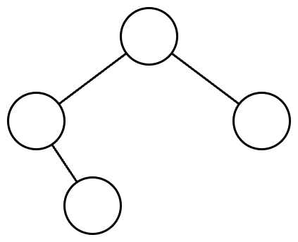

# [Programmers 150367 - 표현 가능한 이진트리](https://school.programmers.co.kr/learn/courses/30/lessons/150367)

## 문제 설명

당신은 이진트리를 수로 표현하는 것을 좋아합니다.

이진트리를 수로 표현하는 방법은 다음과 같습니다.

1. 이진수를 저장할 빈 문자열을 생성합니다.
2. 주어진 이진트리에 더미 노드를 추가하여 포화 이진트리로 만듭니다. 루트 노드는 그대로 유지합니다.
3. 만들어진 포화 이진트리의 노드들을 가장 왼쪽 노드부터 가장 오른쪽 노드까지, 왼쪽에 있는 순서대로 살펴봅니다. 노드의 높이는 살펴보는 순서에 영향을 끼치지 않습니다.
4. 살펴본 노드가 더미 노드라면, 문자열 뒤에 0을 추가합니다. 살펴본 노드가 더미 노드가 아니라면, 문자열 뒤에 1을 추가합니다.
5. 문자열에 저장된 이진수를 십진수로 변환합니다.

이진트리에서 리프 노드가 아닌 노드는 자신의 왼쪽 자식이 루트인 서브트리의 노드들보다 오른쪽에 있으며, 자신의 오른쪽 자식이 루트인 서브트리의 노드들보다 왼쪽에 있다고 가정합니다.

다음은 이진트리를 수로 표현하는 예시입니다.

주어진 이진트리는 다음과 같습니다.



주어진 이진트리에 더미노드를 추가하여 포화 이진트리로 만들면 다음과 같습니다. 더미 노드는 점선으로 표시하였고, 노드 안의 수는 살펴보는 순서를 의미합니다.


노드들을 왼쪽에 있는 순서대로 살펴보며 0과 1을 생성한 문자열에 추가하면 `"0111010"`이 됩니다. 이 이진수를 십진수로 변환하면 58입니다.

당신은 수가 주어졌을때, 하나의 이진트리로 해당 수를 표현할 수 있는지 알고 싶습니다.

이진트리로 만들고 싶은 수를 담은 1차원 정수 배열 `numbers`가 주어집니다. `numbers`에 주어진 순서대로 하나의 이진트리로 해당 수를 표현할 수 있다면 1을, 표현할 수 없다면 0을 1차원 정수 배열에 담아 return 하도록 solution 함수를 완성해주세요.

## 제한 사항

- 1 ≤ `numbers`의 길이 ≤ 10,000
  - 1 ≤ `numbers`의 원소 ≤ 10¹⁵

## 입출력 예

| numbers       | result    |
| ------------- | --------- |
| [7, 42, 5]    | [1, 1, 0] |
| [63, 111, 95] | [1, 1, 0] |

## 입출력 예 설명

입출력 예 #1

7은 다음과 같은 이진트리로 표현할 수 있습니다.


42는 다음과 같은 이진트리로 표현할 수 있습니다.


5는 이진트리로 표현할 수 없습니다.

따라서, [1, 0]을 return 하면 됩니다.

입출력 예 #2

63은 다음과 같은 이진트리로 표현할 수 있습니다.


111은 다음과 같은 이진트리로 표현할 수 있습니다.


95는 이진트리로 표현할 수 없습니다.

따라서, [1, 1, 0]을 return 하면 됩니다.

---

## 문제 정보

| 난이도 | Lv.3 |
| ------ | ---- |
| 정답률 | 34%  |

## 풀이 정보

| 풀이 시간 | 102 min            |
| --------- | ------------------ |
| 알고리즘  | 트리, 문자열, 재귀 |

| 정확성 테스트                       |
| ----------------------------------- |
| 테스트 1 〉 통과 (1.07ms, 85.9MB)   |
| 테스트 2 〉 통과 (1.18ms, 77.2MB)   |
| 테스트 3 〉 통과 (1.18ms, 86.6MB)   |
| 테스트 4 〉 통과 (1.22ms, 84.3MB)   |
| 테스트 5 〉 통과 (1.64ms, 73.2MB)   |
| 테스트 6 〉 통과 (1.96ms, 73MB)     |
| 테스트 7 〉 통과 (2.14ms, 79.6MB)   |
| 테스트 8 〉 통과 (1.51ms, 85.8MB)   |
| 테스트 9 〉 통과 (3.63ms, 81.5MB)   |
| 테스트 10 〉 통과 (12.31ms, 83.2MB) |
| 테스트 11 〉 통과 (9.41ms, 92.6MB)  |
| 테스트 12 〉 통과 (8.03ms, 82.3MB)  |
| 테스트 13 〉 통과 (8.45ms, 97.5MB)  |
| 테스트 14 〉 통과 (7.68ms, 102MB)   |
| 테스트 15 〉 통과 (6.47ms, 83.8MB)  |
| 테스트 16 〉 통과 (12.27ms, 92.4MB) |
| 테스트 17 〉 통과 (15.53ms, 101MB)  |
| 테스트 18 〉 통과 (10.47ms, 96MB)   |
| 테스트 19 〉 통과 (11.37ms, 87.7MB) |
| 테스트 20 〉 통과 (7.49ms, 80.3MB)  |

## 코드

```java
class Solution {
    public int[] solution(long[] numbers) {
        int[] answer = new int[numbers.length];

        for (int i = 0; i < numbers.length; i++) {
            answer[i] = isValid(numbers[i]) ? 1 : 0;
        }

        return answer;
    }

    private static boolean isValid(long number) {
        char[] binaryNumberArr = toBinaryArr(number);

        return dfs(binaryNumberArr, 0, binaryNumberArr.length - 1);
    }

    // 각 서브트리를 재귀적으로 탐색
    private static boolean dfs(char[] arr, int left, int right) {
        // 리프 노드면 true로 넘어감
        if (left == right) return true;

        int mid = (left + right) / 2;

        // 서브트리의 루트가 1이면 루트의 자식 노드를 루트로 갖는 서브트리 탐색
        // 서브트리의 루트가 0이면 루트의 자식 노드는 1이 되면 안됨
        if (arr[mid] == '1') {
            return dfs(arr, left, mid - 1) && dfs(arr, mid + 1, right);
        } else {
            if (arr[(left + mid - 1) / 2] == '1' || arr[(mid + 1 + right) / 2] == '1') {
                return false;
            } else {
                return dfs(arr, left, mid - 1) && dfs(arr, mid + 1, right);
            }
        }
    }

    // long 타입 숫자를 이진수의 각 비트를 원소로 갖는 배열로 반환
    private static char[] toBinaryArr(long number) {
        String binaryNumber = Long.toBinaryString(number);
        int len = binaryNumber.length();

        int n = 1;
        while (len > (1 << n) - 1) {
            n++;
        }

        return ("0".repeat((1 << n) - 1 - len) + binaryNumber).toCharArray();
    }
}
```

## 해설

주어진 숫자를 이진수로 변환한 후 이진트리로 표현 가능한 지 판단하는 방식으로 해결했다.

숫자를 이진수로 바꾸는 것은 `toBinaryString` 메서드를 활용하면 간단하게 얻을 수 있는데, 이때 포화 이진트리와 매칭시켜야해서 포화 이진트리의 크기만큼 앞에 0을 추가해서 크기를 먼저 맞춰줘야 한다. 앞에 0을 붙이면 기존의 숫자가 바뀌지 않으면서 포화 이진트리의 각 노드와 이진수의 비트를 매핑시킬 수 있기 때문이다. 포화 이진트리의 크기는 비트 연산자를 활용해서 구했다.

이후 재귀적으로 탐색으로 해야하는데 큰 틀은 현재 서브트리의 루트가 1이면 자식 서브트리가 모두 가능한 이진트리면 true를 아니면 false를 반환하고, 현재 서브트리의 루트가 0이면 자식 서브트리의 루트가 모두 0이어야 하는 것이다. 더미 노드에는 실제 노드가 자식으로 올 수 없고 더미 노드에 더미 노드가 자식으로 오는 것은 가능한 것에 주의해야 한다. 현재 서브트리의 루트가 0인 경우 역시 자식 서브트리의 루트가 모두 0이어도 재귀적으로 탐색해야 한다. 탐색 종료는 현재 서브트리가 리프 노드인 경우인데 포화 이진트리에서 인덱스를 파라미터로 넘기면 left == right인 경우가 리프 노드일때고 리프 노드는 표현 가능 여부에 영향을 안 주므로 true를 반환했다.

## 리뷰

더미 노드가 더미 노드를 가질 수 없다고 생각해서 디버깅이 좀 걸렸다.

---
