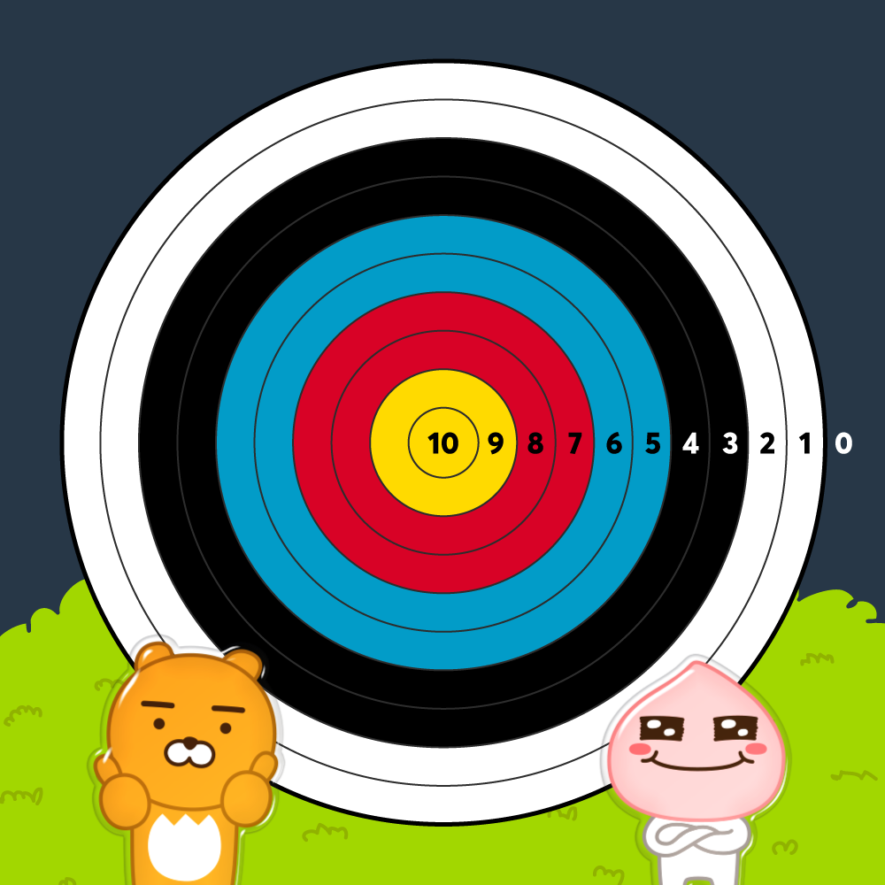

# [Programmers 92342 - 양궁대회](https://school.programmers.co.kr/learn/courses/30/lessons/92342)

## 문제 설명

카카오배 양궁대회가 열렸습니다.  
`라이언`은 저번 카카오배 양궁대회 우승자이고 이번 대회에도 결승전까지 올라왔습니다. 결승전 상대는 `어피치`입니다.  
카카오배 양궁대회 운영위원회는 한 선수의 연속 우승보다는 다양한 선수들이 양궁대회에서 우승하기를 원합니다. 따라서, 양궁대회 운영위원회는 결승전 규칙을 전 대회 우승자인 라이언에게 불리하게 다음과 같이 정했습니다.

1. 어피치가 화살 `n`발을 다 쏜 후에 라이언이 화살 `n`발을 쏩니다.
2. 점수를 계산합니다.
   1. 과녁판은 아래 사진처럼 생겼으며 가장 작은 원의 과녁 점수는 10점이고 가장 큰 원의 바깥쪽은 과녁 점수가 0점입니다.
      
   2. 만약, k(k는 1~10사이의 자연수)점을 어피치가 a발을 맞혔고 라이언이 b발을 맞혔을 경우 더 많은 화살을 k점에 맞힌 선수가 k 점을 가져갑니다. 단, a = b일 경우는 어피치가 k점을 가져갑니다. k점을 여러 발 맞혀도 k점 보다 많은 점수를 가져가는 게 아니고 k점만 가져가는 것을 유의하세요. 또한 a = b = 0 인 경우, 즉, 라이언과 어피치 모두 k점에 단 하나의 화살도 맞히지 못한 경우는 어느 누구도 k점을 가져가지 않습니다.
      - 예를 들어, 어피치가 10점을 2발 맞혔고 라이언도 10점을 2발 맞혔을 경우 어피치가 10점을 가져갑니다.
      - 다른 예로, 어피치가 10점을 0발 맞혔고 라이언이 10점을 2발 맞혔을 경우 라이언이 10점을 가져갑니다.
   3. 모든 과녁 점수에 대하여 각 선수의 최종 점수를 계산합니다.
3. 최종 점수가 더 높은 선수를 우승자로 결정합니다. 단, 최종 점수가 같을 경우 어피치를 우승자로 결정합니다.

현재 상황은 어피치가 화살 `n`발을 다 쏜 후이고 라이언이 화살을 쏠 차례입니다.  
라이언은 어피치를 가장 큰 점수 차이로 이기기 위해서 `n`발의 화살을 어떤 과녁 점수에 맞혀야 하는지를 구하려고 합니다.

화살의 개수를 담은 자연수 `n`, 어피치가 맞힌 과녁 점수의 개수를 10점부터 0점까지 순서대로 담은 정수 배열 `info`가 매개변수로 주어집니다. 이때, 라이언이 가장 큰 점수 차이로 우승하기 위해 `n`발의 화살을 어떤 과녁 점수에 맞혀야 하는지를 10점부터 0점까지 순서대로 정수 배열에 담아 return 하도록 solution 함수를 완성해 주세요. 만약, 라이언이 우승할 수 없는 경우(무조건 지거나 비기는 경우)는 `[-1]`을 return 해주세요.

## 제한 사항

- 1 ≤ `n` ≤ 10
- `info`의 길이 = 11
  - 0 ≤ `info`의 원소 ≤ `n`
  - `info`의 원소 총합 = `n`
  - `info`의 i번째 원소는 과녁의 `10 - i` 점을 맞힌 화살 개수입니다. ( i는 0~10 사이의 정수입니다.)
- 라이언이 우승할 방법이 있는 경우, return 할 정수 배열의 길이는 11입니다.
  - 0 ≤ return할 정수 배열의 원소 ≤ `n`
  - return할 정수 배열의 원소 총합 = `n` (꼭 n발을 다 쏴야 합니다.)
  - return할 정수 배열의 i번째 원소는 과녁의 `10 - i` 점을 맞힌 화살 개수입니다. ( i는 0~10 사이의 정수입니다.)
  - 라이언이 가장 큰 점수 차이로 우승할 수 있는 방법이 여러 가지 일 경우, 가장 낮은 점수를 더 많이 맞힌 경우를 return 해주세요.
    - 가장 낮은 점수를 맞힌 개수가 같을 경우 계속해서 그다음으로 낮은 점수를 더 많이 맞힌 경우를 return 해주세요.
    - 예를 들어, `[2,3,1,0,0,0,0,1,3,0,0]`과 `[2,1,0,2,0,0,0,2,3,0,0]`를 비교하면 `[2,1,0,2,0,0,0,2,3,0,0]`를 return 해야 합니다.
    - 다른 예로, `[0,0,2,3,4,1,0,0,0,0,0]`과 `[9,0,0,0,0,0,0,0,1,0,0]`를 비교하면 `[9,0,0,0,0,0,0,0,1,0,0]`를 return 해야 합니다.
- 라이언이 우승할 방법이 없는 경우, return 할 정수 배열의 길이는 1입니다.
  - 라이언이 어떻게 화살을 쏘든 라이언의 점수가 어피치의 점수보다 낮거나 같으면 `[-1]`을 return 해야 합니다.

## 입출력 예

| n   | info                    | result                  |
| --- | ----------------------- | ----------------------- |
| 5   | [2,1,1,1,0,0,0,0,0,0,0] | [0,2,2,0,1,0,0,0,0,0,0] |
| 1   | [1,0,0,0,0,0,0,0,0,0,0] | [-1]                    |
| 9   | [0,0,1,2,0,1,1,1,1,1,1] | [1,1,2,0,1,2,2,0,0,0,0] |
| 10  | [0,0,0,0,0,0,0,0,3,4,3] | [1,1,1,1,1,1,1,1,0,0,2] |

## 입출력 예 설명

입출력 예 #1

어피치와 라이언이 아래와 같이 화살을 맞힐 경우,

| 과녁 점수 | 어피치가 맞힌 화살 개수 | 라이언이 맞힌 화살 개수 | 결과               |
| --------- | ----------------------- | ----------------------- | ------------------ |
| 10        | 2                       | 3                       | 라이언이 10점 획득 |
| 9         | 1                       | 2                       | 라이언이 9점 획득  |
| 8         | 1                       | 0                       | 어피치가 8점 획득  |
| 7         | 1                       | 0                       | 어피치가 7점 획득  |
| 6         | 0                       | 0                       |                    |
| 5         | 0                       | 0                       |                    |
| 4         | 0                       | 0                       |                    |
| 3         | 0                       | 0                       |                    |
| 2         | 0                       | 0                       |                    |
| 1         | 0                       | 0                       |                    |
| 0         | 0                       | 0                       |                    |

어피치의 최종 점수는 15점, 라이언의 최종 점수는 19점입니다. 4점 차이로 라이언이 우승합니다.

하지만, 라이언이 아래와 같이 화살을 맞힐 경우 더 큰 점수 차로 우승할 수 있습니다.

| 과녁 점수 | 어피치가 맞힌 화살 개수 | 라이언이 맞힌 화살 개수 | 결과               |
| --------- | ----------------------- | ----------------------- | ------------------ |
| 10        | 2                       | 0                       | 어피치가 10점 획득 |
| 9         | 1                       | 2                       | 라이언이 9점 획득  |
| 8         | 1                       | 2                       | 라이언이 8점 획득  |
| 7         | 1                       | 0                       | 어피치가 7점 획득  |
| 6         | 0                       | 1                       | 라이언이 6점 획득  |
| 5         | 0                       | 0                       |                    |
| 4         | 0                       | 0                       |                    |
| 3         | 0                       | 0                       |                    |
| 2         | 0                       | 0                       |                    |
| 1         | 0                       | 0                       |                    |
| 0         | 0                       | 0                       |                    |

어피치의 최종 점수는 17점, 라이언의 최종 점수는 23점입니다. 6점 차이로 라이언이 우승합니다.

따라서 `[0,2,2,0,1,0,0,0,0,0,0]`을 return 해야 합니다.

입출력 예 #2

라이언이 10점을 맞혀도 어피치가 10점을 가져가게 됩니다.  
따라서, 라이언은 우승할 수 없기 때문에 `[-1]`을 return 해야 합니다.

입출력 예 #3

어피치와 라이언이 아래와 같이 화살을 맞힐 경우,

| 과녁 점수 | 어피치가 맞힌 화살 개수 | 라이언이 맞힌 화살 개수 | 결과               |
| --------- | ----------------------- | ----------------------- | ------------------ |
| 10        | 0                       | 1                       | 라이언이 10점 획득 |
| 9         | 0                       | 1                       | 라이언이 9점 획득  |
| 8         | 1                       | 2                       | 라이언이 8점 획득  |
| 7         | 2                       | 3                       | 라이언이 7점 획득  |
| 6         | 0                       | 0                       |                    |
| 5         | 1                       | 2                       | 라이언이 5점 획득  |
| 4         | 1                       | 0                       | 어피치가 4점 획득  |
| 3         | 1                       | 0                       | 어피치가 3점 획득  |
| 2         | 1                       | 0                       | 어피치가 2점 획득  |
| 1         | 1                       | 0                       | 어피치가 1점 획득  |
| 0         | 1                       | 0                       | 어피치가 0점 획득  |

어피치의 최종 점수는 10점, 라이언의 최종 점수는 39점입니다. 29점 차이로 라이언이 우승합니다.

하지만 라이언이 아래와 같이 화살을 맞힐 경우,

| 과녁 점수 | 어피치가 맞힌 화살 개수 | 라이언이 맞힌 화살 개수 | 결과               |
| --------- | ----------------------- | ----------------------- | ------------------ |
| 10        | 0                       | 1                       | 라이언이 10점 획득 |
| 9         | 0                       | 1                       | 라이언이 9점 획득  |
| 8         | 1                       | 2                       | 라이언이 8점 획득  |
| 7         | 2                       | 0                       | 어피치가 7점 획득  |
| 6         | 0                       | 1                       | 라이언이 6점 획득  |
| 5         | 1                       | 2                       | 라이언이 5점 획득  |
| 4         | 1                       | 2                       | 라이언이 4점 획득  |
| 3         | 1                       | 0                       | 어피치가 3점 획득  |
| 2         | 1                       | 0                       | 어피치가 2점 획득  |
| 1         | 1                       | 0                       | 어피치가 1점 획득  |
| 0         | 1                       | 0                       | 어피치가 0점 획득  |

어피치의 최종 점수는 13점, 라이언의 최종 점수는 42점입니다. 이 경우도 29점 차이로 라이언이 우승합니다.  
하지만, 첫 번째 경우와 두 번째 경우를 비교했을 때, 두 번째 경우가 두 경우 중 가장 낮은 점수인 4점을 더 많이 맞혔기 때문에 `[1,1,2,3,0,2,0,0,0,0,0]`이 아닌 `[1,1,2,0,1,2,2,0,0,0,0]`을 return 해야 합니다.

입출력 예 #4

가장 큰 점수 차이로 이기는 경우 중에서 가장 낮은 점수를 가장 많이 맞힌, 10~3점을 한 발씩 맞히고 나머지 두 발을 0점에 맞히는 경우인 `[1,1,1,1,1,1,1,1,0,0,2]`를 return 해야 합니다.

---

## 문제 정보

| 난이도 | Lv.3 |
| ------ | ---- |
| 정답률 | 52%  |

## 풀이 정보

| 풀이 시간 | 78 min |
| --------- | ------ |
| 알고리즘  | DFS    |

| 정확성 테스트                       |
| ----------------------------------- |
| 테스트 1 〉 통과 (0.07ms, 85.4MB)   |
| 테스트 2 〉 통과 (11.30ms, 90.6MB)  |
| 테스트 3 〉 통과 (8.16ms, 86.8MB)   |
| 테스트 4 〉 통과 (0.83ms, 72.6MB)   |
| 테스트 5 〉 통과 (18.35ms, 86.9MB)  |
| 테스트 6 〉 통과 (22.63ms, 74.8MB)  |
| 테스트 7 〉 통과 (0.95ms, 85.6MB)   |
| 테스트 8 〉 통과 (0.28ms, 88.4MB)   |
| 테스트 9 〉 통과 (0.95ms, 70.8MB)   |
| 테스트 10 〉 통과 (0.41ms, 77.9MB)  |
| 테스트 11 〉 통과 (0.60ms, 74.4MB)  |
| 테스트 12 〉 통과 (0.61ms, 82.6MB)  |
| 테스트 13 〉 통과 (3.30ms, 75.6MB)  |
| 테스트 14 〉 통과 (8.45ms, 76.1MB)  |
| 테스트 15 〉 통과 (8.25ms, 76.7MB)  |
| 테스트 16 〉 통과 (1.53ms, 89.2MB)  |
| 테스트 17 〉 통과 (0.87ms, 91.5MB)  |
| 테스트 18 〉 통과 (0.08ms, 88.8MB)  |
| 테스트 19 〉 통과 (0.03ms, 84.9MB)  |
| 테스트 20 〉 통과 (12.30ms, 90.6MB) |
| 테스트 21 〉 통과 (8.63ms, 74.9MB)  |
| 테스트 22 〉 통과 (16.97ms, 78.9MB) |
| 테스트 23 〉 통과 (0.24ms, 86MB)    |
| 테스트 24 〉 통과 (14.44ms, 86.8MB) |
| 테스트 25 〉 통과 (13.95ms, 77.2MB) |

## 코드

```java
class Solution {

    private static int[] answer = {-1};
    private static int max = 0;  // 라이언이 어피치를 이긴 점수차

    public int[] solution(int n, int[] info) {
        dfs(new int[11], 0, n, info);

        return answer;
    }

    private static void dfs(int[] selArr, int selIdx, int n, int[] info) {
        // n발을 모두 쏜 경우
        if (selIdx == 11 && n == 0) {
            int result = solve(selArr, info);

            // 현재 점수차보다 더 크게 이기면 바로 갱신하고 현재 점수차와 동일하면 더 작은 점수를 많이 쏜 경우만 갱신
            if (result > max) {
                max = result;
                answer = selArr.clone();
            } else if (result == max && result > 0 && hitMinPoint(selArr)) {
                answer = selArr.clone();
            }

            return;
        }

        // n발을 모두 못 쏜 경우
        if (selIdx == 11) {
            return;
        }

        for (int i = 0; i <= n; i++) {
            selArr[selIdx] = i;
            dfs(selArr, selIdx + 1, n - i, info);
        }
    }

    private static int solve(int[] ryan, int[] apeach) {
        int sum = 0;

        for (int i = 0; i <= 10; i++) {
            if (ryan[i] == 0 && apeach[i] == 0) continue;

            sum = ryan[i] > apeach[i] ? sum + (10 - i) : sum - (10 - i);
        }

        return sum;
    }

    private static boolean hitMinPoint(int[] current) {
        for (int i = 10; i >= 0; i--) {
            if (answer[i] < current[i]) {
                return true;
            } else if (answer[i] > current[i]) {
                return false;
            }
        }

        return false;
    }
}
```

## 해설

DFS를 활용해서 해결했다.

길이 11의 배열에 `n`을 잘 분배해서 넣어야 한다. 순열과 조합을 DFS로 구하는 방식처럼 0 ~ n 사이의 수를 해당 인덱스에 넣고 다음 재귀때는 n - i를 넘겨서 n이 0이 되면서 모든 숫자를 분배했으면 조건을 평가하면 된다. 모든 화살을 반드시 쏴야 함에 유의해야 한다. 조건은 현재까지 구한 점수차보다 더 점수차가 클 경우 바로 갱신하면 되고 동일할 경우 더 점수가 낮은 화살을 많이 쏜 경우를 찾아주면 된다.

## 리뷰

DFS 자체가 더 작은 점수를 많이 쏜 순서로 돌 줄 알았는데 아니어서 디버깅에 시간이 조금 걸렸다.

---
