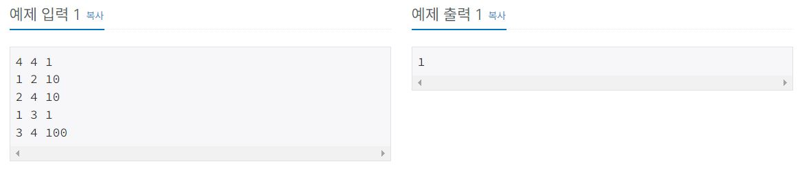
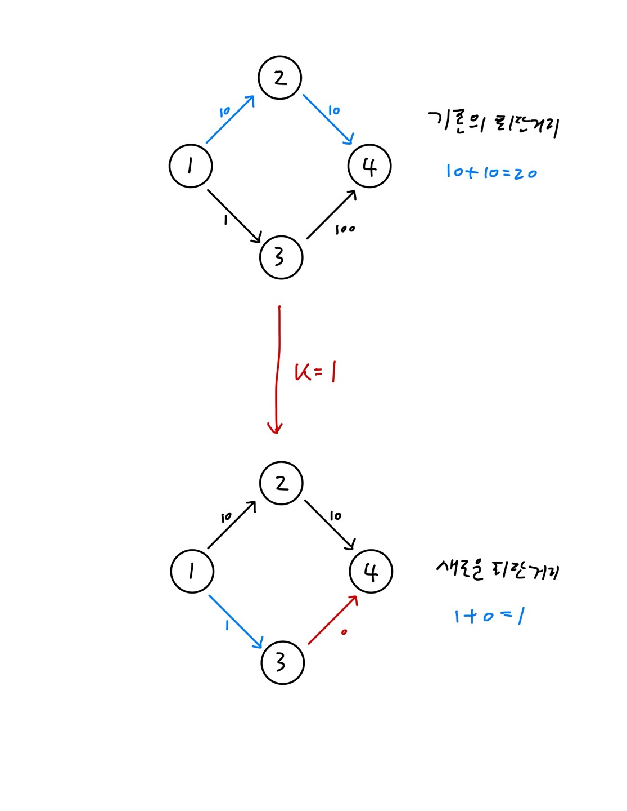

https://www.acmicpc.net/problem/1162

# 🔍 도로포장
- 설계 시간 : ? min
- 구현 시간 : ? min
- 난이도 : 플래티넘 5
- 알고리즘 : 다익스트라 알고리즘
- 코드 길이 : 3937B
- 실행 시간 : 628ms(제한 2초)
- 메모리 : 65572KB

------------------------------

# 🔍 예제 입출력

------------------------------

# 💡 아이디어

- 이전의 벽 부수고 이동하기 2(https://www.acmicpc.net/problem/14442) 문제를 스스로 해결할 수 있으면 간단한 문제였다. 

------------------------------

# ✔ 문제 풀이

- 다익스트라 알고리즘을 통해 최단거리를 구해야 하는 것은 금방 생각할 수 있는데, 각각의 경로가 K개의 도로를 공짜로 지나갈 수 있어서 단순히 가중치만으로 계산하기는 어렵다. 
- 아이디어는 다익스트라의 방문 체크 과정에서 도로를 포장한 횟수까지 고려하는 것으로 다익스트라에서 기존의 방문 체크는 특정 도시를 방문할 수 있는 최단경로가 확실할 때 방문체크를 통해 더이상 고려하지 않듯이, 특정 도시를 특정 포장횟수로 방문할 수 있는 최단경로가 확실할 때 방문 체크를 해주는 원리로 확장한 것이다. 
- 방문 체크는 2차원 배열을 통해 도시 번호와 포장 횟수를 나타낼 수 있고, 최단 거리 배열(dist) 역시 2차원 배열로 만들어서 특정 도시를 특정 포장횟수로 방문할 수 있는 최단 거리를 저장하게 해줬다. 
- 테스트 케이스에서 걸렸던 상황이 몇 가지 있었는데 주석으로 남겼다. 

------------------------------

# 🧠 어려웠던 점

- Node 클래스에 cnt 필드가 추가되면서 상당히 헷갈렸다. 

------------------------------

# 🧐 좋은 풀이

- 다 비슷하게 풀었다. 