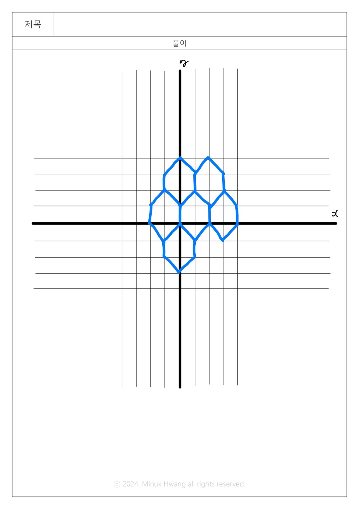

https://www.acmicpc.net/problem/17370

# 🔍 육각형 우리 속의 개미
- 설계 시간 : 8min
- 구현 시간 : 87min
- 난이도 : 골드 3
- 알고리즘 : 그래프 이론, 브루트포스, 그래프 탐색, DFS, 백트래킹
- 코드 길이 : 4675B
- 실행 시간 : 168ms(제한 1초)
- 메모리 : 14128KB

---

# 💡 아이디어

- 딱 봤을 때, DFS로 찾는데 백트래킹이 필요한 유형일거 같았다.
  - 개미가 지나온 길에 다시 도착하면 종료된다는 점에서 방문 체크에 대한 힌트가 느껴졌다.
- 문제 풀이 방식은 육각형의 각 꼭짓점을 좌표화 하든가 노드화 하든가 둘 중 하나일 것 같았는데, 좌표로 푸는게 정신건강에 좋아보였다.
- 이후 조건에 맞게 DFS를 구현하는데, 백트래킹을 통해 시간을 단축해야 1초안에 통과할 수 있을 것 같았다.

---

# 🧠 어려웠던 점

- 일단 문제를 이해하기가 약간 어려웠고, N이 커지면 경로가 엄청나게 늘어나지 않을까 걱정이 됐다.
  - 탐색을 단순히 하는 것이 아닌 어떤 문제 특유의 원리가 있는지 고민했지만 예외가 많아 보여서 아마 없을 것 같다.
- 일단 그동안 DFS를 풀 때마다 느끼는 점이지만 디버깅이 너무 어려운 것 같다.
  - 정답이 안나와서 하나하나 다 점을 찾아가며 문제를 발견하려 했는데 문득 DFS는 스택 구조니까 각 좌표도 스택에 담아두면 정답인 경우 좌표만 한 번에 볼 수 있지 않을까 싶었다.
  - 약간 꼬이긴 했지만 진짜 됨(코드 참고)
- DFS에서 방문체크를 하는 것까지는 좋았는데, 정답이 아닌 경우 방문 해제를 하는 것이 어려웠다.
  - 코드에서 정답이 2번 중복 출력되는 현상으로 ans/2로 답을 구했는데, 정확히는 모르겠지만 아마 해제 시점때문에 한번 더 세진걸로 파악중이다.
- 방문 체크 배열을 만들때 범위를 임의로 선정하는 것에 약간 부담이 있었고, 좌표는 음수도 있지만 배열 인덱스는 음이 아닌 정수만 있어서 헷갈렸다.

---

# 🧐 좋은 풀이

- N이 22라서 크다고 생각했는데 2^22 < 10^8 로 완탐을 확신하는 사람들이 대다수였다.
- 개미가 움직이는 공간을 그냥 100 정도의 여유로운 수로 다들 잡았다.
- 코드 논리는 크게는 비슷한데 내가 조건문 6개 방향을 처리한 부분을 반복문으로 좀 더 깔쌈하게 처리해서 코드만 봤을 때는 쉬운 문제 같아보였다. 
