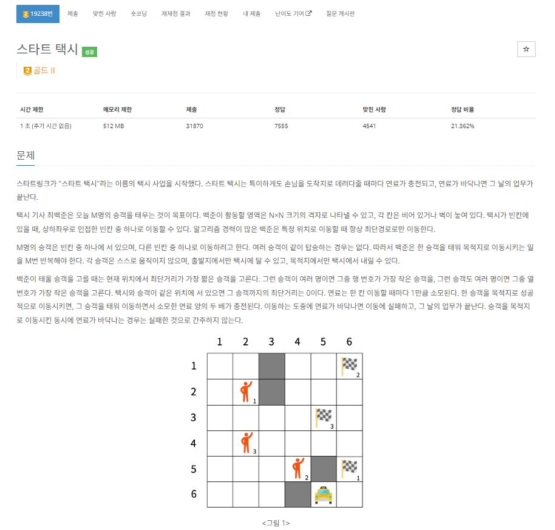
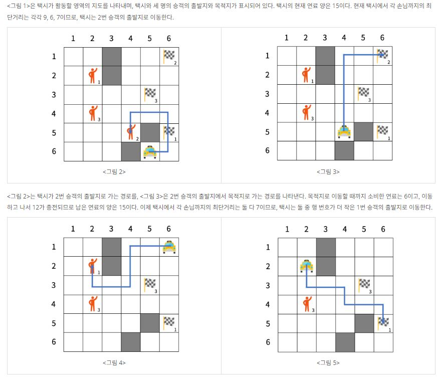
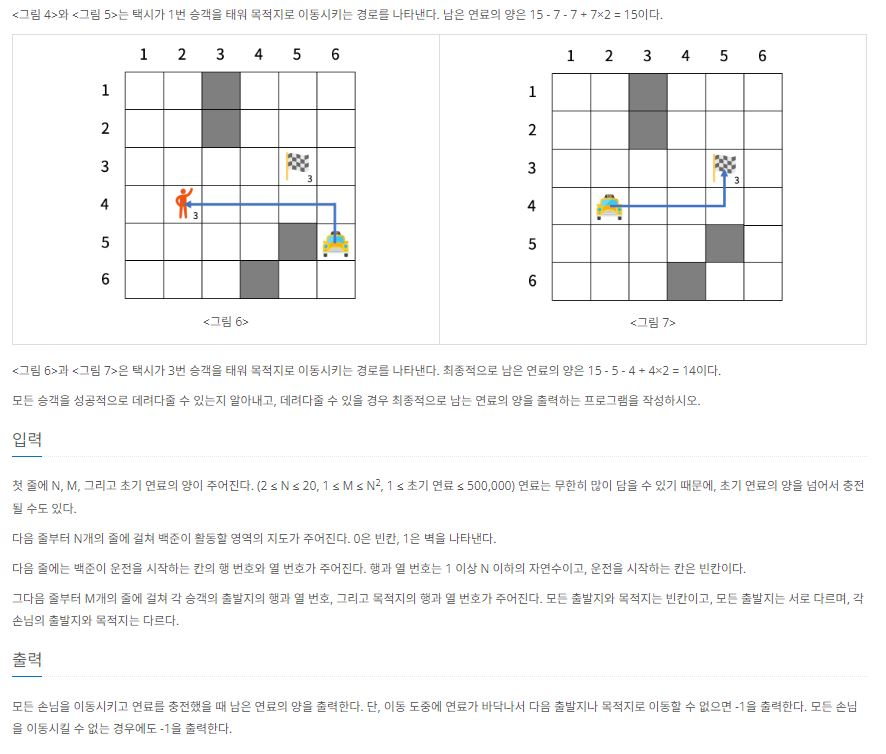

https://www.acmicpc.net/problem/19238

# 🔍 스타트 택시
- 설계 시간 : 4min
- 구현 시간 : 116min
- 난이도 : 골드 2
- 알고리즘 : 구현 / 시뮬레이션 / BFS
- 코드 길이 : 3757B
- 실행 시간 : 984ms(제한 1초)
- 메모리 : 296820KB

------------------------------

# 💡 아이디어

- 최단거리는 뭐다? -> 그냥 무조건 BFS다
- 정답 비율 20%대인데 메모리 512MB에 시간 제한 1초면 시간 초과 광탈이 많지 않을까 생각함
  - 근데 구현 실수도 조심했어야 했음
- 최단거리는 택시와 승객, 승객과 목적지 두 가지를 승객 수만큼 구해야하는데 벽이 있어서 전부 BFS로 찾아야 함
  - 승객과 목적지의 최단거리는 입력에서 고정이니까 한번만 구하고 택시와 승객의 최단거리는 택시가 움직이면 매번 구해줘야함
  - 불편하지만 메서드를 따로 분리해줘야 함(한번에 하면 시간초과)
- 택시가 한칸 움직일때마다 연료를 갱신하면 바보
  - 그냥 승객 태우고 목적지까지 한번에 가고 남은 연료가 0 이상인지로 도착 가능 여부 파악

------------------------------

# 🧠 어려웠던 점

- 택시가 태울 다음 승객을 고르는게 은근 까다롭게 느껴졌음
  - 택시와 승객의 최단거리가 같은 경우가 여러가지면 승객의 행과 열을 기준으로 찾는데, 쉽지 않았음
- 메서드 구현은 쉬웠는데, 입력이 많아서 어떻게 구조화할까랑 메인 함수에서 로직을 어떻게 짤지가 약간 쉽지 않았음
- 승객을 다 못 날른 경우 처리가 은근 까다로움

------------------------------

# 🧐 공부할 점

- BFS를 파라미터로 행번호 열번호 받아서 처리하는거를 주로 했었는데, 출발점 행열, 도착점 행열을 받아서 처리하기도 했고, 최단거리 구하는 방식을 바꿔보면서 BFS 공부를 더 해야할 거 같다
