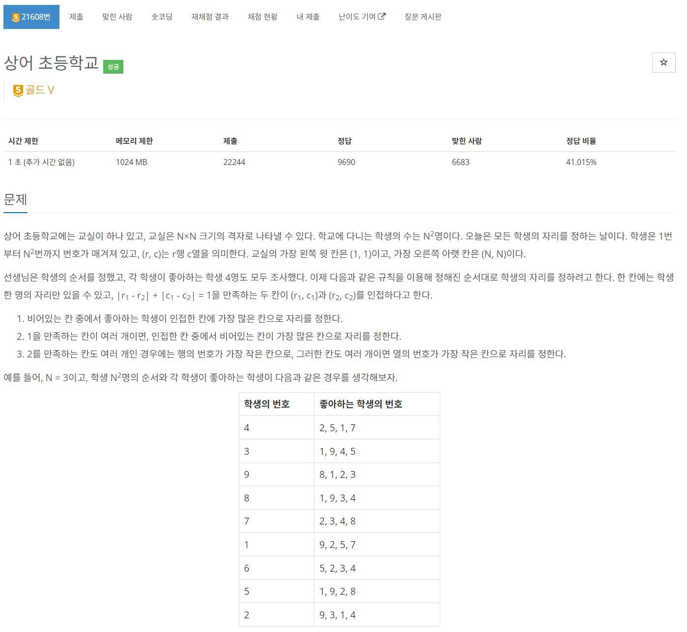
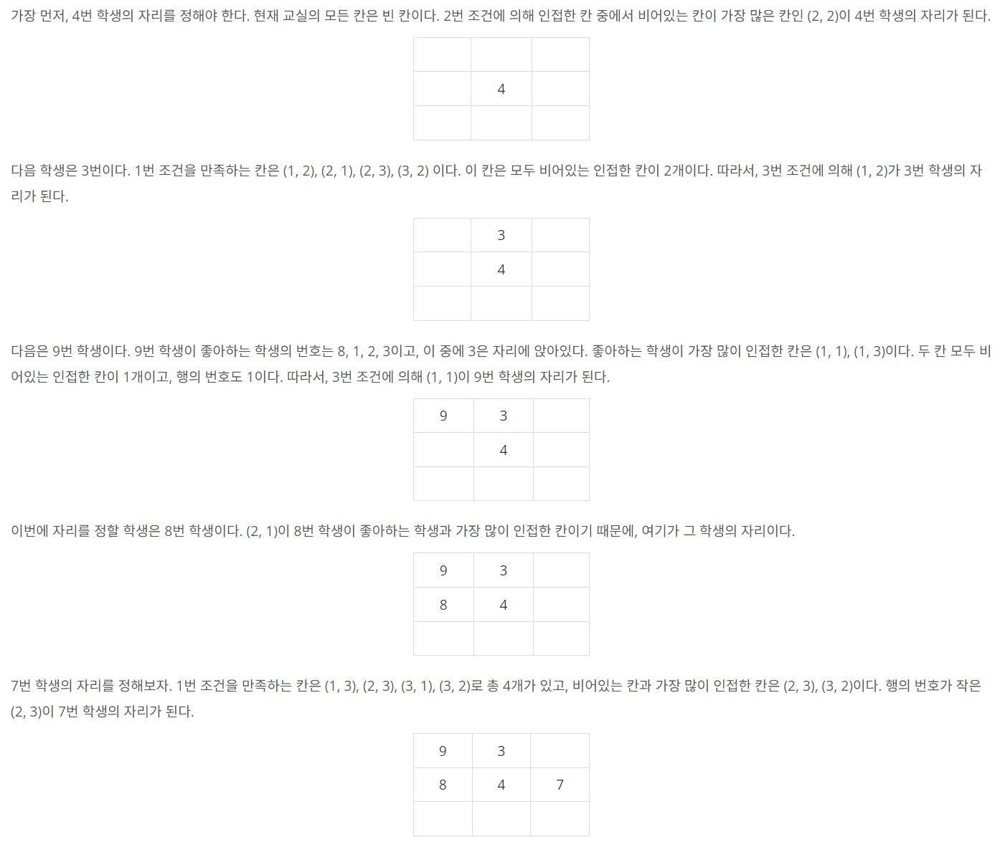
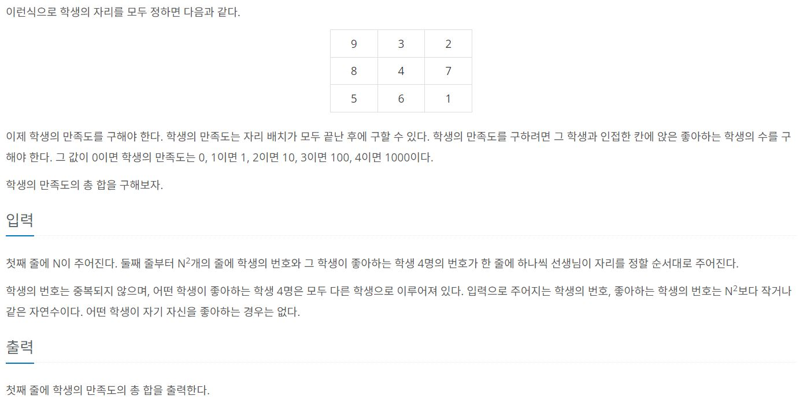
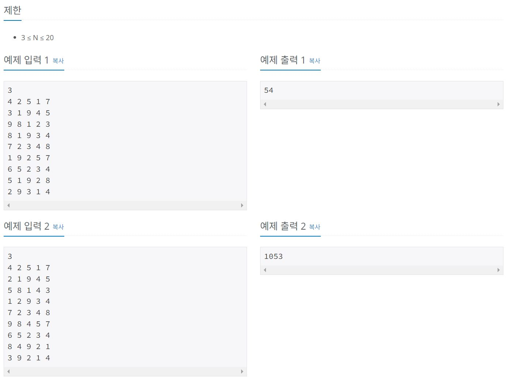

https://www.acmicpc.net/problem/21608

# 🔍 상어 초등학교
- 설계 시간 : 3min
- 구현 시간 : 102min
- 난이도 : 골드 5
- 알고리즘 : 구현
- 코드 길이 : 3760B
- 실행 시간 : 584ms(제한 1초)
- 메모리 : 32824KB

------------------------------

# 💡 아이디어

- 그냥 땡 구현 문제 삘왔고 메모리는 넉넉해서 무난해보였음
- 요즘 자주 나오는 2차원 배열로 입력값 처리하기를 해봄
- 예시 설명이 참 친절해서 쉬워보였음

------------------------------

# 🧠 어려웠던 점

- 구현이 골5치고 생각보다 빡셈(구현 문제니까!)
  - 일단 자리의 우선 순위 조건이 4개라서 꼼꼼히 구현해야함
  - 가장 어려웠던게 친구수가 동일한 자리가 여러 개일때 빈자리가 가장 많은 자리를 찾는건데, 이게 변수 하나로 처리가 안될거 같았음
  - 결국 모든 자리에 대해 우선순위에 필요한 데이터를 다 받았고 조건에 맞게 정렬해서 첫번째 원소를 뽑는 방식으로 하기로 함
  - 근데 정렬 과정에서 더미 데이터가 들어가는걸 찾는게 좀 귀찮았음
  - 제한 시간이 1초인데 델타배열을 여러번 써야해서 좀 쫄렸음
  - 모든 데이터를 다 가진채로 찾아야 한다는 마음 먹기가 제일 힘들었던듯

- 객체 정렬 오랜만이라 좀 꼬였음

------------------------------

# 🧐 좋은 풀이

- 구현은 직접 해보자
