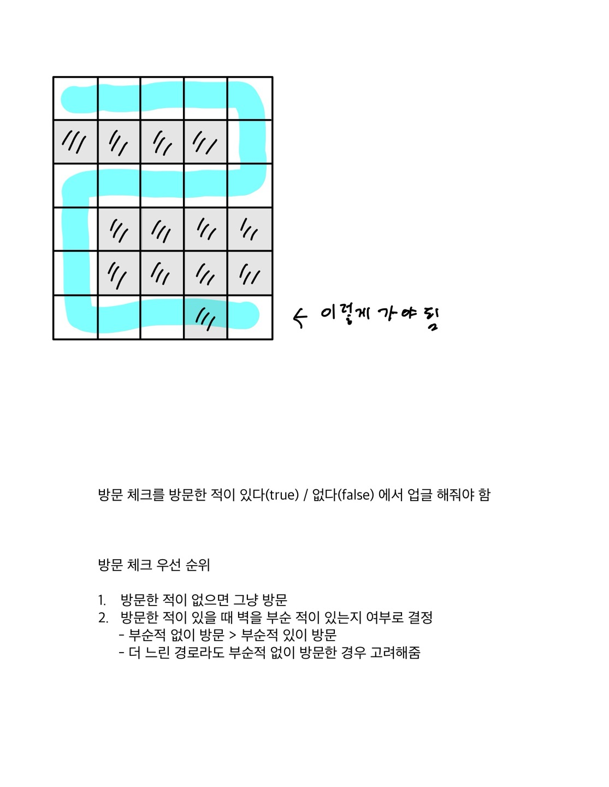

https://www.acmicpc.net/problem/2206

# 🔍 벽 부수고 이동하기
- 설계 시간 : ? min
- 구현 시간 : ? min
- 난이도 : 골드 3
- 알고리즘 : BFS
- 코드 길이 : 6191B
- 실행 시간 : 592ms(제한 2초)
- 메모리 : 109716KB

------------------------------

# 💡 아이디어

- 최단 거리라고 써있으면 반사적으로 BFS 일단 생각
- map이 최대 1000 x 1000 이라서 조합으로 뽑은 벽을 지우고 BFS 돌리기를 반복하면 시간 초과 남 -> 무조건 BFS 1트에 찾아야 함
- BFS에 사용할 Node가 벽을 부순 적이 있는지 정보를 들고 다니고 이걸 방문 체크 배열과 비교하는 식으로 풀어야 될거 같았음
- 근데 벽을 한 번 부수고 이동하는게 더 짧으면 그렇게 이동해야해서 일반적인 boolean 방문 체크로는 해결이 안됨
- 방문 체크 배열을 int 배열로 만들어 더 많은 정보를 저장할 수 있게 바꿈

------------------------------

# ✔ 문제 풀이

핵심은 벽을 부순적이 있는 여부에 대한 정보와 방문 체크 배열을 비교하는 과정

새로 넣을 후보 노드에 대해서

1. 해당 칸이 길 && 처음 방문 함(visited == 0)
    - 벽을 부순적이 있음 : 기존 노드의 벽 파괴 정보를 들고 방문 가능
    - 벽을 부순적이 없음 : 기존 노드의 벽 파괴 정보를 들고 방문 가능

2. 해당 칸이 길 && 벽을 부순 적이 없이 방문 해봄(visited == 1)
    - ~~벽을 부순적이 있음 : 벽을 부쉈는데도 더 오래 걸린 경로는 필요 없음~~
    - ~~벽을 부순적이 없음 : 둘 다 부순 적은 없지만 이전꺼가 최단 거리여서 필요 없음~~

3. 해당 칸이 길 && 벽을 부순 적이 있이 방문 해봄(visited == 2)
    - ~~벽을 부순적이 있음 : 둘 다 부순 적은 있지만 이전꺼가 최단 거리여서 필요 없음~~
    - 벽을 부순적이 없음 : 현재는 최단 거리는 아니지만 벽을 부순적이 없어서 가능성이 있음

4. 해당 칸이 벽 && 처음 방문 함(visited == 0)
    - ~~벽을 부순적이 있음 : 벽은 한 번만 부술 수 있으므로 out~~
    - 벽을 부순적이 없음 : 벽을 부수고 방문 가능

5. 해당 칸이 벽 && 벽을 부순 적이 없이 방문 해봄(visited == 1)
    - ~~벽을 부순적이 있음 : 해당 칸이 벽인데 부순 적이 없이 방문은 애초에 불가능 out~~
    - ~~벽을 부순적이 없음 : 해당 칸이 벽인데 부순 적이 없이 방문은 애초에 불가능 out~~

6. 해당 칸이 벽 && 벽을 부순 적이 있이 방문 해봄(visited == 2)
    - ~~벽을 부순적이 있음 : 벽은 한 번만 부술 수 있으므로 out~~
    - ~~벽을 부순적이 없음 : 벽은 한 번만 부술 수 있으므로 out~~

------------------------------

# 🧠 어려웠던 점

- 방문 체크를 변형해야 한다는 걸 알아도 조건이 헷갈리고 구현도 은근 까다로웠다
- 각각의 조건이 간섭이 일어나 무한 루프에 빠지거나 부적절한 답이 나오지 않을까 약간 찝찝했다
  - 최단 거리가 먼저 visited를 채우고 이후 갱신되는 구조가 될거 같아서 괜찮은거 같기도 하고

6 5 
00000
11110
00000
01111
01111
00010 

이거 반례 뚫으면 아마 pass 될 듯 (답 : 18)

------------------------------

# 🧐 좋은 풀이

- 다 비슷하게 풀었다
- 시작점과 도착점에서 동시에 BFS를 돌린 사람들이 좀 있는데 왜 그런지는 모르겠음...
