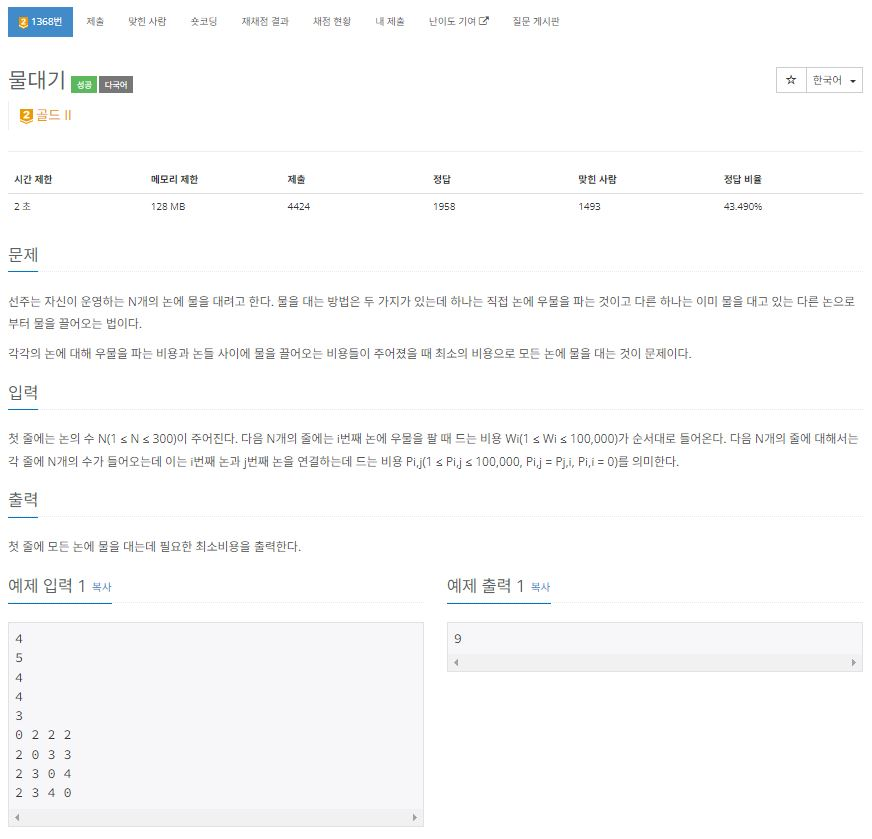
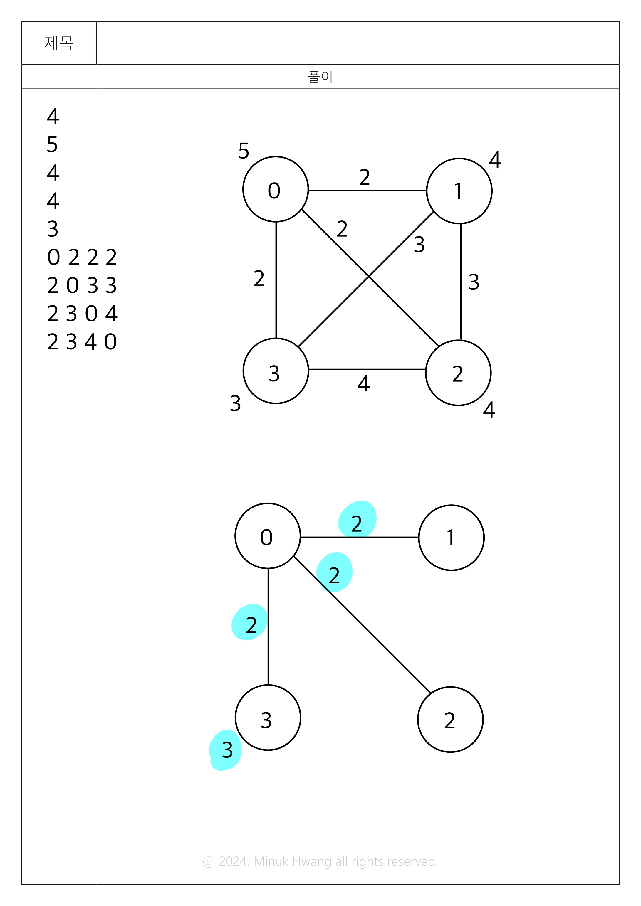
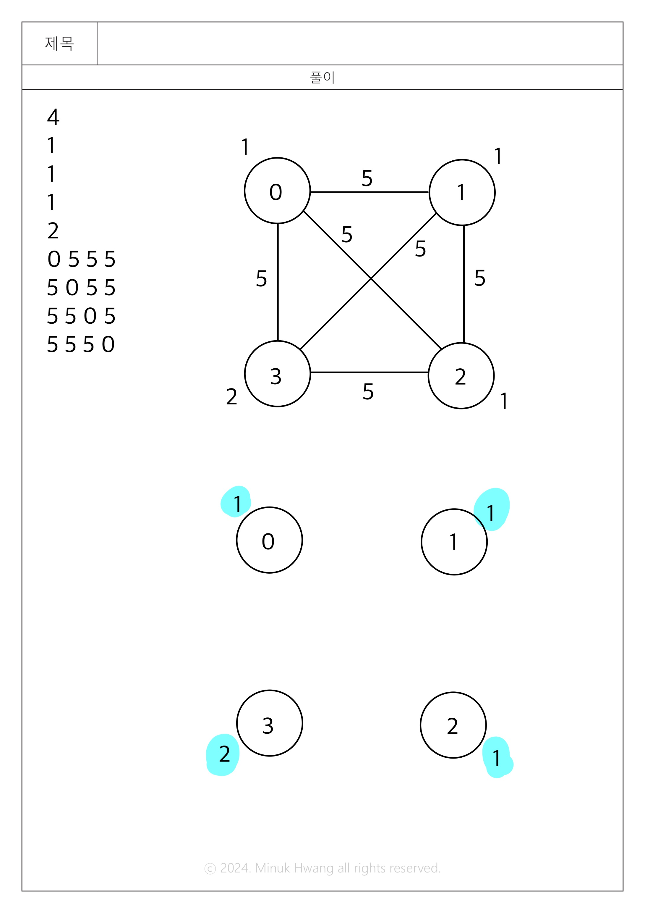

https://www.acmicpc.net/problem/1368

# 🔍 물대기
- 설계 시간 : 1 + 1 + 1min
- 구현 시간 : 105 + 52 + 42min
- 난이도 : 골드 2
- 알고리즘 : 크루스칼 알고리즘
- 코드 길이 : 1323B
- 실행 시간 : 920ms(제한 2초)
- 메모리 : 89551KB

------------------------------

# 💡 아이디어

- 모든 논을 연결한 최소 신장 트리가 될 때까지 비교하는 크루스칼 알고리즘 활용

------------------------------

# 🧠 어려웠던 점

- 어떻게 풀어야 할지 감이 안와서 어려웠음
  - 뭔가 프림 삘나서 우선순위큐 프림으로 한참 했는데 4%에서 자꾸 실패하다가 셀프 테케 넣어보니까 구현이 잘 안됐었음
  - 고민하다가 그리디로 푸는건 맞는지 혼란도 몇 번 왔음(뭔가 반례가 있을거 같은 느낌)
  - 프림만 생각하다가 크루스칼로 하면 되나 생각했는데 갑자기 될 거 같아서 해보니까 됨
- 풀고 보니까 프림으로는 안될 거 같기도 함(그냥 삘)

------------------------------

# 🧐 좋은 풀이

- 직접 해본건 아닌데 가상 논을 하나 만들어서 가상 논과 실제 논을 이어주고 비용을 우물을 파는 비용으로 하는 아이디어는 뭔가 참신해서 가져옴(가상 논을 0번으로 하면 딱 되나?)

https://hyeo-noo.tistory.com/304
