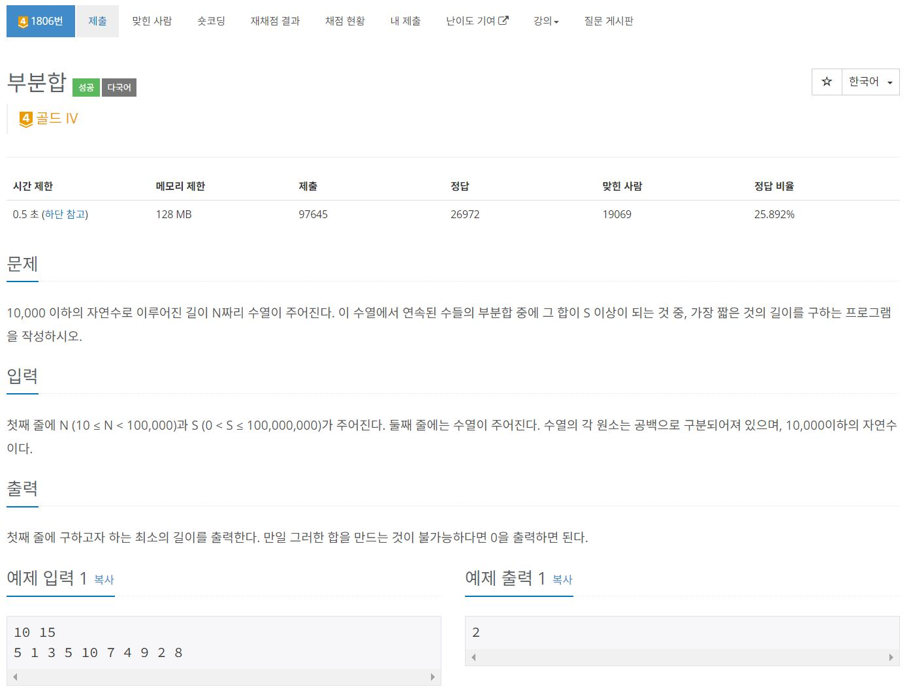

https://www.acmicpc.net/problem/1806

[입력] 
10 15 
5 1 3 5 10 7 4 9 2 8 

|0|1|2|3|4|5|6|7|8|9|합계|
|-|-|-|-|--|-|-|-|-|-|--:|
|5|1|3|5|10|7|4|9|2|8|54|
|5|1|3|5|10| | | | | |24|
| |1|3|5|10| | | | | |19|
| | |3|5|10| | | | | |18|
| | | |5|10| | | | | |15|
| | | | |10|7| | | | |17|
| | | | |  |7|4|9| | |20|
| | | | |  | |4|9|2| |15|
| | | | |  | | |9|2|8|19|

[5, 10] 이 제일 짧으므로 정답은 2

[입력] 
5 3 
1 1 1 1 5 

|0|1|2|3|4|합계|
|-|-|-|-|-|-:|
|1|1|1|1|5|9|
|1|1|1| | |3|
| |1|1|1| |3|
| | |1|1|5|7|
| | | |1|5|6|
| | | | |5|5|

[5] 이 제일 짧으므로 정답은 1

# 🔍 부분합
- 설계 시간 : 1min
- 구현 시간 : 16min
- 난이도 : 골드 4
- 알고리즘 : 투 포인터 알고리즘
- 코드 길이 : 1275B
- 실행 시간 : 224ms(제한 0.5초)
- 메모리 : 26328KB

------------------------------

# 💡 아이디어

- 투 포인터 알고리즘의 대표적인 문제로 사용법을 한번은 보고 시작하는게 맞다고 봄
- 풀이 자체는 그냥 국룰 풀이인듯

------------------------------

# 🧠 어려웠던 점

- 부분합이라 대놓고 나오기도 하고 투 포인터인거 아니까 이렇게 푸는데 눈치 채기 어려울거 같음
  - 시간 제한이랑 선형 자료구조인걸로 알아야 하나?
- 반례라 하기는 뭐하지만 내 논리에 틀린점이 없는지 잘 찾아야 될 듯

------------------------------

# 🧐 좋은 풀이

