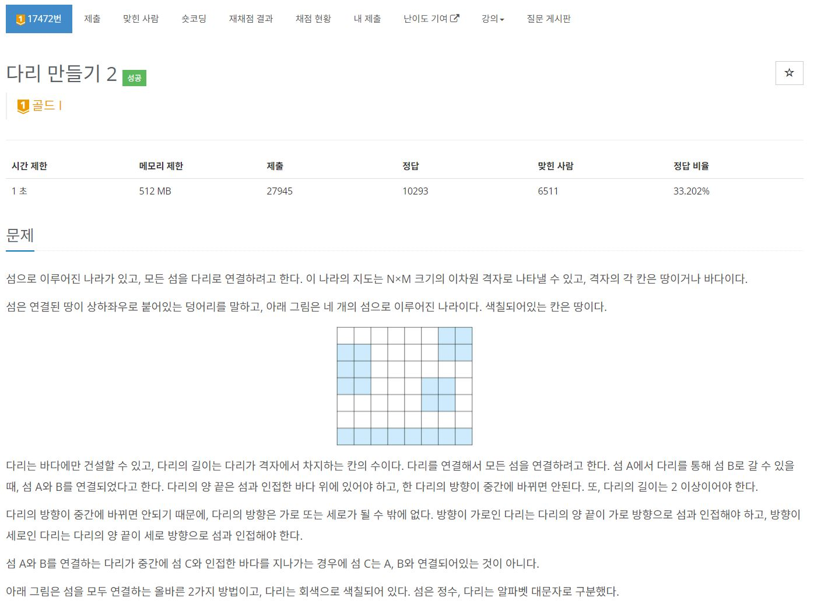
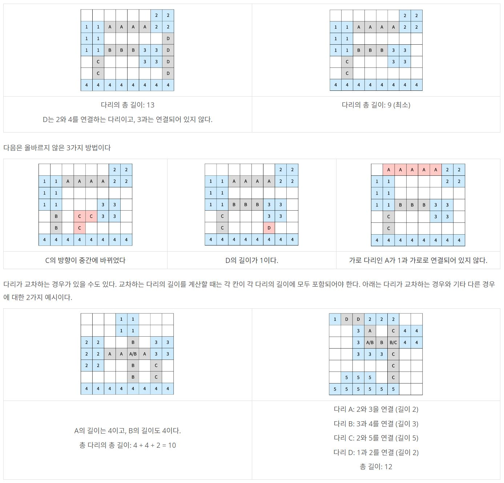
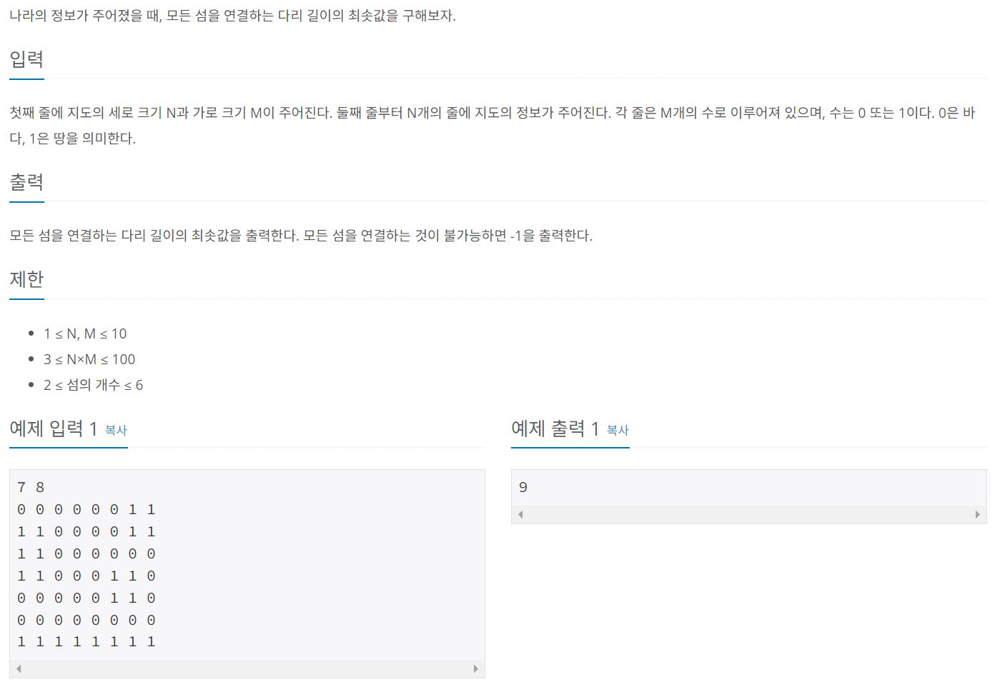
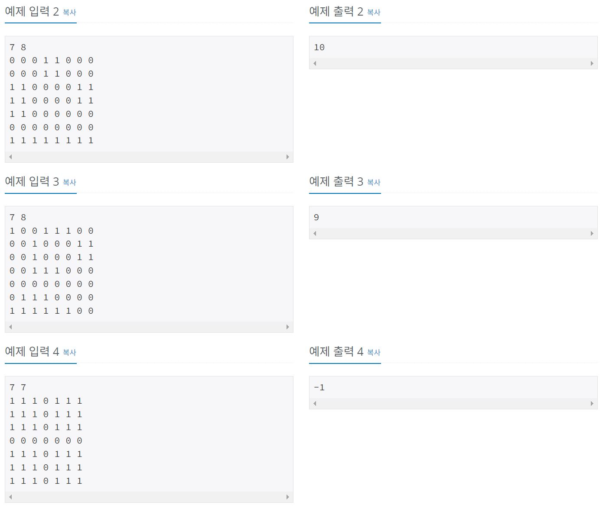
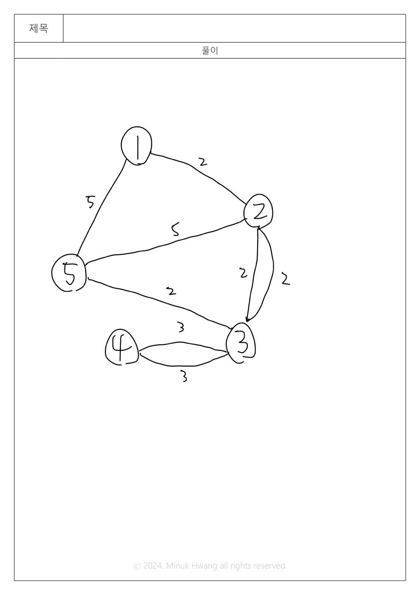

https://www.acmicpc.net/problem/17472

1. 입력값

|1|0|0|1|1|1|0|0|
|-|-|-|-|-|-|-|-|
|0|0|1|0|0|0|1|1|
|0|0|1|0|0|0|1|1|
|0|0|1|1|1|0|0|0|
|0|0|0|0|0|0|0|0|
|0|1|1|1|0|0|0|0|
|1|1|1|1|1|1|0|0|

2. 번호 붙이기

|1|0|0|2|2|2|0|0|
|-|-|-|-|-|-|-|-|
|0|0|3|0|0|0|4|4|
|0|0|3|0|0|0|4|4|
|0|0|3|3|3|0|0|0|
|0|0|0|0|0|0|0|0|
|0|5|5|5|0|0|0|0|
|5|5|5|5|5|5|0|0|

3. 그래프로 만들기

# 🔍 다리 만들기 2
- 설계 시간 : 8min
- 구현 시간 : 44min
- 난이도 : 골드 1
- 알고리즘 : BFS / 브루트포스 / 크루스칼
- 코드 길이 : 4959B
- 실행 시간 : 120ms(제한 1초)
- 메모리 : 13064KB

------------------------------

# 💡 아이디어

- 각각의 섬을 하나의 노드로 생각하고, 섬과 섬 사이에 놓을 다리를 간선으로 생각하자
- 그러면 모든 섬을 연결하는 다리 길이의 최솟값은 MST를 찾으라는거랑 같은 말이 된다

------------------------------

# 🧠 어려웠던 점

- 일단 풀이 방법을 떠올리는게 좀 힘들었음
  - 다리는 직선만 가능한데, 이게 BFS일까?
- 섬과 섬 사이의 거리를 알아내는게 쉽지 않음
  - 결국은 완탐인거 같은데 예외처리나 이런게 약간 귀찮은 느낌

------------------------------

# 🧐 좋은 풀이

